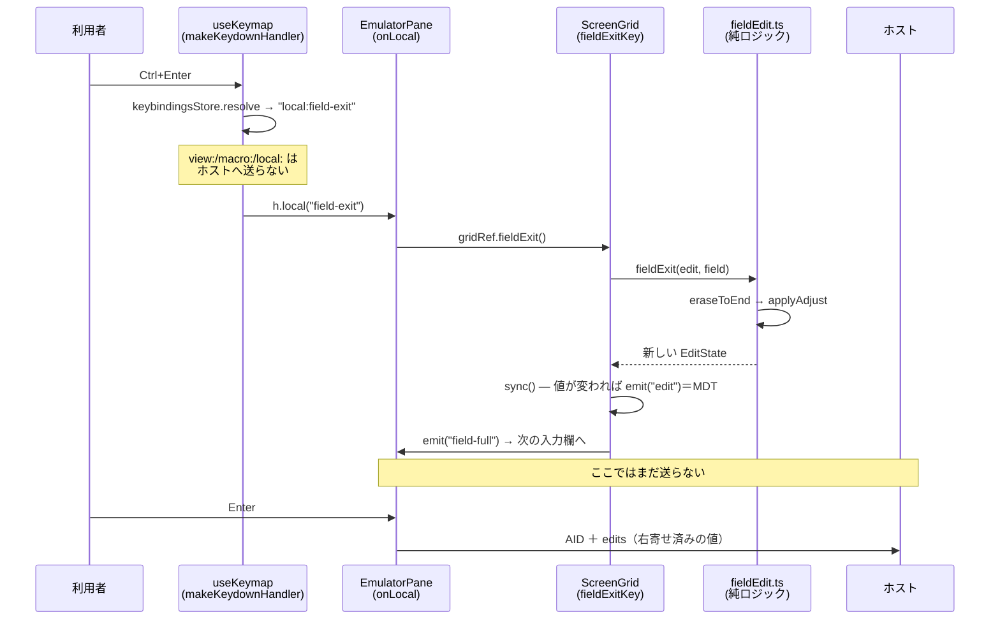

# レビューガイド: FFW の ADJUST とローカル編集キー

人間の PR レビュー用の解説。**どこを重点的に見ればよいか**と**なぜその形なのか**を先に示す。

## 1 行で

**5250 の「Field Exit を押すと欄が右寄せされる」を実装した。** ADJUST の指定はホストが FFW に載せて
送ってくるが、整形するのは端末の仕事なので、右寄せは web-ui 側で行う。

## 重点的に見てほしい 3 点

### ① `rightAdjust` が原典どおりか（`packages/web-ui/src/composables/fieldEdit.ts`）

GNU tn5250 `lib5250/display.c` の `tn5250_display_shift_right` の移植。**ここが仕様の中核**。

```
①先頭から続く空白を fill で置換 → ②末尾が空白の間、1 桁ずつ右へずらして先頭に fill
```

この 2 段構えから、次の 3 つが自動的に導かれる（実装で条件分岐していないのがポイント）:

- 末尾が既に非空白 → **1 桁も動かない**（満杯の欄は無変化）
- 全桁が空白 → **何もしない**（原典に「そうしないと無限ループ」とある）
- 語中の空白は保持されたまま一緒に動く（`"1 2  "` → RZ → `"0001 2"`）

`packages/web-ui/test/field-adjust.test.ts` がこの 3 つを個別に固めている。

### ② 適用の契機が「Field Exit のときだけ」か

**Tab や Enter では右寄せしない。** 原典の呼び出し元を全数確認した結果で、実機の作法でもある
（だから Field Exit というキーが存在する）。既存の入力経路（`advanceIfFull` / 文字入力 / Tab）には
**手を入れていない**ので、この PR で既存の操作感が変わることはない。

### ③ キーバインドの版マージ（`packages/web-ui/src/stores/keybindings.ts`）

既定を 3 つ足すにあたり、**既存のバグを先に直している**。旧実装は版を上げると全既定を混ぜ直すため、
既定を 1 つ足すだけで**利用者が消した既定まで復活**していた。`ADDED_BY_VERSION` で
「その版で増えた分だけ」を足す形へ変えた。ここは既存利用者の設定に触る箇所なので要確認。

## 処理フロー



## 変更の地図

| 層 | ファイル | 役割 |
|---|---|---|
| core | `screen/types.ts` | `FieldAdjust` 型と `Field.adjust` / `Field.signedNumeric` |
| core | `screen/buffer.ts` | FFW → スナップショットへの写し（予約値 0x1–0x4 は無指定に落とす） |
| core | `screen/field-validate.ts` | 数値欄の許容判定を `trim()` してから行う（右寄せが作る padding を通す） |
| web-ui | `composables/fieldEdit.ts` | **純ロジック**（`eraseToEnd` / `rightAdjust` / `applyAdjust` / `fieldExit`） |
| web-ui | `components/ScreenGrid.vue` | 3 キーの実行＋`defineExpose`。修飾キーガードの追加 |
| web-ui | `components/EmulatorPane.vue` | `onLocal` の配線（欄から欄への移動はこちらの担当） |
| web-ui | `stores/keybindings.ts` | `local:` 割当先と版ごとの増分マージ |
| web-ui | `components/KeybindingsPanel.vue` | キー設定 UI の optgroup |
| docs | `README.md` / `scripts/README.md` | 実装に合わせた記述と検証手順 |
| 検証 | `scripts/*adjust*.mjs` | 実機フィクスチャ・FFW 実測・往復実測・E2E |

## 実測で分かった「当初の見立ての誤り」

backlog は ADJUST を「**数値欄で**実機と見た目も送信値も変わる」と評価していた。実機で測った結果:

- **送信値が変わるのは英数字欄**（`CHECK(RZ)/(RB)`）。ホストは整形しないので左詰めのまま届いていた
- **数値欄はホスト側が吸収する**（左詰めで送っても `12` と解釈される）＝**見た目だけ**の違いだった

この切り分けは実測しないと出てこない。backlog にも訂正を書き戻した。

## 意図的に原典と違えた 2 点（`decisions.md` D2 / D10）

1. **Erase EOF で右寄せしない**。tn5250j は `fieldExit()` を使い回すため右寄せまで走るが、
   消しただけで文字が右へ飛ぶのは操作として不自然。backlog の定義（「Field Exit の①だけ」）を採る
2. **値が変わらない Field Exit では MDT を立てない**。原典は無条件に立てるが、この PJ には
   「カーソル移動だけで MDT にしない」という先行決定があり、無条件 MDT は**SEU の埋め込み色属性が
   失われる**という既知の実害を復活させる

## 動かして確かめるには

```sh
node --env-file=.env scripts/build-adjtest.mjs      # 初回のみ（TESTLIB にフィクスチャ作成）
node --env-file=.env scripts/verify-browser-adjust.mjs    # 実ブラウザ＋実機で 15 項目
```
