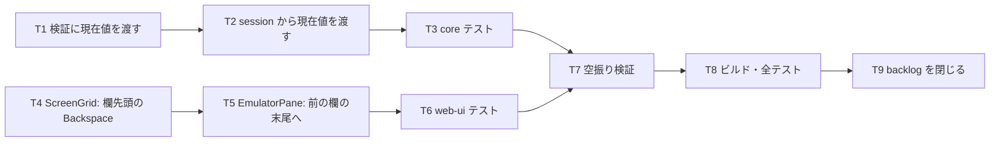

# 計画: field-input の「要確認」2 件

## subtask 分割の判定: 分割しない

2 件は互いに独立だが、どちらも小さく（各 1〜2 ファイル）**1 PR に収まる**。
同じ backlog ファイルを閉じるという 1 つの目的でまとまっている。

## 実装方針

**core（検証）と web-ui（キー）は独立**なので順序の制約は無い。
検証の方が壊すと影響が広いので先に固める。

**T1 が関門。** 検証を緩めすぎると誤入力まで通る。

## 作業順序と依存関係

1. **T1** `validateFieldContent` に「現在値」引数（依存: なし）— **関門**
2. **T2** `session.setField` が現在値を渡す（依存: T1）
3. **T3** core テスト（依存: T2）
4. **T4** `ScreenGrid` の Backspace（SBCS / DBCS 両方）で `field-prev` を emit（依存: なし）
5. **T5** `EmulatorPane` が前の入力欄の末尾へフォーカス（依存: T4）
6. **T6** web-ui テスト（依存: T5）
7. **T7** 空振り検証（依存: T3, T6）
8. **T8** ビルド・全テスト（依存: 全部）
9. **T9** backlog の該当 2 件を結論つきで閉じる（依存: T8）

## リスク / 留意点

| # | リスク | 対応 |
|---|---|---|
| R1 | 検証を緩めすぎて誤入力が通る | **現在値にある文字だけ**。「現在値に無い文字は弾く」をテストで固定 |
| R2 | 現在値の取得で DBCS 欄のセンチネルが混ざる | 検証は既にセンチネルを除いた文字列で行う（前作）。現在値も同じ扱いにする |
| R3 | `field-prev` が既存の Backspace（欄内削除）を壊す | `cursor === 0` のときだけ。既存の `field-edit` 系テストを関門にする |
| R4 | 前の欄へ移ったあと caret が先頭に置かれる（`focusInput` は 0 に置く） | 末尾へ置く専用の経路にする。テストで caret 位置を確かめる |

## テスト方針

- **core（`field-validate-current.test.ts`）**
  - 現在値 `"$***1,234.56"` の欄へ `"$***1,234.57"` → 通る
  - 現在値 `"1234"` の欄へ `"12$4"` → 弾く（**空振り防止の要**）
  - 現在値を渡さない既存の呼び出しは従来どおり（回帰）
  - DBCS 種別・コードページの検証は変わらない（回帰）
- **web-ui（`field-boundary-backspace.test.ts`）**
  - 欄の先頭で Backspace → `field-prev` が出て**値は変わらない**
  - 欄の途中で Backspace → 従来どおり削除（`field-prev` は出ない）
  - `EmulatorPane`: 2 つ目の欄の先頭で Backspace → 1 つ目の欄にフォーカスが移り caret が末尾
  - 先頭の欄では末尾の欄へ回る
- **空振り検証**: 判定を外すと落ちることを確認
- **実行**: web-ui は**パッケージ dir から**。ビルドは `vue-tsc` 込み
