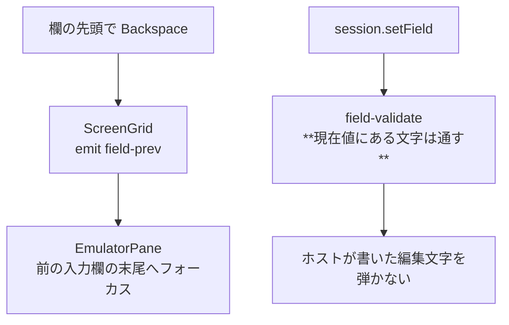

# 調査: field-input の「要確認」2 件

## 1. 欄の先頭で Backspace を押したらどうなるか（U1・U2）

### F1: 原典は**前の欄の末尾へカーソルを移す。文字は消さない**

GNU tn5250 `display.c` の `tn5250_display_kf_backspace`:

```c
/* If in first position of field, set cursor position to last position
 * of previous field. */
if (cursor is at field start) {
    field = tn5250_display_prev_field(This);
    tn5250_display_set_cursor_field(This, field);
    if (field_length - 1 > 0) dbuffer_right(field_length - 1);   /* 末尾へ */
    return;                                                       /* 消さない */
}
tn5250_dbuffer_left(This->display_buffers);
```

- **欄の先頭**: 画面順で 1 つ前の入力欄へ移り、その**末尾**にカーソルを置く。**削除はしない**
- **それ以外**: カーソルを左へ動かすだけ（**既定は非破壊**。`destructive_backspace` は
  既定 0 で、設定で初めて破壊的になる。`display.c:60`）

### F2: 本実装の Backspace は**破壊的**（ACS の作法）

`fieldEdit.ts:46` の `backspace` はカーソル手前の 1 文字を消して左詰めする。
`cursor <= 0` では**何もしない**（`return state`）。

→ **破壊的なところは変えない。** PC の利用者が期待する挙動で、非破壊に変えると
既存利用者の操作が全部変わる。**欄の先頭のときだけ**原典に合わせて前の欄へ移す
（原典もそこでは消していないので、破壊/非破壊の違いは関係しない）。

これで backlog の指摘「EDTMSK の分解欄をまたげない」が解消する。
`ArrowLeft` は左端でペインのセル移動へ委譲されるのに `Backspace` だけ行き止まり、という
食い違いも無くなる。

## 2. 編集文字を含む値が入力欄へ来るか（U3・U4）

### F3: `EDTCDE` / `EDTWRD` は**用途 B（入出力両用）でも書ける**

`scripts/build-edttest.mjs` で 1 件ずつ単独コンパイルした（実機 / IBM i 7.5）。

| DDS | コンパイル |
|---|---|
| `6 2 B EDTCDE(1)` | **通る** |
| `6 2 B EDTWRD('    ,   . ')` | **通る** |
| `6 2 B EDTCDE(J)` | **通る** |
| `6 2 O EDTCDE(1)`（対照） | 通る |
| `6 2 B`（対照） | 通る |

**「output-capable 向けだから入力欄には来ない」という見立ては誤りだった。**

### F4: **分解されず、編集文字は入力欄の中に入って来る**

`scripts/research-edtcde.mjs` で `TESTLIB/EDTPGM` を呼んで実測:

```
r 3|  EDTCDE(1) B             .00|
in#1 r3 c22 len=8 numeric=true value="     .00"     FFW=0x4300 shift=num-only
in#2 r5 c22 len=7 numeric=true value="000000"       FFW=0x4300 shift=num-only
in#3 r7 c22 len=9 numeric=true value="     .00"     FFW=0x4300 shift=num-only
in#4 r11 c22 len=7 numeric=true value=""            FFW=0x4700 shift=signed-num
```

- **DDS の 4 欄がそのまま 4 つの入力欄**として来る（EDTMSK のような分解は起きない）
- **`.` が欄の値に含まれている**（`"     .00"`）。編集文字は欄の外の画面文字ではない
- 欄長は編集文字ぶん伸びる（`6 2` が `EDTCDE(1)` で 8 桁、`EDTCDE(J)` で 9 桁）
- シフトは **num-only（0x0300）**

### F5: いまの許容集合では**送れなくなる構成がある**

`field-validate.ts` の num-only / signed-num の許容集合は `/^[0-9.,+-]*$/`。

- `EDTCDE(1)` / `EDTCDE(J)` が作る `.` `,` `-` は**通る**
- しかし **`EDTCDE(A)` 系は負値を `CR` で表す**（`1,234.56CR`）
- **`EDTWRD` の定数文字は任意**（`$` `*` `/` `¥` など。`$***1,234.56` / `12/31/26` も作れる）

→ そういう欄を利用者が触ると、**画面そのものが送信できなくなる**（core が FIELD_TYPE で弾く）。
**しかも弾いている文字は、ホスト自身がその欄に書いたもの。**

### F6: 実機の端末はそもそも送信時に内容検証をしていない

原典はシフト種別の検証を**打鍵のときだけ**行う（`tn5250_field_valid_char` の呼び出し元は
`interactive_addch` の 1 か所）。バッファの中身は**そのまま送る**。

本実装の `validateFieldContent` は**送信時**の検証で、実機には無い層。
これは MCP・マクロ・ペーストという実機に無い入口を守るために要る層なので、
無くすのではなく**「ホストが置いた文字は通す」**に直すのが筋。

## 3. 影響範囲



- `packages/web-ui/src/components/ScreenGrid.vue` / `EmulatorPane.vue`: 境界の Backspace
- `packages/core/src/screen/field-validate.ts`: 許容集合に「現在値にある文字」を足す
- `packages/core/src/session/session.ts`: 現在値を検証へ渡す

## 4. spec への申し送り

| 未確定 | 結論 | 根拠 |
|---|---|---|
| U1 | **前の欄の末尾へ移す。削除はしない** | F1（原典） |
| U2 | 破壊的なままにする（欄の先頭だけ原典に合わせる） | F2 |
| U3 | **実在する。** 用途 B に書け、分解されず編集文字が欄の中に来る | F3・F4（実機） |
| U4 | num-only（0x0300）で欄長が編集文字ぶん伸びる | F4 |

そのうえで spec で決めること:

1. **許容集合を無条件に広げない。** `$` `*` `/` を一律に通すと、ただの誤入力も通る。
   **「その欄の現在値に含まれる文字は通す」**（＝ホストが書いた文字は弾かない）とする
2. 前の欄への移動は**画面順で 1 つ前**（原典の `prev_field`）。先頭欄では末尾へ回る
   （既存の `onFieldFull` が `(cur + 1) % n` で回っているのと対称にする）
3. **削除はしない**（原典どおり）。移動だけ
