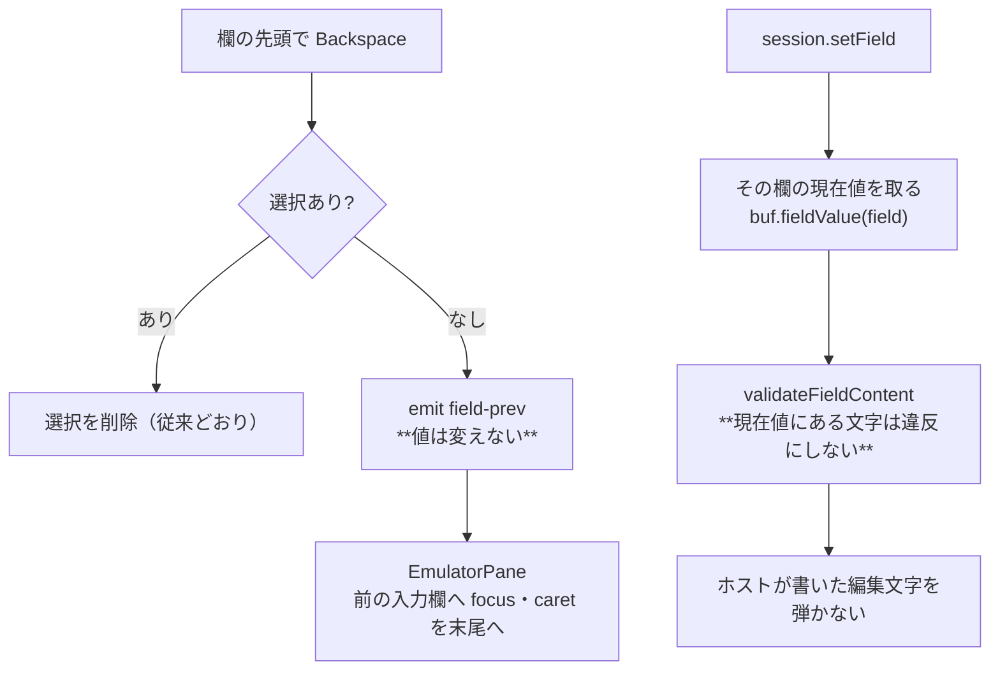

# レビューガイド: field-input の「要確認」2 件

## 変更概要 / 目的

`.aidev/backlog/field-input.md` に「実機がどう振る舞うか確認してから決める」と据え置かれていた
2 件を、**根拠を取って決着**させる。これで同ファイルの未着手が 0 件になる。

## 重要ポイント（特に見てほしい所）

### 1. 「入力欄には編集文字は来ない」は**誤りだった**（実測）

backlog は「`EDTWRD` / `EDTCDE` は output-capable 向けなので通常運用では表示のみ」と
見立てていた。実機で確かめたら**用途 B（入出力両用）でも書けて**、しかも EDTMSK のような
分解をされず**編集文字が入力欄の中に入って**来る。

```
in#1 r3 c22 len=8 numeric=true value="     .00"   FFW=0x4300 shift=num-only
```

`EDTCDE(A)` 系は負値を `CR` で表し、`EDTWRD` の定数文字は任意（`$` `*` `/`）。
いまの許容集合 `/^[0-9.,+-]*$/` で弾くと、**ホスト自身が書いた値を送り返せず
画面ごと送信できなくなる**。

### 2. 直し方: 許容集合は広げず「**現在値にある文字は通す**」

`packages/core/src/screen/field-validate.ts:16` の `checked`。

- 許容集合に `$` `*` `/` を足す案は却下——**編集語の定数文字は任意なので網羅できず**、
  かつ**ただの誤入力まで通る**
- 検証を丸ごと外す案も却下——MCP・マクロ・ペーストが無防備になる
- 「ホストが書いた文字だけ通す」なら、**不合理だけが消えて他は締まったまま**

**現在値が空の欄（大多数）では従来と完全に同じ**なのがこの案の要点。

### 3. 送信時検証は「実機に無い層」

実機の端末はシフト種別を**打鍵のときだけ**見て、バッファの中身はそのまま送る
（原典の `tn5250_field_valid_char` の呼び出し元は打鍵処理の 1 か所だけ）。
この前提を JSDoc に書いた——無いと、次に同じ不具合を踏んだとき
**「実機がそうだから」で誤った方向（検証を強める）へ倒れる**。

### 4. 欄の先頭の Backspace は「前の欄の末尾へ移る。削除しない」

原典（GNU tn5250 `kf_backspace`）どおり。**欄の中の Backspace は破壊的のまま**にした
（PC の作法。原典は既定で非破壊だが、そこを変えると既存利用者の操作が全部変わる。
欄の先頭では原典も削除しないので食い違わない）。

## 処理フロー



## 主要な変更箇所

- `packages/core/src/screen/field-validate.ts:16` — `checked`（現在値にある文字を除いて判定）
- `packages/core/src/session/session.ts:232` — 現在値を渡す**配線**
  （※ ここが**空振り検証で見つかった穴**。純関数のテストだけでは渡し忘れに気づけなかった）
- `packages/web-ui/src/components/ScreenGrid.vue` — Backspace（SBCS / DBCS 両方）
- `packages/web-ui/src/components/EmulatorPane.vue` — `onFieldPrev`（末尾へ caret）

## リスク / 確認してほしい点

- **R1: 検証を緩めている。** 緩む範囲は「その欄に元からある文字」だけ。
  現在値が空の欄では従来と完全に同じ。「現在値に無い文字は弾く」をテストで固定
- **R2: 埋め込み空白の扱いが条件付きになった。** 現在値に空白がある欄では通る
  （`EDTWRD` が桁区切りに空白を使うため）。コメントに但し書きを入れた
- **R3: Backspace の分岐追加。** `cursor === 0` かつ選択なしのときだけ。
  既存の欄内編集テストは全通過
