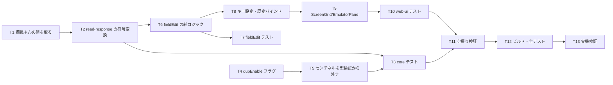

# 計画: 負値入力と符号付き数値の送信表現、Dup キー

## subtask 分割の判定: 分割しない

送信変換（core）だけでは利用者から見た振る舞いが変わらず（符号桁を作る手段が無い）、
キーだけでも送れない。**不可分**。1 PR に収まる。

## 実装方針

**送信変換（T1–T3）を先に固める。** ここが不具合の本体で、キーはその上に載る導線。
`ScreenGrid.vue` は大きいので最後。

**T2 が関門。** 既存の送信経路（センチネル・末尾空白）を壊すと全画面の送信が壊れる。

## 作業順序と依存関係

1. **T1** `ScreenBuffer` に「末尾空白を落とさない欄値」（依存: なし）
2. **T2** `read-response.ts` の signed-num 変換（依存: T1）— **関門**
3. **T4** `types.ts` / `buffer.ts` に `dupEnable`（依存: なし）
4. **T5** `field-validate.ts` からセンチネルを除いて判定（依存: なし）
5. **T3** core テスト（依存: T2, T4, T5）
6. **T6** `fieldEdit.ts` に `fieldMinus` / `fieldPlus` / `dupFill`（依存: T2 の設計）
7. **T7** `fieldEdit` の単体テスト（依存: T6）
8. **T8** `LOCAL_EDIT_ACTIONS` ＋ 版 3 の既定バインド ＋ 文言（依存: T6）
9. **T9** `ScreenGrid.vue` / `EmulatorPane.vue`（依存: T6, T8）
10. **T10** web-ui テスト（依存: T9）
11. **T11** 空振り検証（依存: T3, T10）
12. **T12** ビルド・全テスト（依存: 全部）
13. **T13** 実機検証（依存: T12）— **負値が本当に届くかはここでしか分からない**

## リスク / 留意点

| # | リスク | 対応 |
|---|---|---|
| R1 | 送信変換が既存の送信を壊す（センチネル・末尾空白・DBCS） | signed-num の欄**だけ**分岐。既存テストを関門にする |
| R2 | 「符号桁を送らない」で欄が 1 桁短くなり、非 signed-num へ波及 | 分岐を `signedNumeric` に限定。core テストで両方を固定 |
| R3 | `-` の横流しで、数値欄に `-` を打てなくなる（ペースト・マクロは別経路） | 横流しは**打鍵だけ**。ペースト・`setField` は従来どおり |
| R4 | 既定バインドがブラウザ既定と衝突（`ctrl+-` 縮小 / `ctrl+d` ブックマーク） | 既存のローカル編集キーと同じく `preventDefault` |
| R5 | Dup のセンチネルが型検証に弾かれる | T5 で外す。数値欄での Dup をテストで固定 |
| R6 | num-only の符号処理を実装しない判断が「漏れ」と誤解される | `decisions.md` に残し、テストで「Field Exit と同じ」を固定 |

## テスト方針

- **core（`signed-num-transmit.test.ts`）**
  - `"    12-"`（欄長 7）→ `40 40 40 40 F1 D2`（符号桁を送らず最終桁のゾーンが D）
  - `"    12 "` → `40 40 40 40 F1 F2`（正）
  - **signed-num でない欄は 1 バイトも変わらない**（回帰）
  - センチネル（属性バイト）を含む欄が壊れない（回帰）
  - `dupEnable` が `0x1000` で立つ
  - センチネルを含む値が数値欄の型検証を通る
- **web-ui**
  - `fieldEdit`: `fieldMinus` / `fieldPlus` / `dupFill` の純ロジック
  - `ScreenGrid`: 数値欄で `-` を打つと Field− が走る／非数値欄では文字として入る
  - Dup: `DUP_ENABLE` 欄で埋まる／無い欄ではメッセージ
- **空振り検証**: 符号変換・横流し・DUP_ENABLE 判定を外して落ちることを確認
- **実機（`scripts/verify-browser-sign.mjs`）**: `SGNPGM` で **Field− の結果が `[-12]` になる**
