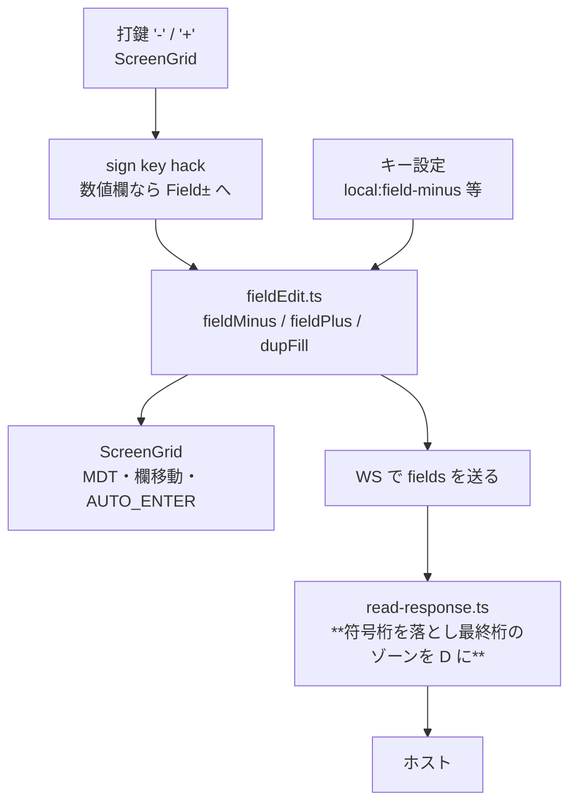

# 調査: 負値入力（Field− / Field+）と符号付き数値の送信表現、Dup キー

**原典の直読**（GNU tn5250 / tn5250j）と **実機の実測**の 2 本立て。

## 調査の問い

- **U1**: いま `-12` を符号付き数値欄へ送るとホストは何を受け取るか
- **U2**: 端末はどの形で負値を送ればよいか
- **U3**: Field− / Field+ は符号以外に何をするか
- **U4**: Dup は何を送るか。`DUP_ENABLE` はどの DDS 指定で立つか
- **U5**: 既定バインドに何を割り当てるか

## 1. 実機の実測（実機 / IBM i 7.5 / CCSID 939）

`scripts/build-sgntest.mjs` で `TESTLIB/SGNDSPF`・`SGNPGM` を作り、
`scripts/research-sign.mjs` が**欄ごとに 1 つずつ**送って RPG の `[...]` を読んだ。

### F1: **いまの実装では負値が送れない**（U1 の答え・不具合）

| 送った形 | SGN（`6S 0`） | NUM（`6 0`） |
|---|---|---|
| `-12`（**いまの実装**） | `[12]` | `[12]` |
| `    12-`（7 バイト） | **CPF5257 入出力エラー** | **CPF5257 入出力エラー** |
| `12-`（3 バイト） | `[120]` | `[120]` |
| `    12`（正の対照） | `[12]` | `[12]` |

**`-12` を送ると符号が黙って落ちて `12` になる。** エラーも出ないので、
**利用者は負値を入れたつもりで正値を送ってしまう**（データが静かに壊れる）。

`12-` が `120` になるのも示唆的で、**ホストは受け取ったバイトを順にゾーン 10 進の桁として読む**
（`60` はゾーン 6・数字 0 → `0`）。`    12-` が落ちるのは **7 バイト送ってしまい 6 桁の欄に
入り切らない**ため。

**最初は SGN と NUM へ同時に値を入れて測ったので、どちらが CPF5257 を出したのか分からなかった。**
欄ごとに 1 つずつ送り直して初めて「両方とも同じ」と確定した。

### F2: `DUP` は DDS のキーワードとして通り、`DUP_ENABLE` を立てる（U4 の半分）

```
in#4 DUPF DUP  len= 6 FFW=0x5020  shift=alpha  **DUP_ENABLE** MONOCASE
```

`0x5020` = `DUP_ENABLE`(0x1000) + `MONOCASE`(0x0020)。

### F3: Dup 文字（0x1C）はそのままホストへ届く

生バイトのセンチネル（`rawSentinel(0x1C)`）で 6 桁ぶん送ったところ、
RPG の `if DUPF = x'1C1C1C1C1C1C'` が真になり `[ALLDUP]` が返った。
**端末が 0x1C を書けば、アプリはそれを受け取れる。**

### F4: 実機の数値入力欄は `6S 0` も `6 0` も同じ `shift=signed-num`（前作の再確認）

`num-only`（0x0300）になるのは DDS 35 桁が `M` の**文字欄**だけ（`6M` → `0x4300`）。
つまり**この機の数値入力欄はすべて signed-num** で、num-only の符号処理は実機で再現できない。

## 2. 原典（参照実装の直読）

### F5: 送信時に**符号桁は送らず、最終桁のゾーンを 0xD にする**（U2 の答え）

GNU tn5250 `session.c:549-566`（Read MDT Fields の組み立て）:

```c
/* For signed numeric fields, if the second-last character is a digit
 * and the last character is a '-', zone shift the second-last char.
 * In any case, don't send the sign position. */
if (tn5250_field_is_signed_num(field)) {
    size--;                                   /* ← 符号桁は送らない */
    c = size > 0 ? data[size - 1] : 0;
    if (size > 1 && data[size] == remote('-') && isdigit(local(c))) {
        c = (0xd0 | (0x0f & c));              /* ← 最終桁のゾーンを D に */
    }
}
```

**F1 の実測と完全に一致する。** 7 バイト送ると桁あふれ（CPF5257）になり、
正しい負値は **6 バイトで最終桁のゾーンが D**（`40 40 40 40 F1 D2` = −12）。

なお `CMD_READ_INPUT_FIELDS` の枝も同じ変換をする（符号桁の位置に加工後の値を置く）。
本実装が使うのは Read MDT Fields なので上を移植する。

### F6: Field− / Field+ の中身（U3 の答え）

`display.c:1710-1755`（Field−）/ `1646-1692`（Field+）:

1. 対象外の欄（signed-num でも num-only でもない）→ `field_minus_in_char` が真なら
   **Field Exit と同じ**、偽なら操作員エラー `FLDM_DISALLOWED`
2. `field_pad_and_adjust`（カーソル以降を消して ADJUST）
3. **signed-num**: 最終桁（符号桁）へ `-` を置く（Field+ は `0`＝空にする）
4. **num-only**: 最終バイトのゾーンを 0xD にする（Field+ は何もしない）
5. `AUTO_ENTER` なら Enter、そうでなければ次の入力欄へ

### F7: `+` / `-` の打鍵は Field+ / Field− へ横流しされる

`display.c:927-940` の `sign_key_hack`:

```c
if (This->sign_key_hack && (is_num_only(field) || is_signed_num(field))) {
    switch (ch) { case '+': kf_field_plus(This); return;
                  case '-': kf_field_minus(This); return; }
}
```

数値欄で `-` を打つと**文字として入らず Field− が走る**。
F1 の「`-12` を送ると黙って `12` になる」不具合は、これを入れれば構造的に起こらなくなる。

### F8: Dup の中身（U4 の残り）

`display.c:1795-1835`:

1. 保護欄 → 操作員エラー `PROTECT`
2. **MDT を先に立てる**（`DUP_ENABLE` の判定より前）
3. `DUP_ENABLE` でない → 操作員エラー `DUP_DISALLOWED`
4. カーソルから**欄末尾まで** `0x1C` で埋める
5. FER なら標識を立てて留まる。そうでなければ ADJUST → `AUTO_ENTER` なら Enter → 次の欄

## 3. 影響範囲



- `packages/core/src/protocol/read-response.ts`: signed-num の送信変換（**中核**）
- `packages/core/src/screen/types.ts`: `dupEnable` フラグ
- `packages/core/src/screen/buffer.ts`: `DUP_ENABLE` を写す
- `packages/core/src/screen/field-validate.ts`: センチネル（生バイト）を型検証から外す
- `packages/web-ui/src/composables/fieldEdit.ts`: `fieldMinus` / `fieldPlus` / `dupFill`
- `packages/web-ui/src/composables/useKeymap.ts`: `LOCAL_EDIT_ACTIONS` に 3 つ追加
- `packages/web-ui/src/stores/keybindings.ts`: 版 3 の既定バインド
- `packages/web-ui/src/components/ScreenGrid.vue`: 打鍵の横流しとキー処理
- `packages/web-ui/src/composables/opMessages.ts`: Dup 不許可の文言

## 4. spec への申し送り

| 未確定 | 結論 | 根拠 |
|---|---|---|
| U1 | **いまは負値が送れない**（黙って正値になる） | F1 の実測 |
| U2 | **符号桁は送らず、最終桁のゾーンを 0xD にする** | F5（原典）＋ F1（7 バイトで桁あふれ） |
| U3 | 消去 → ADJUST → 符号 → AUTO_ENTER/次欄 | F6 |
| U4 | Dup は `0x1C` を欄末尾まで。`DUP_ENABLE` は DDS の `DUP` | F8・F2・F3 |
| U5 | **spec で決める**（PC キーボードに Field− キーが無い） | — |

そのうえで spec で決めること:

1. **`-` / `+` の打鍵を Field− / Field+ へ横流しする**（F7）。これが無いと F1 の不具合が残る
2. **num-only 欄の Field− は対象外にする。** 実機の数値入力欄はすべて signed-num（F4）で
   **num-only の符号処理を実機で確かめられない**。確かめられないものを実装しない側へ倒し、
   Field Exit と同じ振る舞いにする（原典の `field_minus_in_char` と同じ逃げ道）
3. **送信変換は core に置く。** 画面（編集モデル）は符号桁に `-` を持ったまま——実機の見た目と同じ——で、
   ワイヤに出るときだけ変換する。web-ui 側で変換すると画面と送信値が食い違う
4. **センチネル（生バイト）を型検証から外す。** Dup が `0x1C` を値に入れるため、
   数値欄の許容集合 `/^[0-9.,+-]*$/` に引っかかると Dup が使えない
5. 既定バインドは**版 3**として足す（既存の「増分だけ混ぜる」方式）
