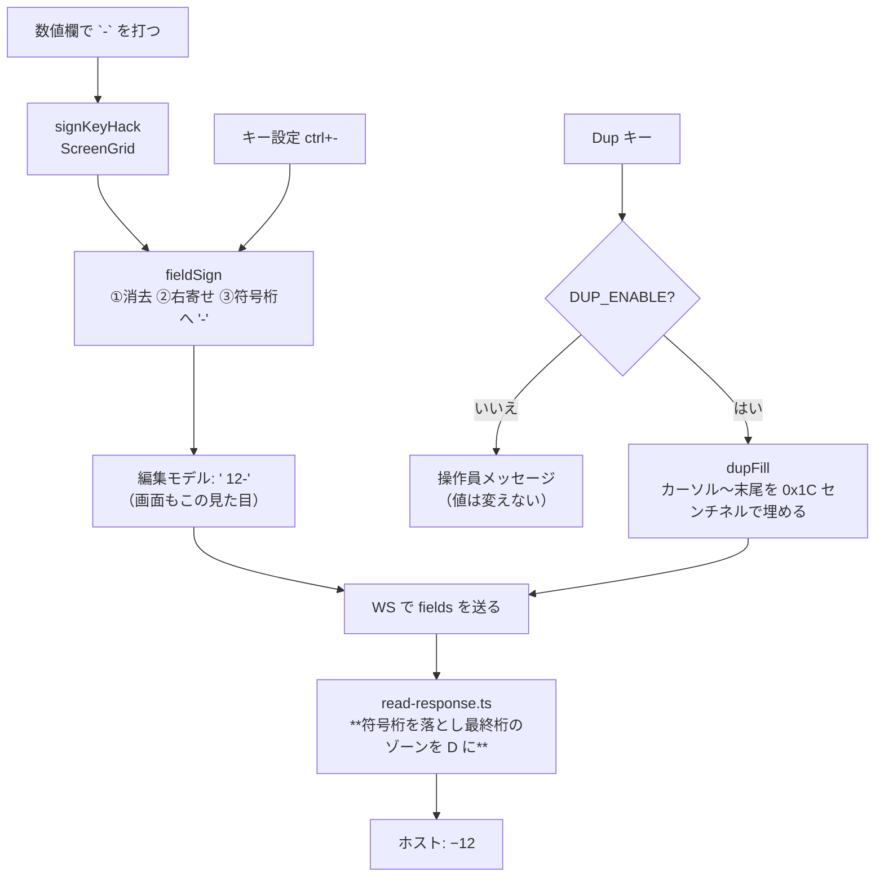

# レビューガイド: 負値入力と符号付き数値の送信表現、Dup キー

## 変更概要 / 目的

**負の値がホストに届かない不具合を直す。** ついでに実機の作法である
Field− / Field+ / Dup をローカル編集キーとして足す。

### 直す不具合（実機で実測）

数値欄に `-12` と打つと、**ホストは `12` を受け取る**。エラーも警告も出ないので、
利用者は負値を入れたつもりで正値を送る。

| 送った形 | ホストが受け取った値 |
|---|---|
| `-12`（**変更前**） | `12` … 符号が黙って落ちる |
| `    12-`（7 バイトそのまま） | **CPF5257 入出力エラー**（桁あふれ） |
| `    12`（6 バイト） | `12` |

## 重要ポイント（特に見てほしい所）

### 1. 正しい送信表現は「符号桁を送らず、最終桁のゾーンを 0xD にする」

`packages/core/src/protocol/read-response.ts:19` の `signedNumericValue`。
GNU tn5250 `session.c:551-566` の移植で、**実測の CPF5257（桁あふれ）とも整合する**。

```
画面（編集モデル）  "    12-"   ← 符号桁は画面上 1 桁を占める（実機と同じ見た目）
送信バイト          40 40 40 40 F1 D2   ← 符号桁は送らず、最終桁 F2 → D2
```

**変換は core に置いた**（`decisions.md` D3）。web-ui でやると画面と送信値が食い違い、
「見えているものが送られる」原則が崩れる。MCP・マクロ経由も同じ変換を通る。

### 2. `-` / `+` の打鍵を Field− / Field+ へ横流しする（`decisions.md` D2）

`ScreenGrid.vue:1817` の `signKeyHack`。**打った通りに送れない形は打たせない。**
これが無いと 1 の不具合（`-12` と打てて `12` が届く）が残る。

**打鍵だけの規則**で、ペースト・マクロ・MCP は従来どおり。

### 3. num-only 欄の符号処理は**あえて実装していない**（`decisions.md` D1）

原典は num-only 欄で最終バイトのゾーンを直接 0xD にするが、
**実機の数値入力欄はすべて signed-num**（`6S 0` も `6 0` もワイヤ上は 0x0700）。
num-only になるのは DDS 35 桁が `M` の文字欄だけで、**正しさを実機で確かめられない**。
確かめられないものは実装しない側へ倒し、Field Exit と同じにした。

### 4. Dup は複写文字 0x1C をセンチネルで運ぶ

表示できない制御コードなので、既存の「生バイトを運ぶセンチネル」に載せる。
そのため **`validateFieldContent` からセンチネルを除外**した（`decisions.md` D4）——
外さないと数値欄で Dup を押した瞬間に「数字しか入らない」で自分の入力を弾く。

## 処理フロー



## 主要な変更箇所

- `packages/core/src/protocol/read-response.ts:19` — **送信変換（中核）**
- `packages/core/src/screen/buffer.ts:682` — `fieldValue(field, keepTrailingBlanks)`。
  符号桁を見るために末尾空白を残した値が要る
- `packages/core/src/screen/field-validate.ts:16` — センチネルを型検証から外す
- `packages/web-ui/src/composables/fieldEdit.ts:167` — `fieldSign` / `dupFill`（純関数）
- `packages/web-ui/src/components/ScreenGrid.vue:1817` — `signKeyHack`
- `packages/web-ui/src/stores/keybindings.ts:73` — 版 3 の既定バインド

## リスク / 確認してほしい点

- **R1: 送信経路に手を入れている。** 影響を `signedNumeric` の欄だけに限定し、
  「符号付きでない数値欄・英数字欄は 1 バイトも変わらない」を core テストで固定した
- **R2: 数値欄で `-` が文字として打てなくなる。** 打てても正しく送れないので意図した変更だが、
  ペースト・マクロは従来どおり通る（経路が違う）
- **R3: 既定バインドがブラウザ既定と衝突する**（`ctrl+-` 縮小 / `ctrl+d` ブックマーク）。
  既存のローカル編集キーと同じく捕捉時に `preventDefault` する
- **R4: `ctrl++` は数値キーパッドの `+` 向け。** メイン行の `+` は Shift 併用でコンボ名が
  変わるため `ctrl+shift++` も既定に入れてある（review S1）
