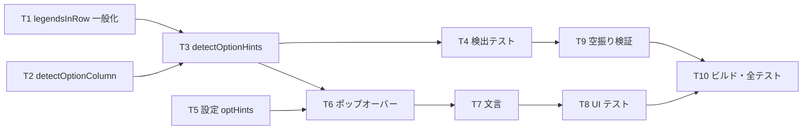

# 計画: オプション欄に選択肢のドロップダウンを出す

## subtask 分割の判定: 分割しない

`fkeyLegend.ts` に検出 2 つ、`viewSettings.ts` に設定 1 つ、`ScreenGrid.vue` に UI。
検出だけ入れても利用者から見た振る舞いは変わらない＝単独デリバリ不可で不可分。1 PR に収まる。

## 実装方針

**純関数（検出）を実機 fixture で固めてから UI に触る。** `ScreenGrid.vue` は大きく、
壊したときの影響が読みにくいので最後に置く。設定（T5）は独立なので途中に挟める。

**T1 が関門。** `F<n>=` 側の結果が 1 つでも変わったら一般化の仕方が誤っている
（既存の凡例ボタンのテストが落ちる）。

## 作業順序と依存関係

1. **T1** `legendsInRow` の一般化（依存: なし）— **関門**
2. **T2** `detectOptionColumn`（依存: なし）
3. **T3** `detectOptionHints`（依存: T1, T2）
4. **T4** 検出テスト（依存: T3）
5. **T5** 設定（依存: なし）
6. **T6** ポップオーバー（依存: T3, T5）
7. **T7** 文言（依存: T6）
8. **T8** UI テスト（依存: T6）
9. **T9** 空振り検証（依存: T4）
10. **T10** ビルド・全テスト（依存: 全部）

## リスク / 留意点

| # | リスク | 対応 |
|---|---|---|
| R1 | 一般化で `F<n>=` の挙動が変わる | T1 を関門にする。既存の凡例テストで確認 |
| R2 | 幅とラベルを別々に切り出すと描画がずれる（既存 review で潰した不具合） | 一般化しても**同一切り出し**を保つ。コメントを残す |
| R3 | `<数字>=` の誤検出 | 凡例と Opt 列が**両方揃ったときだけ**発火。`wrkmsgq` / `menu` fixture が守る |
| R4 | Opt 列の条件（桁 1〜2・3 行以上）は実機 5 画面からの経験則 | 単独では発火しないので実害は小さい。fixture を増やせる形にしておく |
| R5 | `ScreenGrid.vue` にポップオーバーを足して桁割りが崩れる | 絶対配置のオーバーレイにし、`<input>` の構造には触れない |
| R6 | 一覧の全行に導線を出すと画面が埋まる | **フォーカス中の欄だけ**に出す |
| R7 | 既定 ON で出してしまう | `FALLBACK` を OFF にし、テストで固定 |

## テスト方針

- **検出（`opt-legend.test.ts`）**: 実機 fixture 5 画面
  - `wrkobjpdm`（凡例 2 行・Opt c2/len2 × 8 行）/ `wrksplf` / `dsplibl`（c3/len1）で
    凡例と Opt 列が期待どおり取れる
  - `wrkmsgq`（凡例なし）/ `menu`（どちらも無し）で `null`
  - `F3=` `F24=` を拾わない
- **UI（ScreenGrid のコンポーネントテスト）**: 設定 OFF で出ない / ON かつ Opt 欄フォーカスで出る /
  選ぶと欄に値が入る
- **既存資産**: `fkeyLegend` 系・`ScreenGrid` 系の既存テスト全部
- **空振り検証**: Opt 列の条件を外して `wrkmsgq` / `menu` のテストが落ちることを確認
- **実行**: web-ui は**パッケージ dir から**（AGENTS.md）。ビルドは `vue-tsc` 込み
