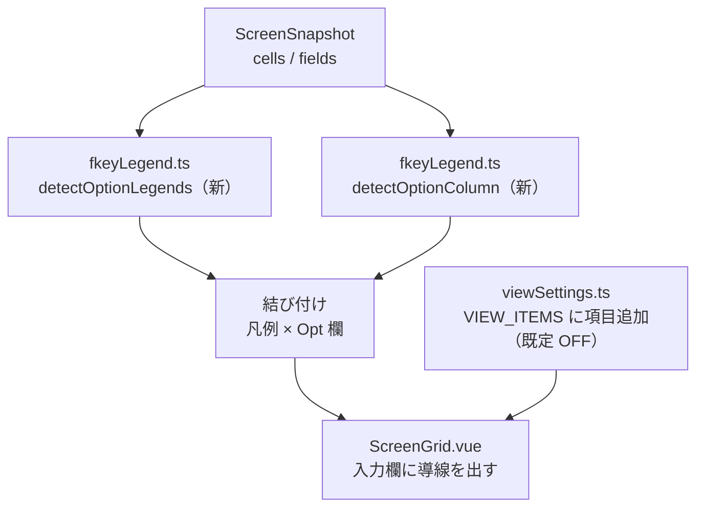

# 調査: オプション欄のドロップダウン

## 調査の問い

- Q1: Opt 欄はどんな形をしているか。PDM 以外の一覧画面でも同じか（requirement の最大の未確定事項）
- Q2: 凡例 `<数字>=` はどこに出るか。機能キー凡例（`F<n>=`）と誤って混ざらないか
- Q3: 既存の凡例抽出（`legendsInRow`）はどこまで流用できるか
- Q4: 誤検出の実害はどれくらいありそうか（凡例が無い画面で拾ってしまわないか）

## 判明した事実

### F1: Opt 欄の形は 5 画面で一貫していた（実機・IBM i 7.5）

| 画面 | 凡例行 | 番号の開始桁 | Opt 欄（桁/長さ） | 並ぶ行 |
|---|---|---|---|---|
| `WRKOBJPDM TESTLIB` | r7, r8 | c4 | **c2 / len2** | 11–18（8 行） |
| `WRKSPLF` | r6, r7 | c4 | **c2 / len2** | 12–20（9 行） |
| `WRKACTJOB` | r6, r7 | c4 | **c2 / len2** | 10–18（9 行） |
| `DSPLIBL` | r6 | c4 | **c3 / len1** | 9–15（7 行） |
| `WRKUSRJOB` | r4, r5 | c4 | **c2 / len2** | 9–18（10 行） |
| `WRKMSGQ` | **凡例なし** | — | **該当なし** | — |

**共通する形（5/5）:**

1. **同じ桁・同じ長さの非保護欄が 3 行以上、縦に連続して並ぶ**（7〜10 行）
2. その欄の桁は **c2〜c3**（行頭付近）、長さは **1〜2**
3. 凡例はその欄より**上の行**にあり、番号の開始桁は **c4**（Opt 欄のすぐ右）
4. 凡例は**複数行にまたがることがある**（PDM は r7-r8 の 2 行）

`WRKMSGQ` は凡例も縦並びの短い欄も無く、**何も拾わないのが正しい**画面として使える。

### F2: `F<n>=` との混同は起きない（既存の正規表現の作りで防げている）

`fkeyLegend.ts:50` の `LEGEND_RE = /(?<![A-Za-z0-9])F(\d{1,2})\s*=\s*/g` は
**直前が英数字なら拾わない**負の後読みを持つ。同じ後読みを `(\d{1,2})=` に付けると
`F3=` の `3` は直前が `F` なので**自動的に外れる**。

実機 6 画面で確認: `F3=` `F4=` `F23=` `F24=` を含む行は、オプション凡例として 1 つも拾われなかった。

### F3: `legendsInRow` はほぼそのまま流用できる

`fkeyLegend.ts` の `legendsInRow`（`F<n>=` 用）は次の処理を持ち、**すべてオプション凡例にも要る**:

- 桁空間（`RowText`）で走査する＝ DBCS があっても桁がずれない
- **ラベルの終端は「空白 2 個以上」**。空白 1 個は日本語ラベル内にも出る
  （実測 `F13= この画面の使用法`。オプション側も `7=名前の変更` `9=印刷状況の処理` と同じ事情）
- 次の凡例の開始位置を hard end にする
- `TRAILING_BORDER` で末尾の罫線を落とす。**ラベルと占有幅を同じ切り出しから求める**
  （別々にすると描画がずれる。既存 review R1 の指摘）
- 中身の無い `F3=` だけのものは捨てる

違いは **キーの型**（`AidKey` ではなく番号）と **番号の範囲**（`F1..F24` のような上限が無い）だけ。

### F4: 表示側の下地も既にある

- `ScreenGrid.vue:783` の `legendsByRow`＝ **snapshot だけに依存する computed**
  （入力のたびに再検出しないための分離）。オプション凡例も同じ形で足せる
- 設定は `stores/viewSettings.ts` の `VIEW_ITEMS`。
  **画面設定メニューとキー設定で共有する単一の出どころ**なので、ここへ足せば両方に自動で出る
  （backlog も「2 か所に書かないこと」と明記）
- `expandable` / `group` / `groupLabel` があり、ON/OFF だけの項目は `linkify` と同じ 2 択でよい

### F5: 誤検出のリスクは実機 6 画面では顕在化しなかった

`(?<![A-Za-z0-9])(\d{1,2})=` を 6 画面すべての全行に当てたところ、
**拾われたのは本物のオプション凡例だけ**だった（`WRKMSGQ` は 0 件）。

ただしこれは 6 画面での話で、`1=2` のような式や日付・金額を含む画面では起こりうる。
backlog も「**Opt 欄の存在・凡例行との位置関係で絞ること**」と明記しており、
**凡例だけで判断せず、F1 の形（縦に並ぶ短い非保護欄）とセットで初めて有効にする**のが妥当。

## 影響範囲

- `packages/web-ui/src/composables/fkeyLegend.ts`: 検出 2 つを追加（`legendsInRow` を一般化）
- `packages/web-ui/src/components/ScreenGrid.vue`: 導線の描画と選択の反映
- `packages/web-ui/src/stores/viewSettings.ts`: `VIEW_ITEMS` に項目追加・`FALLBACK` に既定値
- `packages/web-ui/src/composables/opMessages.ts`: 利用者に見える文言があれば

## 実現性 / リスク

- **実現性は高い。** 判定材料（凡例・欄の形）は 5 画面で一貫しており、
  抽出ロジックは既存 `legendsInRow` の一般化で足りる。
- **リスク R1（中）**: Opt 欄の判定条件（桁 1〜2・3 行以上の縦並び）は 5 画面から作った経験則。
  同じ形の「Opt ではない短い欄」（数量欄が縦に並ぶ入力画面など）を誤って Opt と見なす恐れがある。
  → **凡例が上に無ければ何も出さない**ので、単独では発火しない
- **リスク R2（中）**: `(\d{1,2})=` は `F<n>=` より紛れやすい。F5 のとおり実機 6 画面では出なかったが、
  帳票・計算式を含む画面は未確認
- **リスク R3（低）**: DBCS ラベルの桁計算。既存 `RowText` / `colOf` / `widthOf` に乗るので新規の問題は無い
- **リスク R4（中）**: **UI の出し方が未決**。欄に `<select>` を重ねると 5250 の桁割りが崩れる恐れがある。
  `docs/UI-DESIGN.md` と既存部品（`InfoPopover`）を踏まえて spec で決める

## spec への申し送り

1. **Opt 欄の判定は「同じ桁・同じ長さ（1〜2）の非保護欄が 3 行以上縦に連続」**（F1。5/5 で成立）
2. **凡例はその欄より上の行から拾う**。複数行にまたがるので 1 行に限定しない（PDM は 2 行）
3. **凡例と Opt 欄の両方が揃ったときだけ**発火させる（R1・R2 への対処。backlog の指示とも一致）
4. `legendsInRow` を**キーの型で一般化**し、`F<n>=` と `<数字>=` で共有する。
   ラベル終端「空白 2 個以上」・`TRAILING_BORDER`・幅とラベルの同一切り出しは**必ず引き継ぐ**
5. 負の後読み `(?<![A-Za-z0-9])` を必ず付ける（F2）
6. **既定は OFF**（requirement）。`VIEW_ITEMS` へ足せばメニューとキー設定の両方に出る（F4）
7. **UI の出し方は spec で決める**（R4）。桁割りを壊さないことを最優先にする
8. `WRKMSGQ` を「何も出ない」ことの回帰テストに使う（F1）
