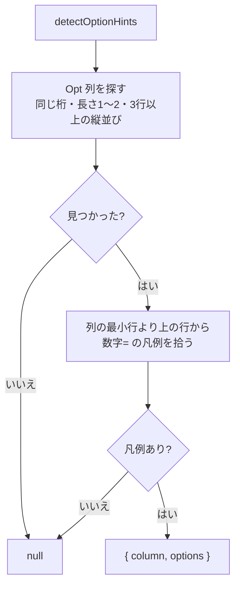

# 仕様: オプション欄に選択肢のドロップダウンを出す

## 概要

画面から**オプション凡例**（`<数字>=<ラベル>`）と**Opt 欄の列**を検出し、
フォーカス中の Opt 欄の直下に**ポップオーバー**で選択肢を出す。選ぶと欄へ番号が入る。

**凡例と Opt 欄の両方が揃ったときだけ**発火する。画面設定で ON/OFF を選べ、**既定は OFF**。

## 設計方針

### 方針1: 検出は `legendsInRow` の一般化で共有する

`F<n>=` 用の `legendsInRow` が持つ処理は**すべてオプション凡例にも要る**（research F3）:
桁空間での走査・ラベル終端「空白 2 個以上」・`TRAILING_BORDER`・**幅とラベルの同一切り出し**。

別実装にすると、既存 review で潰した不具合（ボタンが隣の罫線を飲み込む）を**もう一度踏む**。
`legendsInRow` を「見出しの正規表現とキーの作り方」で一般化し、両者で共有する。

### 方針2: 「凡例 × Opt 欄」が揃ったときだけ発火する

`(\d{1,2})=` は `F<n>=` より紛れやすい（research R2）。単独では有効にせず、
**縦に並ぶ短い非保護欄（＝ Opt 列）が同じ画面にある**ことを条件にする。
backlog の「Opt 欄の存在・凡例行との位置関係で絞ること」と一致する。

Opt 列の判定（実機 5/5 で成立。research F1）:

- 同じ**桁**・同じ**長さ**（1〜2 桁）の**非保護**欄が
- **3 行以上、連続する行に**並ぶ

凡例は Opt 列の**最小行より上**の行から拾う（複数行にまたがる。PDM は 2 行）。

### 方針3: UI はポップオーバー（欄に `<select>` を重ねない）

5250 の桁割りは `<input>` の幅で成り立っており、欄に `<select>` を重ねると崩れる。
**絶対配置のポップオーバー**なら描画に一切影響しない。

`docs/UI-DESIGN.md` の共通ポップオーバー（`InfoPopover`）と同じ作法にそろえる:
バックドロップ＋本体・外側クリックで閉じる。

### 方針4: 設定は ON/OFF の 2 択（デザイン候補は作らない）

backlog:「ON/OFF だけで足りる項目（見た目の候補が無いもの）は `linkify` と同じ 2 択でよい。
**全部にデザイン候補を作らない**」。

`VIEW_ITEMS` へ足せば**画面設定メニューとキー設定の両方に自動で出る**（single source）。

### 方針5: 既定は OFF

**推測を含む機能なので勝手に有効化しない**（backlog の明示要求。
`windowFrame` / `windowBackdrop` の既定が `none` なのと同じ扱い）。

## 対象範囲

| ファイル | 変更内容 |
|---|---|
| `packages/web-ui/src/composables/fkeyLegend.ts` | `legendsInRow` の一般化、`detectOptionLegends()` / `detectOptionColumn()` |
| `packages/web-ui/src/components/ScreenGrid.vue` | ポップオーバーの描画と選択の反映 |
| `packages/web-ui/src/stores/viewSettings.ts` | `VIEW_ITEMS` に `optHints`、`FALLBACK` に既定値 `false` |
| `packages/web-ui/test/fixtures/opt-legend/*.json` | 実機 5 画面（採取済み） |
| `packages/web-ui/test/opt-legend.test.ts` | 新規 |

## インターフェース / データ構造

```ts
/** オプション凡例 1 件（`2=変更`）。座標は 1 始まりの桁。 */
export interface OptionSpan {
  row: number;
  col: number;
  width: number;
  /** 欄へ入れる番号の文字列（`"2"` / `"10"`） */
  value: string;
  label: string;
}

/** Opt 欄の列（同じ桁・同じ長さの非保護欄が 3 行以上縦に並ぶ） */
export interface OptionColumn {
  col: number;
  length: number;
  /** 並んでいる行（昇順） */
  rows: number[];
}

/** 画面からオプション凡例と Opt 列を取り出す。どちらか欠ければ null */
export function detectOptionHints(
  snap: ScreenSnapshot,
  charOf?: CharOf
): { column: OptionColumn; options: OptionSpan[] } | null;
```

## 振る舞いの詳細



- **窓が開いていれば窓の中だけ**を対象にする（`detectFkeyLegends` と同じ考え方）
- 凡例の番号は `1`〜`99`。`(?<![A-Za-z0-9])` を付けて `F3=` を除く（research F2）
- 同じ番号が 2 回出たら**先に出た方**を採る
- 選択の反映は**既存の入力経路**を通す（欄の値を直接書かず、通常の入力と同じく MDT を立てる）

### UI — **既存の選択・クリップボード操作を妨げないことを最優先にする**

利用者指示（requirement の追加要件）を受け、**キーボードを一切横取りせず、フォーカスも奪わない**
純粋な表示オーバーレイにする。

- **開閉はフォーカスに完全に従属させる**。Opt 列の欄にフォーカスが入ったら開き、外れたら閉じる。
  - **キーイベントを 1 つも購読しない**（`Esc` すら捕まえない）。矢印・Tab・Enter・Esc は
    今日とまったく同じ経路を通る
  - 矩形選択が始まると `onGridDragMove` が入力欄を blur するので、**選択開始と同時に自然に閉じる**
  - 開く導線をグリッド内に置かない（印を置くと桁割りを侵し、mousedown のヒット領域も増える）
- **ポップオーバー本体は `@mousedown.stop.prevent`**
  - `.stop`＝ `onGridMousedown` へ伝播させない（伝播すると `clearRectSel()` が走り**矩形選択が消える**）
  - `.prevent`＝ mousedown 既定のフォーカス移動を止める（**入力欄にフォーカスを残す**。
    奪うと貼り付け先が変わる）
- **選択は `click` で行う**（mousedown を prevent しても click は発火する）。`@click.stop` も付ける
- **絶対配置のオーバーレイ**にし、`<input>` の構造・桁割りには一切触れない
- 項目は `2 変更` のように番号とラベルを並べる。選ぶと**既存の入力経路**で欄に番号が入る

> コピー（`onDocCopy` → `rectText()`）は `charAtForClipboard`＝**モデル**から組むので、
> DOM にオーバーレイがあってもクリップボードには混入しない（確認済み）。

## ドメイン固有の考慮

- **ホストが送る情報を UI 側で上書きしない**（AGENTS.md）。番号を入れるだけで、
  欄の解釈・様式には触れない
- **利用者に見えるメッセージは `opMessages.ts` に置き、テストは定数を参照する**（AGENTS.md）
- **環境の検出結果で選択肢を塞がない**（AGENTS.md）。凡例が拾えない画面では
  導線を出さないだけで、通常の入力は一切妨げない
- DBCS ラベルは既存の `RowText` / `colOf` / `widthOf` に乗る（research R3）

## エラー処理 / 異常系

- **凡例だけ / Opt 列だけ**の画面 → `null`（何も出ない）。`WRKMSGQ` がこのケース
- **凡例が拾えるが番号が欄の長さに収まらない**（`10=` を長さ 1 の欄へ）→ その選択肢を出さない
- **欄が保護されている / hidden** → 対象外
- **設定 OFF** → 検出そのものを走らせない（`legendsByRow` が `buttons === "none"` で
  早期 return するのと同じ）

## 受け入れ基準との対応

| requirement の完了条件 | 満たし方 |
|---|---|
| PDM fixture から凡例が抽出できる | `opt-legend.test.ts`（実機 fixture） |
| Opt 欄が特定でき凡例と結び付く | 同上。`wrkobjpdm` / `wrksplf` / `dsplibl` の 3 画面で固定 |
| 選択すると番号が入る | ScreenGrid のコンポーネントテスト |
| 既定では何も出ない | `FALLBACK` の既定値と、設定 OFF で描画されないテスト |
| 誤検出を抑える条件が効いている | `wrkmsgq` / `menu` fixture で `null` を固定 |
| 既存テストが通る | 追加のみ。既存の呼び出しは変えない |
| 空振りでない | Opt 列の条件を外すと `wrkmsgq` / `menu` のテストが落ちることを確認 |
