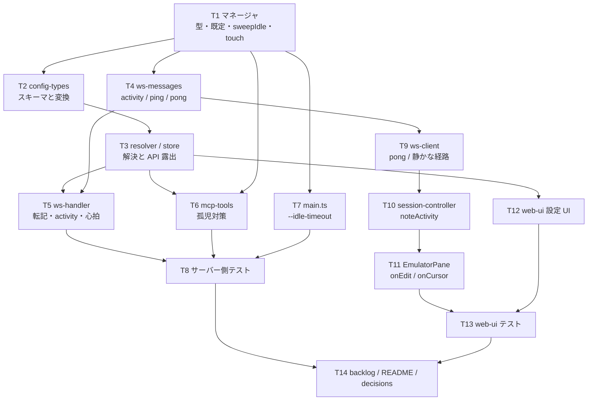

# 計画: セッションの寿命（アイドルタイムアウト・永続）

## 実装方針

**下から積む**（マネージャ → 設定の解決 → 入口 → クライアント → UI → 文書）。
下が固まっていないと上の転記先が決まらず、途中で型を作り直すことになる。

**subtask に割らない。** 1 PR に収まる規模（14 ファイル）で、割れ目を作っても
「マネージャだけ」「設定だけ」では受け入れ基準の検証ができない（設定 → 判定まで通って初めて意味を持つ）。
`DESIGN.md`「5.」の判定で「不可分」に当たる。

## 作業順序と依存関係

## リスク / 留意点

- **プリンター経路の転記漏れ**（research F3）。`ws-handler.onOpenPrinter` は `co.*` をキーごとに
  手で写しているため、足し忘れると「表示だけ効く」状態になる。**テストで display / printer 両方を見る**
- **MCP の孤児**（research F2）。`orphanSafeIdleTimeoutMs` を通し忘れると資源が漏れる。
  MCP の 2 か所（`open_session` / プリンター）を両方通す
- **既定値の変更が既存テストに波及**。`session-manager.test.ts:82` は明示値を渡しているので
  壊れない見込みだが、他に暗黙依存があれば test 工程で出る
- **操作ログの汚染**。`activity` / `ping` / `pong` を `logStore` に出すと利用者の操作ログが埋まる。
  静かな経路を作る
- **`WsClient.send` のマスク処理**を通す/通さないの判断。`activity` / `pong` は payload が無いので
  マスク対象が無い——ただし**将来 payload を足せない形（型に何も持たせない）**にしておく

## テスト方針

### サーバー（`packages/server/test/`）

- `session-manager.test.ts` に追記
  - 既定（引数なし）では無操作でも切れない
  - マネージャ既定が有限なら切れる（既存テストの形）
  - **エントリ個別の値が優先される**（マネージャ有限 × エントリ `"never"` → 切れない）
  - **マネージャ永続 × エントリ有限 → 切れる**
  - プリンターも同じ判定を受ける
  - `touch()` が `lastActivity` を進める（表示・プリンター）。未知 id で投げない
  - `orphanSafeIdleTimeoutMs()`: 数値はそのまま / `"never"` と `undefined` は 30 分
- `config-types` の `idleTimeoutToMs()`: 分 → ms / `"never"` / `undefined`
- `config-resolver` のテスト: セッション設定の `idleTimeout` が `connect.idleTimeoutMs` に載る
- `ws-handler` のテスト（モック `WsSender`）
  - `activity` で `touch` が呼ばれる。`open` 前の `activity` は無視
  - 心拍: 間隔で `ping` が飛ぶ / `deadMs` 超過で `dispose`（`close` が呼ばれる）/ 受信で生き延びる
  - display / printer の両方で `idleTimeoutMs` が `open`/`openPrinter` に渡る
- `main.ts` の `parseArgs`: `--idle-timeout 30` / `never` / 不正値

### web-ui（`packages/web-ui/test/`、パッケージ dir から実行）

- `noteActivity()` が間引く（連打で 1 回）。`activity` に payload が無い
- `ping` 受信で `pong` を返す。`ping`/`pong`/`activity` が `logStore` に残らない
- `EmulatorPane` の入力・カーソル移動で `activity` が出る
- `ConfigCard` のフォームが `idleTimeout` を往復する（未設定 → 送らない / `never` / 分）

### 空振り検証（mutation）

実装を 1 か所ずつ壊し、対応するテストが落ちるか確かめる。特に:

- `sweepIdle` のエントリ個別判定をマネージャ既定に戻す
- MCP の `orphanSafeIdleTimeoutMs` を素通しにする
- ハートビートの死判定を外す
- `activity` の間引きを外す / 逆に常に間引く
- プリンター経路の `idleTimeoutMs` 転記を落とす
