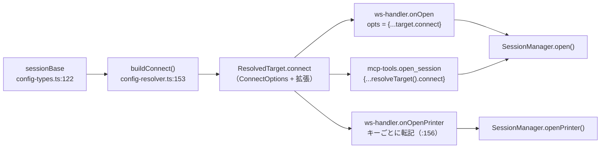
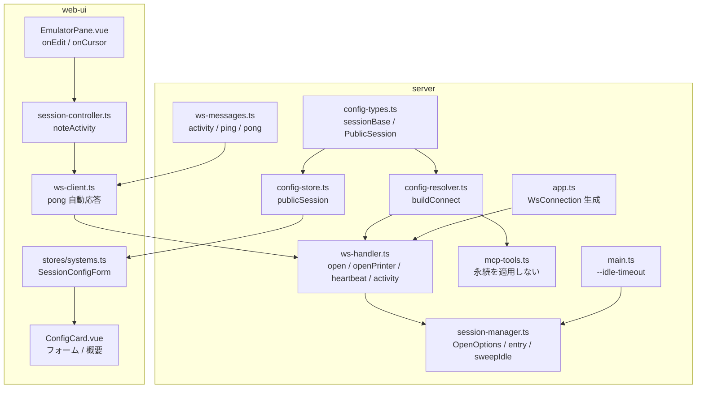

# 調査: セッションの寿命（アイドルタイムアウト・永続）

backlog（`.aidev/backlog/session-lifetime.md`）に 2026-07-28 の調査が既にある。
ここでは**その内容を現行コードで再確認**し、requirement の「未確定事項」を事実で埋める。

## 調査の問い

- Q1: backlog の調査結果（既定 30 分・設定できない・WS 切断で破棄）は今も正しいか
- Q2: **WS を持たない入口があるか**。あれば既定を永続にすると孤児が回収されなくなる
- Q3: 設定を `open()` / `openPrinter()` まで運ぶ既存の道はどれか（前例）
- Q4: 「永続」をどう表すか。既存コードに前例はあるか
- Q5: 死活監視（ping/pong）に手が届くか。WS の実装は何か
- Q6: クライアント側で「利用者が触った」を拾える単一の合流点はどこか
- Q7: 既存テストが `idleTimeoutMs` の既定に依存していないか
- Q8: 設定を UI に出す道はどれか

## 判明した事実

### F1: backlog の調査は現行コードでも正しい（Q1）

- `session-manager.ts:312` `this.idleTimeoutMs = opts.idleTimeoutMs ?? 30 * 60_000` — **既定 30 分**
- `session-manager.ts:321` `startIdleSweep(intervalMs = 60_000)` — **60 秒間隔**
- `session-manager.ts:765-778` `sweepIdle()` は **マネージャ共通の `cutoff` を 1 つ作り**、
  `sessions` と `printers` を回して `entry.lastActivity < cutoff` なら `disconnect()` + `delete`
- `main.ts:172` `const sessions = new SessionManager();` — **引数なし**。CLI にも設定にも項目が無い
- `ws-handler.ts:87-89` `onSocketClose()` → `dispose()`。**WS 切断でセッションを破棄**する
- `lastActivity` を更新するのは `get()`（`session-manager.ts:473`）/ `getPrinter()`（同 629）と
  `deliverReport()`（同 545）だけ。ホスト発の画面更新は `entry.session.on("screen", …)` 直結で通らない

### F2: **MCP 経由のセッションには WS が無い**（Q2）——backlog が見落としていた

`sessions.open()` の呼び出し元は**ちょうど 2 か所**（`grep` で確認）:

| 入口 | 場所 | 孤児の回収 |
|---|---|---|
| WebSocket（ブラウザ） | `ws-handler.ts:106` | `onSocketClose()` が破棄する |
| **MCP** | `mcp-tools.ts:287`（`open_session`）/ `:509`（プリンター） | **無い**。`close_session` を呼ぶかどうかは相手次第 |

MCP は `StreamableHTTPTransport`（`app.ts:233`）で、ツール呼び出しごとの HTTP。
**接続が切れたという通知が無い**。MCP クライアントが落ちれば、そのセッションを閉じる者は誰も居ない。
現在それを回収しているのは `sweepIdle` の壁時計タイマー**だけ**である。

したがって backlog の「孤児回収は `onSocketClose` が担っているので壁時計タイマーは重複」は
**ブラウザ経路に限って正しい**。MCP 経路では壁時計タイマーが唯一の安全網であり、
**既定を一律に永続にすると MCP セッションが `maxSessions`（既定 8）を食い潰して
`CONNECT_FAILED` で新規接続ができなくなる**（装置記述も掴んだまま）。

→ spec への申し送り: **既定は入口ごとに決める**。設定値は両方の入口で尊重するが、
「永続」を MCP に適用してはならない。

### F3: 設定を `open()` まで運ぶ前例は `deviceNameRetry` / `rescueAction`（Q3）

`config-types.ts:122` の `sessionBase` に置いた値が、次の順で運ばれている:

- `ResolvedTarget.connect` は `ConnectOptions` に**サーバー側だけで解釈する値を相乗り**させている
  （`config-resolver.ts:34-38` に「`deviceNameRetry` はサーバー側で解釈するので `ConnectOptions` に
  足して運ぶ」と明記）。同じ手を使える
- **プリンター経路は自動で流れない**。`ws-handler.ts:143-157` が `co.*` をキーごとに転記しているため、
  新しいキーは**明示的に足さないと落ちる**（転記漏れが起きやすい箇所）
- `openPrinter` は `OpenPrinterOptions`（`session-manager.ts:159-165`）で別に型を持つ

### F4: 「永続」の前例は無い。近い型は `rescueAction` の enum（Q4）

`sessionBase` の値はすべて素の値型（`string` / `number` / `boolean` / enum）。
`null` を意味付きで使っている箇所は無い。`0` を「無効」に使っている箇所も無い。

→ spec への申し送り: `undefined`（未設定）と「永続」を型で区別できる形にする。
`z.union([z.literal("never"), z.number().int().min(1).max(1440)])` なら、
`undefined`＝未設定 / `"never"`＝永続 / 数値＝分 で三者が混ざらない。
**`0` や `null` を永続の印にしない**（未設定・転記漏れと見分けが付かなくなる）。

### F5: WS は `@hono/node-server` の `upgradeWebSocket`。生ソケットには依存したくない（Q5）

`app.ts:239-266`。ハンドラは `onOpen(_evt, ws)` / `onMessage` / `onClose` の 3 つで、
`WsConnection` へ渡しているのは **`send` と `close` だけの薄い `WsSender`**（`ws-handler.ts:34-37`）。

- **プロトコル層の ping**（`ws.raw.ping()`）に手を伸ばすと、この薄い境界を破ることになる。
  `WsSender` はテストのモックが差し込める形になっており（`ws-handler.ts:31` のコメント）、
  生ソケットを掴むと **`WsConnection` の単体テストが書けなくなる**
- **アプリ層のハートビート**（`{type:"ping"}` / `{type:"pong"}`）なら既存の境界のまま実装でき、
  モック `WsSender` ＋ 疑似タイマーで検証できる。半開きソケットの検出にも足りる
  （`send` はローカルで成功するが pong が返らない）

→ アプリ層のハートビートを採る。

### F6: クライアント側の合流点は `EmulatorPane` の `onEdit` / `onCursor`（Q6）

`edits` と実効カーソルを書き換えている箇所を全数検索した結果（`grep '\.edits\.set|\.cursor = '`）:

- `EmulatorPane.vue:100` `onEdit()` → `state.value?.edits.set(fieldIndex, value)` — **唯一の書き込み**
- `EmulatorPane.vue:102` `onCursor()` → `cursorOverride.value = …` — クリックと矢印移動の**単一の調停点**
  （`:180` / `:398` の矢印経路も `onCursor` を通る。ファイル内コメントに明記）
- `sessions.ts:201-204` はホスト発の新画面での初期化（利用者の操作ではない）

→ この 2 か所から活動通知を出せば、打鍵・クリック・矢印移動のすべてを覆える。

### F7: 既定に依存する既存テストは 1 件だけ（Q7）

`packages/server/test/session-manager.test.ts:82` が `new SessionManager({ idleTimeoutMs: 100, now })`
で**明示的に有限値を渡し**、`(mgr as any).sweepIdle()` を直接呼んでいる。
既定値を変えてもこのテストは壊れない（明示値を使っているため）。他に参照は無い。

### F8: UI へ出す道は `PublicSession` → `SessionConfigForm` → `ConfigCard`（Q8）

- `config-store.ts:155-181` `publicSession()` が API 応答を組む。**列挙式**なので
  足したキーは明示的に転記しないと出ない
- `config-types.ts:247-271` `PublicSession` に型を足す
- `web-ui/src/stores/systems.ts:36-80` `SessionConfigForm`（POST/PUT の body 型）
- `web-ui/src/components/ConfigCard.vue`（975 行）が編集フォームと概要表示の両方を持つ
  （`sesForm` 初期値 `:81-84` / 読み込み `:173-177` / 保存 `:298-311` / 概要 `:422-428` / 入力 `:561-580`）
- **前例の注意**: `deviceNameRetry` は `sessionBase` にあるが `PublicSession` に無く、**UI から編集できない**。
  つまり「スキーマにあるが UI に無い」状態が既に存在する。今回はタイムアウトは
  利用者が選ぶ設定なので UI まで通す

## 影響範囲

## 実現性 / リスク

- **実現可能**。新しい依存も新しい層も要らない。既存の 3 本の道（設定の解決・WS メッセージ・
  マネージャのエントリ）にキーを 1 つずつ足す形に収まる
- **リスク 1: プリンター経路の転記漏れ**（F3）。`ws-handler.ts` の `co.*` 転記に足し忘れると
  「表示だけ効く」状態になる。テストで両方を見る
- **リスク 2: MCP の孤児**（F2）。既定を一律に永続にすると資源が漏れる。入口ごとに既定を分ける
- **リスク 3: 活動通知が値を運ぶ**（要件の非機能）。`{type:"activity"}` に**payload を持たせない**形にし、
  型でそれを保証する
- **リスク 4: ハートビートの間隔が短すぎると通信が増える**。ping 30 秒・無応答 90 秒で死判定とする
  （3 回の取りこぼしを許す）

## spec への申し送り

1. **既定は入口ごとに決める**（F2）。WS＝永続 / MCP＝有限。設定の有限値は両方で尊重する
2. **`"never"` ＋ 分の数値**で表す（F4）。`0` / `null` は使わない
3. **アプリ層のハートビート**（F5）。`WsSender` の薄い境界を守る
4. **活動通知は `EmulatorPane.onEdit` / `onCursor` の 2 か所から**（F6）。間引く
5. **プリンター経路は明示転記が要る**（F3）
6. 「残る論点」3 件のうち **死活監視は今回実装**（永続の代償として要る）。
   **プリンター常駐**と**永続本数の上限**は文書で結論を出して閉じる
