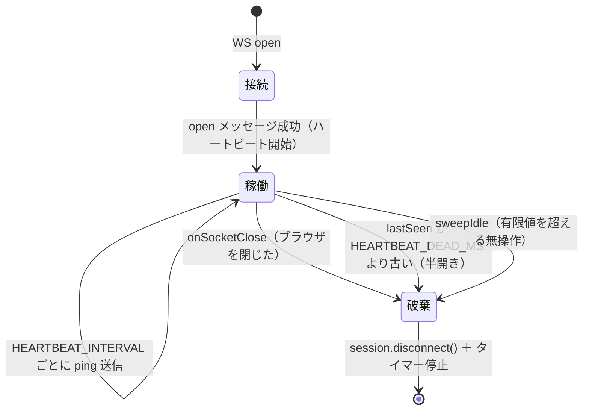
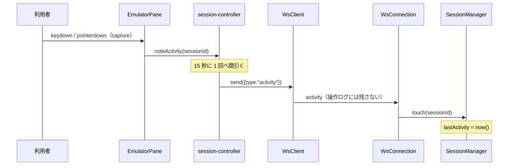

# 仕様: セッションの寿命（アイドルタイムアウト・永続）

## 概要

セッション設定に**アイドルタイムアウト**を足し、「永続（切らない）」を含める。既定を永続にする。
そのうえで「設定した値のとおりに動く」ために、**利用者の在席をサーバーへ伝える経路**と
**WS の死活監視**を足す。

## 設計方針

### 方針1: 既定は入口ごとに決める（research F2）

`sessions.open()` の入口は WebSocket と MCP の 2 つで、**孤児の回収能力が違う**。

| 入口 | 孤児の回収 | 既定 | 設定値の扱い |
|---|---|---|---|
| WebSocket（ブラウザ） | `onSocketClose` ＋ 新設のハートビート | **永続** | そのまま尊重（`"never"` も有効） |
| MCP | **無い**（切断が通知されない） | 30 分 | **有限値は尊重。`"never"` は通さない** |

MCP で `"never"` を通すと、クライアントが落ちたセッションを閉じる者が居なくなり、
`maxSessions`（既定 8）を食い潰して新規接続ができなくなる（装置記述も掴んだまま）。
**「設定どおりに動く」の例外はここ 1 点だけ**で、`sessionLog.warn` で見えるようにする（黙って曲げない）。

### 方針2: `"never"` ＋ 分の数値で表す（research F4）

`undefined`（未設定＝サーバー既定に従う）/ `"never"`（永続）/ `1..1440`（分）の三者を型で分ける。
**`0` も `null` も使わない**——未設定・転記漏れと区別が付かなくなる。

### 方針3: 死活監視はアプリ層のハートビート（research F5）

`WsSender` は `send` / `close` だけの薄い境界で、モックを差し込める形になっている。
生ソケット（`ws.raw.ping()`）を掴むとこの境界が壊れ、`WsConnection` の単体テストが書けなくなる。
`{type:"ping"}` / `{type:"pong"}` のアプリ層メッセージにする。半開きソケットの検出には十分
（`send` はローカルで成功するが pong が返らない）。

### 方針4: 活動通知は「起きた」だけを運ぶ

`{type:"activity"}` は**payload を持たない**（型でそう定義する）。`edits` の中身を早く送ると
秘密（マクロの `secretRef`）の扱いが変わるため。間引き（15 秒）で通信量を抑える。

## 対象範囲

| ファイル | 変更 |
|---|---|
| `packages/server/src/config-types.ts` | `sessionBase.idleTimeout` / `IdleTimeout` 型 / `idleTimeoutToMs()` / `PublicSession.idleTimeout` |
| `packages/server/src/config-resolver.ts` | `buildConnect` で `idleTimeoutMs` を載せる（ms へ変換） |
| `packages/server/src/config-store.ts` | `publicSession()` で転記 |
| `packages/server/src/session-manager.ts` | `SessionManagerOptions.idleTimeoutMs` を `number \| "never"` に / `OpenOptions` / `OpenPrinterOptions` / entry 保持 / `sweepIdle` のエントリ毎判定 / `touch()` / `orphanSafeIdleTimeoutMs()` |
| `packages/server/src/ws-handler.ts` | display/printer 両方で `idleTimeoutMs` を転記 / `activity` / `pong` 受信 / ハートビート |
| `packages/server/src/ws-messages.ts` | `WsActivity` / `WsPong`（client→server）/ `WsPing`（server→client） |
| `packages/server/src/mcp-tools.ts` | `orphanSafeIdleTimeoutMs()` を通す（display / printer） |
| `packages/server/src/main.ts` | `--idle-timeout <分\|never>` |
| `packages/server/src/app.ts` | 変更なし（`WsConnection` の既定でハートビートが動く） |
| `packages/web-ui/src/ws-client.ts` | `ping` に自動 `pong` / 心拍・活動は操作ログに出さない |
| `packages/web-ui/src/session-controller.ts` | `noteActivity()`（間引き） |
| `packages/web-ui/src/components/EmulatorPane.vue` | `@keydown.capture` / `@pointerdown.capture` から `noteActivity()`（**decisions D7 で `onEdit`/`onCursor` から変更**） |
| `packages/web-ui/src/stores/systems.ts` | `SessionConfigForm.idleTimeout` |
| `packages/web-ui/src/components/ConfigCard.vue` | フォームの選択肢と概要行 |
| `README.md` | CLI 表に `--idle-timeout` |

## インターフェース / データ構造

### 設定スキーマ（`config-types.ts`）

```ts
/**
 * 無操作で切るまでの時間。`"never"`＝切らない（永続）/ 数値＝**分**（1〜1440）。
 * 未設定はサーバー既定（`--idle-timeout`。既定は永続）に従う。
 *
 * **`0` / `null` を永続の印にしない**——未設定・転記漏れと見分けが付かなくなる（research F4）。
 */
export const idleTimeoutSchema = z.union([z.literal("never"), z.number().int().min(1).max(1440)]);
export type IdleTimeout = z.infer<typeof idleTimeoutSchema>; // "never" | number

// sessionBase に追加（display / printer 双方で意味を持つ）
idleTimeout: idleTimeoutSchema.optional()

/** 設定値（分 or "never"）を内部表現（ms or "never"）へ。未設定は undefined のまま */
export function idleTimeoutToMs(v: IdleTimeout | undefined): number | "never" | undefined;
```

`sessionBase` に置ける理由: **信頼設定ではない**（サーバー上のパス書き込み・コマンド実行・秘密の
いずれにも触れない）。`watermark` と同じ理屈で、サーバー設定・個人設定の両方が持てる。

### マネージャ（`session-manager.ts`）

```ts
export interface SessionManagerOptions {
  /**
   * アイドルタイムアウトの既定。`"never"`＝切らない。**既定は `"never"`**。
   * エントリ個別の値（`OpenOptions.idleTimeoutMs`）が無いときに使う。
   */
  idleTimeoutMs?: number | "never";
}

export interface OpenOptions /* と OpenPrinterOptions */ {
  /** このセッションのアイドルタイムアウト（ms、または `"never"`）。未指定はマネージャ既定 */
  idleTimeoutMs?: number | "never";
}

export interface SessionEntry /* と PrinterEntry */ {
  idleTimeoutMs?: number | "never";
}

/** 切断を通知しない入口（MCP）向け。既定 30 分 */
export const ORPHAN_IDLE_TIMEOUT_MS = 30 * 60_000;

/**
 * 切断を通知しない入口のアイドル上限を決める。**`"never"` は通さない**——
 * WS の切断・ハートビートが無いので回収する者が居ない（research F2）。
 */
export function orphanSafeIdleTimeoutMs(v: number | "never" | undefined): number;

/**
 * 在席の証拠を受けて `lastActivity` を進める（表示・プリンターの両方）。
 * **所有者検査をしない**のは、id が呼び出し元（WS 接続）自身が開いたものに限られ、
 * クライアントから来た値ではないため。存在しない id は黙って無視する。
 */
touch(id: string): void
```

`sweepIdle()`:

```ts
private sweepIdle(): void {
  const now = this.now();
  const expired = (e: { lastActivity: number; idleTimeoutMs?: number | "never" }): boolean => {
    const limit = e.idleTimeoutMs ?? this.idleTimeoutMs;   // エントリ個別 → マネージャ既定
    return limit !== "never" && e.lastActivity < now - limit;
  };
  // sessions / printers を回して expired なら disconnect + delete（従来と同じ形）
}
```

### WS メッセージ（`ws-messages.ts`）

```ts
/** 利用者が触った合図。**payload を持たない**（値を早く送らない。spec 方針4） */
export interface WsActivity { type: "activity"; }
/** ハートビートの応答 */
export interface WsPong { type: "pong"; }
/** ハートビート（server → client）。無応答が続けば半開きと見なして破棄する */
export interface WsPing { type: "ping"; }
```

### ハートビート（`ws-handler.ts`）

```ts
/** 心拍の間隔（ms） */
export const HEARTBEAT_INTERVAL_MS = 30_000;
/** 最後の受信からこれを超えたら半開きと見なす（取りこぼし 3 回ぶん） */
export const HEARTBEAT_DEAD_MS = 90_000;

// WsConnection の 4 番目の引数（テスト用に間隔と時刻を差し替えられる）
constructor(deps, ws, user?, hb?: { intervalMs?: number; deadMs?: number; now?: () => number })
```

## 振る舞いの詳細

### 状態遷移（WS 接続の寿命）



- **`lastSeen` は「任意の受信」で更新する**。pong 専用にしない——通常のキー送信が流れている間は
  心拍が返らなくても生きている証拠になる（判定を 1 つにまとめて取りこぼしを防ぐ）
- ハートビートは **`open` が成功してから**開始する（display / printer 共通）。`dispose()` で止める
- 死判定は**まず ping を送る前に**行う（送ってから判定すると 1 周期ぶん遅れる）

### 在席の伝わり方



- 活動通知は**有限値かどうかに関わらず送る**。クライアントはサーバー既定を知らないため。
  15 秒の間引きがあるので永続でも無駄は小さい
- **ホスト発の画面更新は活動に数えない**（現状のまま）。IBM i には利用者が居なくてもホストが
  書いてくる経路があり、数えると閉じ忘れたタブが永久に生き残る
- そのため合図は **DOM の生イベント（capture）**から出す。`ScreenGrid` が emit する
  `cursor` / `edit` は**ホスト発の再描画でも飛ぶ**（`onInputFocus` が emit する）ので使えない
  （decisions D7）

### 操作ログの扱い

`ping` / `pong` / `activity` は **`logStore` に出さない**。15 秒・30 秒間隔で流れるため、
出すと利用者が読む操作ログが心拍で埋まって使えなくなる。監査ログにも出さない
（利用者の意図を含まないうえ、量で本来の記録を押し流す）。

### 既定値の一覧

| 場所 | 既定 | 変え方 |
|---|---|---|
| サーバー全体 | **永続** | `--idle-timeout <分\|never>` |
| セッション設定 | 未設定（＝サーバー全体に従う） | 設定 UI / `profiles.json`・`connections.json` |
| MCP 経由 | 30 分 | セッション設定に**有限値**を書く |

### UI

`ConfigCard` のセッション編集フォームに選択肢を 1 つ足す（display / printer 共通の位置）。

- 「サーバー既定に従う」（未設定）/「切らない」/ 5・10・15・30・60・120・240 分
- 概要表示は設定があるときだけ 1 行出す（「無操作で切る: 切らない / 30 分」）

## ドメイン固有の考慮

- **ホストの管轄に踏み込まない**。アイドル対話ジョブの扱いは `QINACTITV` / `QINACTMSGQ` が持つ方針で、
  多くの環境で `*NONE`。既定 30 分で切るのは**ホストの方針を先取りして上書きする**行為だった
- **ACS は放置しても切れない**。このリポジトリは ACS 準拠を基準にしている（AGENTS.md 方針2）
- **永続 ≠ 常駐**。永続は「WS が繋がっている間は切らない」であって「ブラウザを閉じても生きる」ではない。
  常駐（`hostserver.md` / `pc-command.md`）は WS 非依存の寿命管理が要る別作業

## エラー処理 / 異常系

| 事象 | 扱い |
|---|---|
| `--idle-timeout` に不正値 | `parseLimit` と同じ形で起動時にエラー終了（1〜1440 または `never`） |
| MCP で `"never"` が解決された | `ORPHAN_IDLE_TIMEOUT_MS` に落とし、`sessionLog.warn` で理由を出す |
| `activity` を受けたが id 未確定（`open` 前） | 無視する（`sessionId` が undefined なら何もしない） |
| `touch()` に未知の id | 黙って無視（既に閉じたセッションの遅延メッセージ） |
| 半開き検出 | `dispose("heartbeat timeout")` ＋ `ws.close()`。セッションは `disconnect()` される |
| `pong` を送れない（送信側の close 済み） | `send` が readyState を見て捨てる（既存の挙動） |

## 受け入れ基準との対応

| requirement の完了条件 | 満たし方 |
|---|---|
| 設定項目があり「永続」を選べる。未設定と区別できる | `idleTimeoutSchema`（`"never"` / 分 / 省略） |
| `open()` / `openPrinter()` を通ってエントリに保持 | `buildConnect` → `ws-handler` 転記 → entry |
| `sweepIdle()` がエントリ毎に判定し永続を切らない | `expired()` の `limit !== "never"` |
| 既定で無操作でも切られない | `SessionManagerOptions.idleTimeoutMs ?? "never"` |
| 有限値でその時間の無操作で切られる | 同じ `expired()` |
| 入力・カーソル移動が活動になり、値を含まない | `WsActivity`（payload なし）＋ `touch()` |
| 半開きが検出され破棄される | ハートビート（`HEARTBEAT_DEAD_MS`） |
| サーバー全体の既定を有限に戻せる | `--idle-timeout` |
| 「残る論点」3 件に結論 | 死活監視＝実装 / 常駐＝対象外の理由を明記 / 本数上限＝`maxSessions` で足りる |
| backlog の未着手が 0 | 全項目にチェックと結論を書く |
