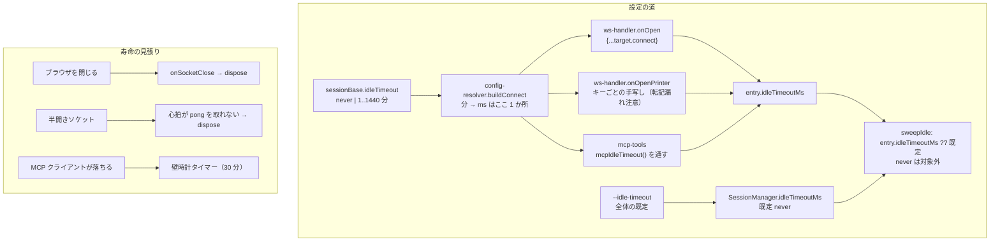
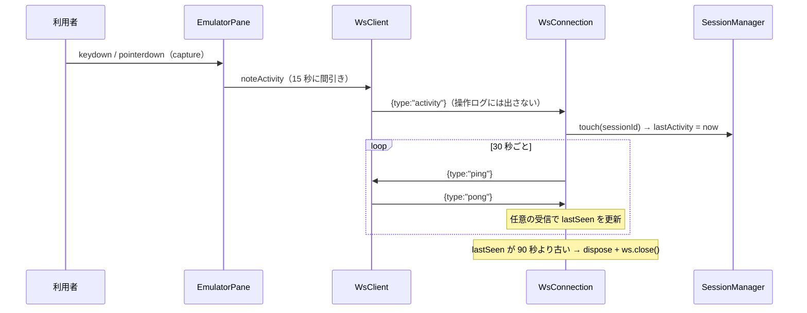

# レビューガイド: セッションの寿命（アイドルタイムアウト・永続）

## 変更概要 / 目的

**無操作でセッションを切る既定（30 分）を「切らない」に変え、セッション設定で時間を選べるようにした。**

`SessionManager` のアイドル掃除は既定 30 分で、**どこからも設定できなかった**。一方
`ws-handler.onSocketClose()` が WS 切断でセッションを破棄しているため孤児は残らず、
掃除が実際に殺していたのは**ブラウザが開いている＝在席している利用者**だった。
加えてアイドル対話ジョブの扱いは本来ホストの管轄（`QINACTITV`。多くの環境で `*NONE`）で、
30 分で切るのは**ホストの方針を先取りして上書きする**行為だった（ACS も放置で切れない）。

## 特に見てほしい所

### 1. backlog の前提が半分間違っていた（decisions D1）

backlog は「孤児回収は `onSocketClose` が担うので壁時計タイマーは重複」と結論していた。
**`sessions.open()` の入口は 2 つある**（`ws-handler.ts:186` / `mcp-tools.ts:287`）。
**MCP には切断の通知が無い**（ツール呼び出しごとの HTTP）ため、MCP セッションを回収していたのは
壁時計タイマー**だけ**だった。一律に永続にすると `maxSessions`（既定 8）を食い潰す。

→ **既定を入口ごとに分けた。** MCP は `orphanSafeIdleTimeoutMs()` で `"never"` を 30 分に落とす。
設定の**有限値は両方の入口で尊重**する。「設定どおりに動く」の例外はここ 1 点だけで、
`sessionLog.warn` に出す（黙って曲げない）。

### 2. 「設定どおり」を字面で終わらせない（spec 方針4 / decisions D4・D7）

有限値を選ぶと**設定した時間より早く切れる**経路があった。打った文字は AID キーまで
送らないので、サーバーからは打鍵中が無操作に見え、**未送信の入力ごと切られる**。
`{type:"activity"}`（**payload なし**）を 15 秒に間引いて送る。

**最初の実装は間違っていた**——`onEdit` / `onCursor` から出していたが、
`ScreenGrid.onInputFocus` が `cursor` を emit するため**ホスト発の画面更新でも飛ぶ**。
それを在席と数えると「閉じ忘れたタブが永久に生き残る」＝要件が明文で禁じた状態になる。
既存テスト 15 件が落ちたことで気づいた。**DOM の生イベント（capture）**に変えた。

### 3. 永続の代償としての死活監視（decisions D3）

既定が永続になると、半開きソケット（TCP が死んでいるのに close イベントが来ない）で
セッションが**永久に**残る。アプリ層のハートビート（`ping`/`pong`。30 秒・無応答 90 秒）を足した。
プロトコル層の ping（`ws.raw.ping()`）を使わないのは、`WsSender` が `send`/`close` だけの
薄い境界でモックを差せる形になっており、生ソケットを掴むと単体テストが書けなくなるため。

**生存の更新は「任意の受信」**で行う（`pong` 専用にしない）。キー送信が流れている最中に
心拍を 3 回取りこぼしただけで生きている接続を切ってしまうため。

## 処理フロー

## 主要な変更箇所

- `packages/server/src/session-manager.ts:841` — `sweepIdle()` が**エントリごと**に判定する
  （共通 cutoff を 1 つ作ると設定が効かない）。`limit !== "never"` が永続を外す
- `packages/server/src/session-manager.ts:88` — `orphanSafeIdleTimeoutMs()`。
  **`"never"` を通さない**唯一の場所。理由が JSDoc にある
- `packages/server/src/session-manager.ts:831` — `touch()`。所有者検査をしない理由を明記
- `packages/server/src/ws-handler.ts:146` — `startHeartbeat()`。**死判定を ping の前に**行う
  （後にすると 1 周期ぶん遅れる）
- `packages/server/src/ws-handler.ts:90` — `handle()` の先頭で `lastSeen` を更新（任意の受信）
- `packages/server/src/ws-handler.ts:239` — **プリンター経路の転記**。ここはキーごとの手写しなので
  足し忘れると「表示だけ効く」状態になる
- `packages/server/src/config-types.ts:128` — `idleTimeoutSchema`。`0` も `null` も使わず、
  未設定 / 永続 / 有限を型で三分する
- `packages/server/src/mcp-tools.ts:1108` — `mcpIdleTimeout()`。曲げたときに warn を出す
- `packages/web-ui/src/components/EmulatorPane.vue:713` — 合図の出所。
  **合成イベントを使ってはならない**理由が JSDoc にある
- `packages/web-ui/src/ws-client.ts:75` — `ping` への自動 `pong`。この層で完結させる
- `packages/web-ui/src/ws-client.ts:8` — `QUIET_TYPES`。心拍で操作ログを埋めない

## リスク / 確認してほしい点

- **既定の変更は挙動の変更**です。これまで 30 分で切れていたブラウザセッションが切れなくなります。
  共有サーバーで困る場合は `--idle-timeout 30` で戻せます（README に追記済み）
- **MCP だけ既定が違う**点（30 分）に納得できるかを見てください。理由は decisions D1。
  「設定どおりに動く」を 1 点だけ曲げています
- **実機検証済み**（`scripts/verify-browser-idle.mjs`・11/11）。既定は 110 秒放置でも切れず
  （＝心拍の往復も成立）、`idleTimeout: 1` は放置で 60 秒で切れ、**同じ設定でも打鍵していれば
  95 秒切れません**。長い有限値（30 分・60 分）の実時間経過は試しておらず、判定は注入した `now()` で
  検証しています（同じ `expired()` を通ります）
- **空振り検証は 28/28** 全て検出。初回に空振りした 3 件はいずれも検証の作りの問題で、
  1 件は**実装側の死んだコード**（`delete form.idleTimeout`）を炙り出しました（test-result.md）
- **既存テスト 9 ファイルに手を入れています**。実装の欠陥ではなく、
  `client: {} as WsClient` という嘘の seed（Vue がエラーを飲み込んで緑のまま
  unhandled error を出していた）と、`sent` に内部往復が混ざるようになった分の除外です
