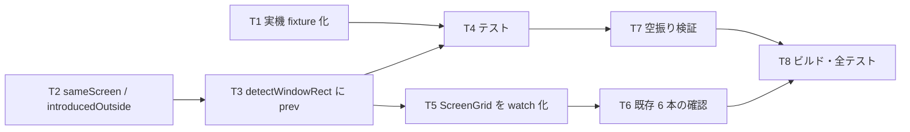

# 計画: 前画面との差分でウィンドウ判定の誤検出（③）を消す

## subtask 分割の判定: 分割しない

`fkeyLegend.ts` の 2 関数追加＋ `ScreenGrid.vue` の配線＋テスト。1 PR に収まる不可分の変更。

## 実装方針

**純関数（`fkeyLegend.ts`）を先に固め、テストで裏を取ってから UI の配線に触る。**
配線（`ScreenGrid.vue` の watch 化）は判定ロジックより壊したときの影響が読みにくいので後に置く。

fixture を最初に作るのは、判定ロジックのテストがそれ無しには書けないため。

## 作業順序と依存関係

1. **T1** fixture 化（依存: なし）
2. **T2** 純関数の追加（依存: なし）
3. **T3** `detectWindowRect` への配線（依存: T2）
4. **T4** テスト（依存: T1, T3）
5. **T5** `ScreenGrid.vue` の watch 化（依存: T3）
6. **T6** 既存 6 本の確認（依存: T3, T5）
7. **T7** 空振り検証（依存: T4）
8. **T8** ビルド・全テスト（依存: 全部）

## リスク / 留意点

| # | リスク | 対応 |
|---|---|---|
| R1 | `prev` を必須にすると既存 6 本が全滅する | 任意引数にし、不在時は即座に候補を返す。T6 で確認 |
| R2 | 内側矩形で比較すると窓 8/9 を落とす（実測済み） | 外周を含めた矩形で測る。T4 の実機 fixture が守る |
| R3 | `文字→空白` を変化に数えると 3 件落とす（実測済み） | 空白化は無視。T4 が守る |
| R4 | `decoWindow` の computed 内で前画面を覚えると、設定 OFF→ON で古い画面と比較する | 判定を watch へ移す（spec 方針4） |
| R5 | 無変化な再描画で窓と誤判定する（合成で再現済み） | `sameScreen` なら判定を更新しない |
| R6 | `ScreenGrid.vue` は大きく、watch 化で既存の描画が壊れうる | `decoWindow` の**戻り値の形は変えない**。既存の window 系テスト 6 本＋ ScreenGrid のテスト全体で確認 |
| R7 | fixture が大きい（実機 34 対で 612KB） | 窓 9 対＋通常の代表数対に絞る |

## テスト方針

- **新規 `window-prev-diff.test.ts`**
  - 実機 fixture: 本物の窓が**9/9 検出される**（R2・R3 の回帰資産）
  - ③ への遷移（合成）が `null`
  - `sameScreen`: 同一画面で true、1 セット違えば false
  - `prev` 無しで現行と同じ結果（R1）
- **既存資産**: `window-view` / `stacked-window` / `reverse-frame-window` /
  `pane-cursor-window` / `window-write-extent` / `real-help-window` の 6 本。
  **パッケージ dir から実行**する（AGENTS.md）
- **空振り検証**: 裏取りの呼び出しを外して ③ のテストが落ちることを確認する
- **ビルド**: `npm run build -w @as400web/web-ui`（vue-tsc 込み）
