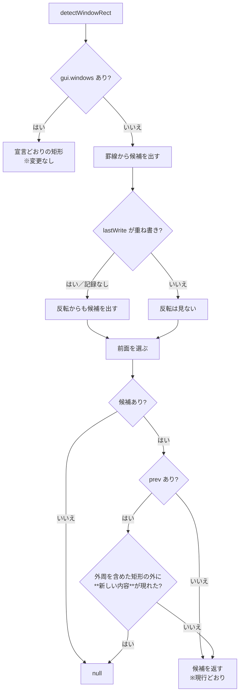

# 仕様: 前画面との差分でウィンドウ判定の誤検出（③）を消す

## 概要

`detectWindowRect` に**前画面を任意引数**で渡せるようにし、罫線・反転が出した候補矩形に対して
**「外周を含めた矩形の外側に、新しい内容が現れていないか」**を検査する。現れていれば窓ではない。

呼び出し側（`ScreenGrid.vue`）は直前の snapshot と直近の判定結果を保持し、
**画面が前回と完全に同じなら判定を更新しない**。

## 設計方針

### 方針1: 比較範囲は候補矩形の「外周」を含める

`detectWindowRect` が返すのは**枠の内側**。そのまま外側を測ると**新しく描かれた枠自体**が
変化として数えられ、実測で本物の窓 9 件中 8 件を落とした。

外周は `{row1-1, row2+1, col1-1, col2+1}`。罫線経路の戻り値
（`{row1: top+2, row2: bottom, col1: from+1, col2: to-1}`）から枠の行・桁をちょうど復元する。

### 方針2: 「新しい内容が現れた」だけを変化とみなす

外周を含めても残った差分は**すべて `文字→空白`** だった
（実測: WRKACTJOB 3・WRKOBJPDM 3・WRKSPLF 14 セル）。
**窓の枠が DBCS 文字の片割れを潰した跡**で、縁の 1〜3 桁に限って出る。

そこで「現在が空白かつ非反転」のセルは比較から除く。これで実測 9/9 が通る。

> 余裕（margin）を広げる案も測ったが、margin 2 でも 2 件残り、かつ判別力を削る。
> 「何が起きているか」に即した条件（空白化は無視）の方が値の選び方に根拠がある。

### 方針3: 画面が完全一致なら判定を更新しない

同じ画面が無変化で再描画されると枠外も無変化になり、窓と誤判定する（合成データで再現）。
**情報が増えていないのに判定を変える理由が無い**ので、呼び出し側が前回の結論を保つ。

### 方針4: 状態は `ScreenGrid.vue` の watch で持つ（computed に入れない）

`decoWindow` は computed で、`windowFrame === "none" && windowBackdrop === "none"` のとき
**早期 return する**。computed 内で前画面を覚えると、設定を OFF→ON した瞬間に
**古い画面と比較**してしまう。

→ 判定は `watch` で行い結果を `ref` に持つ。`watch` のコールバックは
**第 2 引数で前の値**を受け取れるので、前画面は自然に手に入る。
`decoWindow` は設定のガードを見てその ref を返すだけにする。

`displayChar` が依存する props（`showShiftMarks` / `sbcsView`）も watch 対象に含める
（設定変更で表示文字が変わると罫線の見え方が変わるため）。

### 方針5: 先行作業の `WriteExtent` 経路はそのまま残す

反転経路の裏取り（`isOverlayWrite`）は実測で裏付いており、前画面差分と二重に効いても
矛盾しない（Attn の窓は両方の条件を通る）。**消さない**。

## 対象範囲

| ファイル | 変更内容 |
|---|---|
| `packages/web-ui/src/composables/fkeyLegend.ts` | `detectWindowRect` に `prev` 引数、`introducedOutside()` を追加 |
| `packages/web-ui/src/components/ScreenGrid.vue` | 判定を watch へ移し、前画面・前回結論を保持 |
| `packages/web-ui/test/fixtures/window-prev-diff/*.json` | 実機の (前画面, 現画面) 対（代表のみ） |
| `packages/web-ui/test/window-prev-diff.test.ts` | 新規 |

## インターフェース / データ構造

```ts
// fkeyLegend.ts

/**
 * 最前面の窓の内側を返す。
 * @param prev 直前の画面。渡すと「枠の外に新しい内容が現れたか」で候補を裏取りする。
 *             **省略時は現行と完全に同じ挙動**（既存のテスト資産は前画面を持たない）
 */
export function detectWindowRect(
  snap: ScreenSnapshot,
  charOf?: CharOf,
  prev?: ScreenSnapshot | null
): WindowRect | null;

/** 2 つの画面が表示上まったく同じか（判定を更新すべきでないことの検査に使う） */
export function sameScreen(a: ScreenSnapshot, b: ScreenSnapshot, charOf?: CharOf): boolean;
```

## 振る舞いの詳細



`introducedOutside(prev, cur, rect, charOf)`:

```
外周 = { row1-1, row2+1, col1-1, col2+1 }
外周の外側の各セルについて:
  現在が「空白かつ非反転」なら飛ばす   ← 枠が DBCS の片割れを潰した跡
  表示文字か反転が前画面と違えば true
すべて通れば false
```

画面サイズが前後で違う場合（24x80 ⇄ 27x132）は比較できないので **`prev` を無視**して
現行どおりの結果を返す。

### `ScreenGrid.vue` 側

```ts
/** 直近の判定結果。前画面との差分を見るので computed ではなく watch で更新する */
const detectedWindow = ref<WindowRect | null>(null);
watch(
  () => [props.snapshot, props.showShiftMarks, props.sbcsView] as const,
  ([snap], old) => {
    const prev = old?.[0];
    // 画面が前回とまったく同じなら情報が増えていない。前回の結論を保つ
    if (prev && prev !== snap && sameScreen(prev, snap, displayChar)) return;
    detectedWindow.value = detectWindowRect(snap, displayChar, prev ?? null);
  },
  { immediate: true, deep: false }
);
```

`decoWindow` は設定ガードのあと `detectedWindow.value` を返すだけにする。

## エラー処理 / 異常系

- **前画面なし**（接続直後・`immediate` の初回）: `prev` は `undefined` → 現行どおり。
- **画面サイズが変わった**: 比較を諦めて現行どおり（`introducedOutside` が false を返す）。
- **候補矩形が画面端に接する**: 外周が画面外へはみ出しても、走査は画面内のセルだけを見るので安全。
- **`windowFrame`/`windowBackdrop` が none**: 判定自体は走り続ける（watch は設定に依らない）。
  描画しないだけなので、設定を ON にした瞬間から正しい結論が使える。

## 受け入れ基準との対応

| requirement の完了条件 | 満たし方 |
|---|---|
| `prev` 不在時は現行と同一 | `if (!prev) return candidate;` の 1 行。既存 6 本のテストで担保 |
| 実機の窓 9/9 が検出される | 実機 fixture を回帰テストに入れる |
| ③ が窓と判定されない | ③ への遷移対（合成）で `null` を固定 |
| 無変化な再描画で判定が変わらない | `sameScreen` のテスト＋ ScreenGrid の watch |
| 既存 6 本が通る | 全部 `prev` を渡さない |
| 空振りでない | `introducedOutside` の呼び出しを外すと ③ のテストが落ちることを確認 |
