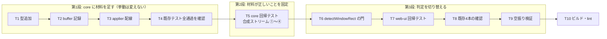

# 計画: ウィンドウ判定を「受信データの書き込み範囲」で決める

## subtask 分割の判定: **分割しない**

3層決定木（`aidev-docs/DESIGN.md`「5.」）の discriminator は「そのピースは単独で検証・
デリバリ可能か」。本作業は次の理由で**不可分**と判定する。

- core の記録だけを入れても**利用者から見た振る舞いは何も変わらない**（判定を切り替えて初めて価値が出る）
- 判定の切り替えだけを先に入れることは**できない**（材料が無いため）
- 規模も 1 PR に収まる（core 3 ファイル＋web-ui 1 ファイル＋テスト 2 本）

→ 単一 `tasks.md` で進める。過剰分割はしない。

## 実装方針

spec の「段階的な着手」をそのままタスク順にする。**判定の切り替えを最後に置く**のが要点で、
core の改修が既存挙動を壊していないことを先に確定させてから、初めて web-ui を触る。

**T4 が関門**。ここで既存テストが落ちるなら、記録の入れ方（特に `nullNonBypass` を数えない判断、
`restoreScreen` を全画面扱いにする判断）を見直してから先へ進む。

## 作業順序と依存関係

1. **T1** 型の追加（依存: なし）
2. **T2** buffer への記録実装（依存: T1）
3. **T3** applier への配線（依存: T2）
4. **T4** 既存テスト全通過の確認（依存: T3）— **関門**
5. **T5** core 側の回帰テスト（依存: T3）
6. **T6** `detectWindowRect` の門（依存: T5。材料の正しさを確定してから触る）
7. **T7** web-ui 側の回帰テスト（依存: T6）
8. **T8** 既存 4 本の確認（依存: T6）
9. **T9** 空振り検証（依存: T7）
10. **T10** ビルド・lint（依存: 全部）

## リスク / 留意点

| # | リスク | 対応 |
|---|---|---|
| R1 | 既存 4 テストが書き込み範囲を持たない（research F5） | `lastWrite` を任意にし、不在時は現行経路へ完全フォールバック。T8 で確認 |
| R2 | CC1 の `nullNonBypass` を数えると矩形が全画面へ膨らむ | 数えない（spec 方針4）。理由を `buffer.ts` にコメントで残す |
| R3 | 書き込み無しレコードで窓が消える | 書き込み・CLEAR・RESTORE のいずれも無ければ前回値を残す（spec 方針3）。T5 で固定 |
| R4 | 窓側の実データが無い（research F7） | 合成ストリームで組む。core に前例あり（`save-screen.test.ts` 等） |
| R5 | 下限（高さ3・幅8）が本物の窓を弾く | 既存 4 テストの窓（`window-stack` fixture の実機採取窓）で確認する。ただしこれらは `lastWrite` を持たないため門を通らない＝T5 の合成ケースで担保する |
| R6 | `eraseRange` の矩形畳み込みで行またぎを誤る | 行またぎは全幅扱いにする（spec）。T5 で境界ケースを固定 |

## テスト方針

- **core（`packages/core/test/write-extent.test.ts`）**: 合成データストリームを組み、
  `applyDataStream` 後の `lastWrite` を検証する。
  - ① 窓: SAVE SCREEN → CLEAR なしで部分書き込み → `rect` が窓の範囲・`cleared=false`
  - ② 通常画面: CLEAR UNIT → 全画面書き込み → `cleared=true`
  - ③ 帳票（左右に `:`）: CLEAR UNIT → 全画面書き込み → `cleared=true`
  - ④ 反転バナー: CLEAR UNIT → 全画面書き込み → `cleared=true`
  - 書き込み無しレコード → 前回値が残る（R3）
  - `eraseRange` の行またぎ → 全幅（R6）
  - RESTORE SCREEN → `restored=true`
- **web-ui（`packages/web-ui/test/window-write-extent.test.ts`）**:
  `detectWindowRect` に `lastWrite` 付き snapshot を渡し、③④ が `null`・① が従来の矩形を返すことを固定。
  `lastWrite` 無しの snapshot で**現行と同じ結果**になることも 1 ケース置く（フォールバックの担保）。
- **既存資産**: `window-view` / `stacked-window` / `reverse-frame-window` / `pane-cursor-window`
  の 4 本を改修前後で比較する。
  - **web-ui のテストはパッケージ dir から実行する**（AGENTS.md。ルートからだと偽陽性が出る）
- **空振り検証**: T6 の門を一時的に外して ③④ のテストが落ちることを確認し、結果を PR に書く。
- **ビルド**: `npm run build -w @as400web/web-ui`（`vue-tsc -b && vite build`）でテンプレート型も通す（AGENTS.md）。
