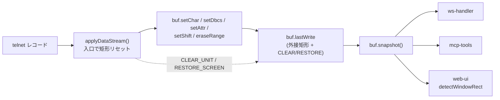

# 調査: ウィンドウ判定を受信データの書き込み範囲で決める

## 調査の問い

- Q1: 書き込みは本当に buffer の 4〜5 箇所に集約されているか（backlog の前提）
- Q2: 「レコード」の境界はどこか。矩形をリセットする単位は何か
- Q3: 通常画面と窓は、書き込み範囲／CLEAR で実際に区別できるか（**実データで測る**）
- Q4: `snapshot()` はどこから呼ばれるか。矩形をどこに保持すべきか
- Q5: 既存 4 テストは何を材料に snapshot を組んでいるか（改修で壊れないか）
- Q6: ローカル入力（利用者のキー入力）が矩形を汚さないか
- Q7: 実測 4 画面（①〜④）の再現データは入手できるか

## 判明した事実

### F1: 書き込み経路は 4〜5 箇所ではない（backlog の過少見積り）

`this.cells[...]` への書き込みを全数えした結果、**ホスト由来の経路は 8 つ**ある
（`packages/core/src/screen/buffer.ts`）。

| # | 経路 | 行 | 種別 | 矩形への寄与 |
|---|---|---|---|---|
| 1 | `setChar` | 428 | 通常描画 | 1 セル |
| 2 | `setShift` | 435 | SO/SI 制御桁 | 1 セル（**backlog に記載なし**） |
| 3 | `setDbcs` | 445-446 | DBCS | 2 セル |
| 4 | `setAttr` | 452 | 属性 | 1 セル |
| 5 | `eraseRange` | 461 | EA/RA 等 | 範囲 |
| 6 | `blankWindowArea` | 221 | CREATE_WINDOW の下地消し | 矩形（**直接書き**） |
| 7 | `nullNonBypass` | 680 | WTD の CC1 | 全欄（**直接書き**） |
| 8 | `restoreScreen` | 392 | RESTORE SCREEN | `cells` 丸ごと差し替え |

加えて `clearUnit`(359) / `clearUnitAlternate`(298) は `resize`(137→140) 経由で
`cells` を新規配列に差し替える＝**全画面クリア**。

**1〜5 に計装を入れるだけでは 6〜8 を取りこぼす。** うち実害があるのは:

- **7 (`nullNonBypass`)**: WTD の CC1 で非 bypass 欄を null 化する。画面中に散った入力欄を
  消すため、これを「書き込み」に数えると**矩形が全画面へ膨らみ、本物の窓を弾く**恐れがある
- **8 (`restoreScreen`)**: 窓を閉じるとき（ESC 0x12）に来る。全画面差し替えなので
  **全画面書き込みとして数えるのが正しい**（窓が閉じた＝窓ではない、と自然に判定される）

### F2: レコード境界＝`applyDataStream` の 1 回の呼び出し

- `applyDataStream(data, buf, codec, warn)`（`wtd-applier.ts:56`）は
  **telnet レコード 1 本**を受け取り、`while (r.remaining > 0)` で**その中の複数コマンド**
  （CLEAR_UNIT / WTD / SAVE_SCREEN / WSF …）を順に処理する
- 呼び出しは `session.ts:424` の 1 箇所のみ。`parseRecord(record).data` を渡している
- したがって**矩形のリセット位置は `applyDataStream` の入口**で確定できる（分岐なし）
- 実データでも **1 レコード＝1 画面**が成り立っていた（F3）

### F3: 実測 — 通常画面は 96〜100% ＋ CLEAR 必発（決定的）

リポジトリ同梱の**実機採取レコード**（`packages/core/test/fixtures/*.jsonl`。pub400 で採取）を
core の `applyDataStream` に再生し、buffer の書き込みメソッドを差し替えて
「実際に書かれたセル」の外接矩形を測った（＝実装が取るのと同じ方式）。

| fixture | レコード | 外接矩形 | 面積比 | CLEAR |
|---|---|---|---|---|
| `pub400-signon-to-menu` | rec0（サインオン画面） | r1-24, c1-80 | **100%** | **あり** |
| 〃 | rec1（メニュー） | r1-24, c1-80 | **100%** | **あり** |
| `pub400-autosignon-menu` | rec2（メニュー） | r1-24, c1-80 | **100%** | **あり** |
| `pub400-jobinfo` | rec2 | r1-24, c1-80 | **100%** | **あり** |
| 〃 | rec3 | r1-23, c1-80 | **96%** | **あり** |
| 〃 | rec4 | r1-23, c1-80 | **96%** | **あり** |

**判明した 2 点:**

1. **通常の全画面遷移には CLEAR が必ず付いていた**（6/6）。窓は SAVE SCREEN の上に
   CLEAR なしで描く（`buffer.ts:212` のコメントが実機 GRIDCL7 で確認済みと記す）ので、
   **CLEAR の有無だけでもかなり強い材料**になる
2. **全画面でも 96% に留まることがある**（メッセージ行 r24 を書かないケース）。
   よって「面積 100% なら通常画面」のような厳密判定は使えない。**閾値が要る**

> 注意: 当初 diff（適用前後の差分）で測ったところ rec1 は 83%・変化セル 82 と出た。
> **「書いたが値が同じ」セルを取りこぼす**ため、diff ではなく**書き込みそのもの**を
> 記録する必要がある（実装方針の裏付け）。

### F4: `snapshot()` は 15 箇所以上から呼ばれる → 矩形は buffer に保持する

`session.ts` 内だけで 9 箇所、`ws-handler.ts` / `mcp-tools.ts` / `screen-recorder.ts` /
`signon.ts` からも呼ばれる。**適用直後とは限らない**ため、
「snapshot 生成時に計算する」形は取れない。**buffer が最後のレコードの矩形を保持し、
`snapshot()` はそれを写すだけ**にする必要がある。

### F5: 既存 4 テストは書き込み範囲を持たない snapshot を組む（**最重要の制約**）

| テスト | snapshot の作り方 | 書き込み範囲 |
|---|---|---|
| `reverse-frame-window.test.ts` | `snapOf(...)` で手組み | **無し** |
| `window-view.test.ts` | `snapOf(CHAR_WINDOW)` / `guiWindowSnap()` で手組み | **無し** |
| `pane-cursor-window.test.ts` | `snap(windows)` で手組み | **無し** |
| `stacked-window.test.ts` | `fixtures/window-stack/*.json`（**描画済みテキスト**） | **無し** |

`window-stack` の fixture は `{rows, cols, lines:[{text, rev, und, kind}]}` 形式＝
**レンダリング結果**であり、データストリームではない。

→ **書き込み範囲を「必須の第一級条件」にすると既存 4 本が全滅する。**
受け入れ基準「既存 4 本が改修前と同じく通る」を満たすには、
**新フィールドを任意（optional）にし、`detectWindowRect` は不在時に現行ヒューリスティックへ
フォールバック**しなければならない。これは spec の必須要件。

### F6: ローカル入力は矩形を汚さない（好都合）

利用者のキー入力は `setFieldValue`（`buffer.ts:544-554`）が `this.cells[...]` を
**直接**書き換える経路で、`setChar` を通らない。よって 1〜5 に計装しても
ローカル入力は矩形へ入らない。加えて矩形は `applyDataStream` 入口でリセットされるので、
**「最後にホストが書いた範囲」**という意味が保たれる。

### F7: 実測 4 画面（①〜④）の再現データは**入手できていない**

- `scripts/probe-window-signal.mjs`（未追跡）が 2026-07-28 のこの調査用スクリプト。
  実行したところ**サインオン画面で停止**した。原因は DBCS のテール桁（`char === ""`）を
  空白へ置換しているため、画面文字列が `サ イ ン ・ オ ン` となり
  `includes("サイン")` が一致しないこと（`diag-window-fkey.mjs:34` は
  `c.char` をそのまま join していて正しい）
- さらに **認証情報が無い**。`connections.json` にユーザー/パスワードは保存されておらず
  （`hasPw: false`）、`.env` は `AS400_SECRET_KEY` のみ。**実機での窓の採取は現時点で不可**
- 窓の実機記録として残っているのは `packages/web-ui/test/fixtures/window-stack/*.json`
  （ov-file/lib/opt × help/attn、rev-attn-then-help）だが、**描画結果**なので
  書き込み範囲は含まない

→ 窓側の回帰テストは**合成データストリーム**で組む。前例があり無理はない
（`packages/core/test/save-screen.test.ts` / `window-backdrop.test.ts` /
`wdsf-applier-grid-lines.test.ts` が同様に手組みのストリームで検証している）。

## 影響範囲

- **core**
  - `packages/core/src/screen/buffer.ts`: 書き込み記録の追加（F1 の 8 経路）、`snapshot()` へ載せる
  - `packages/core/src/protocol/wtd-applier.ts`: `applyDataStream` 入口でのリセット、`ApplyResult` への追加
  - `packages/core/src/screen/types.ts`: `ScreenSnapshot` に任意フィールド追加
- **web-ui**
  - `packages/web-ui/src/composables/fkeyLegend.ts`: `detectWindowRect` の判定順序
  - 呼び出し側 `ScreenGrid.vue` の `decoWindow` は**変更不要**の見込み（戻り値の形は変えない）
- **snapshot の他の消費者**（`ws-handler` / `mcp-tools` / `screen-recorder` / `signon` /
  printer 系）は任意フィールド追加なので影響なし

## 実現性 / リスク

- **実現性は確認済み**。buffer のメソッドを差し替えて矩形を採る方式を実データで動かし、
  F3 の測定値を得た。本実装は同じことを内側で行うだけ
- **性能**: 追加は min/max 更新のみ（`setChar` 1 回あたり数命令）。`eraseRange` は
  既存ループの外で 2 回の min/max 更新に畳める。dirty ビットマップ等は不要
- **リスク R1（高）**: 既存 4 テストは書き込み範囲を持たない（F5）。任意フィールド＋
  フォールバックにしないと受け入れ基準を満たせない
- **リスク R2（中）**: CC1 の `nullNonBypass`（F1 の 7）を書き込みに数えると、
  窓を開く WTD が CC1 を伴う場合に矩形が全画面へ膨らむ。**数えない**方が安全だが、
  実機データで CC1 の実際の使われ方を確認できていない
- **リスク R3（中）**: 窓側の実データが無い（F7）。合成ストリームで組むため、
  「実機の窓が本当に部分書き込みか」は**リポジトリ内の既存の実機知見**
  （`buffer.ts:212` の GRIDCL7 コメント、SAVE SCREEN → 窓描画 → RESTORE SCREEN の流れ）に依拠する
- **リスク R4（低）**: 全画面でも 96% のことがある（F3）。閾値の置き方を誤ると通常画面を窓と誤る

## spec への申し送り

1. **新フィールドは任意にし、不在時は現行判定へフォールバックする**（F5・R1）。これは
   受け入れ基準に直結する必須事項
2. **CLEAR の有無を第一級の材料として使う**（F3）。実データ 6/6 で通常画面に CLEAR が付いていた。
   「CLEAR あり → 窓ではない」は面積比より頑健
3. **矩形は buffer に保持し `snapshot()` が写す**（F4）。snapshot 時計算は不可
4. **計装は 8 経路すべてを検討する**（F1）。特に `restoreScreen` は全画面扱いにする。
   `nullNonBypass` は**数えない**方針を推奨（R2）——数える理由が実データで示せていない
5. **面積の閾値**は 100% ではなく余裕を持たせる（F3 の 96% 実例）。
   併せて「小さすぎる更新」の下限も置く（メッセージ行だけの更新を窓と誤らないため）
6. **窓側の回帰テストは合成ストリームで組む**（F7）。既存 core テストに前例あり
7. **補助条件**（入力欄が矩形内に収まるか）は `snap.fields` で安価に足せる。core 改修を待たない
8. **未解決のまま spec へ送る**: 実機での窓レコードの採取（認証情報が要る）。
   採れれば R3 が消えるが、**本作業のブロッカーにはしない**（合成で組める）

## 付随して見つかった修正候補（本作業のスコープ外）

- `scripts/probe-window-signal.mjs` の DBCS テール桁バグ（F7）。未追跡ファイルのため触っていない
- `.aidev/backlog/field-input.md` の「ローカル編集キー」節は**実装済みなのに未チェック**
  （`useKeymap.ts:16` の `LOCAL_EDIT_ACTIONS`、`keybindings.ts:65-67` の既定バインド）。
  未実装で残るのは Field− / Field+ のみ
