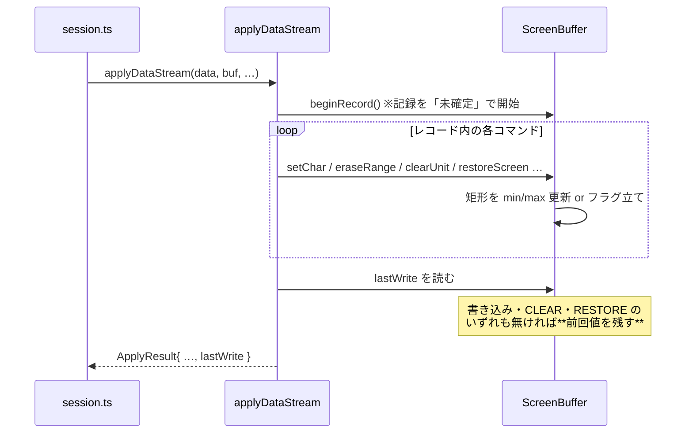
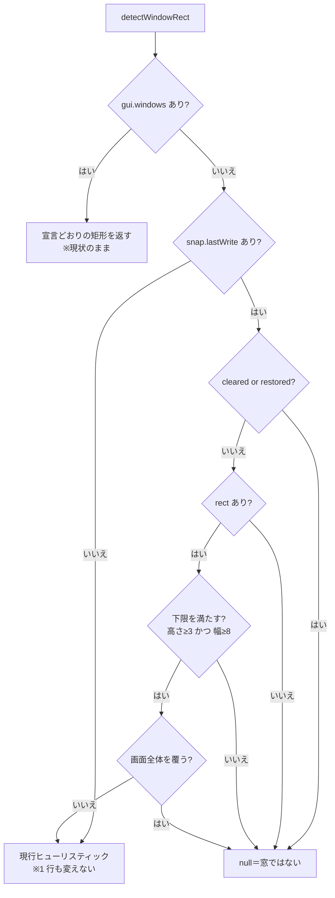

# 仕様: ウィンドウ判定を「受信データの書き込み範囲」で決める

## 概要

core が**レコード 1 本ごとに「ホストが書いたセルの外接矩形」と「CLEAR / RESTORE を通ったか」**を
記録し、`ScreenSnapshot` に**任意フィールド**として載せる。web-ui の `detectWindowRect` は
その情報がある場合に限り、**窓ではないことが確定する条件で門前払い**する。

罫線検出・反転検出は残すが、役割を「窓かどうか」から「**枠がどこか**」へ降格させる。

## 設計方針

### 方針1: CLEAR の有無を第一級の材料にする（面積比ではなく）

research F3 の実測が根拠。実機採取レコードの**通常の全画面遷移 6/6 すべてに CLEAR が付いていた**
一方、窓は SAVE SCREEN の上に CLEAR なしで描く（`buffer.ts:212` の実機 GRIDCL7 由来コメント）。

面積比を主条件にしない理由は 2 つ:

- 通常画面でも **96%** に留まることがある（メッセージ行を書かないケース。実測 `pub400-jobinfo` rec3/rec4）
- 逆に**全画面に近い大きな窓**も実在する（ヘルプ窓は画面の大半を覆う）

面積は「小さすぎる更新」を弾く**下限**にのみ使う。

### 方針2: 新フィールドは任意にし、不在時は現行判定へ完全にフォールバックする

research F5 が根拠。既存 4 テストはすべて**手組み snapshot／描画済み fixture**で、
書き込み範囲を持たない。必須にすると 4 本とも壊れ、受け入れ基準を満たせない。

`detectWindowRect` の新しい門は `if (snap.lastWrite)` の内側だけに置く。
**不在なら 1 行も挙動が変わらない。**

### 方針3: 書き込みが無いレコードは直前の範囲を保持する（**取りこぼし防止**）

ホストは「窓を描くレコード」と「入力を待つだけのレコード」を別々に送ることがある。
素直に毎レコードで上書きすると、後続の書き込み無しレコードで**窓が消える**。

→ レコード中に**書き込み・CLEAR・RESTORE のいずれも無かった場合は、前回の値を残す**。

### 方針4: `nullNonBypass`（CC1）は書き込みに数えない

research R2。CC1 は画面中に散った入力欄を null 化するため、数えると
**矩形が全画面へ膨らみ本物の窓を弾く**。「数えるべき」という根拠が実データで示せていない以上、
安全側（数えない）に倒す。`buffer.ts` に理由をコメントで残す。

### 方針5: 計装は buffer の内部に閉じる（呼び出し側に散らさない）

research F1 の 8 経路すべてを `buffer.ts` の中で拾う。`wtd-applier` 側は
**レコードの開始を伝える 1 行**だけを足す。判定材料の出どころを 1 か所に保つ。

## 対象範囲

| ファイル | 変更内容 |
|---|---|
| `packages/core/src/screen/types.ts` | `WriteExtent` 型を追加、`ScreenSnapshot.lastWrite?` を追加 |
| `packages/core/src/screen/buffer.ts` | 書き込み記録（8 経路）、`beginRecord()`、`snapshot()` へ載せる |
| `packages/core/src/protocol/wtd-applier.ts` | 入口で `buf.beginRecord()`、`ApplyResult.lastWrite` を返す |
| `packages/web-ui/src/composables/fkeyLegend.ts` | `detectWindowRect` に門を追加 |
| `packages/core/test/write-extent.test.ts` | 新規。core 側の記録の検証 |
| `packages/web-ui/test/window-write-extent.test.ts` | 新規。判定の回帰（③④ を弾く） |

`ScreenGrid.vue` の `decoWindow` は**変更しない**（`detectWindowRect` の戻り値の形を変えないため）。

## インターフェース / データ構造

```ts
// packages/core/src/screen/types.ts

/**
 * 直近に適用したレコードがバッファへ書いた範囲。**窓かどうかの判定材料**として web-ui へ渡す。
 *
 * 罫線からの推測では ③（左右に `:` が並ぶ帳票）④（反転バナー）を窓と誤検出する。
 * 窓かどうかは描画結果ではなく**受信データ**に出ている——本物の窓は背景を消さずに窓の領域だけ書き、
 * 通常画面は CLEAR してから画面全体を書く（実測: 通常の全画面遷移 6/6 に CLEAR が付いていた）。
 */
export interface WriteExtent {
  /** 書き込みの外接矩形（1 始まり・両端含む）。書き込みが 1 セルも無ければ省略 */
  rect?: { row1: number; row2: number; col1: number; col2: number };
  /** CLEAR UNIT / CLEAR UNIT ALTERNATE を通った */
  cleared: boolean;
  /** RESTORE SCREEN（ESC 0x12）で画面を丸ごと戻した */
  restored: boolean;
  /** 実際に書かれたセル数（矩形の面積とは別。矩形が疎かどうかを見る余地を残す） */
  cells: number;
}

export interface ScreenSnapshot {
  // …既存…
  /** 直近レコードの書き込み範囲（記録がある場合のみ。消費側は不在を許容すること） */
  lastWrite?: WriteExtent;
}
```

```ts
// packages/core/src/protocol/wtd-applier.ts
export interface ApplyResult {
  // …既存…
  /** このレコードの書き込み範囲（`ScreenSnapshot.lastWrite` と同じ値） */
  lastWrite: WriteExtent;
}
```

```ts
// packages/core/src/screen/buffer.ts（公開 API）
class ScreenBuffer {
  /** レコード適用の開始。書き込み記録をリセットする（applyDataStream の入口から呼ぶ） */
  beginRecord(): void;
  /** 直近レコードの書き込み範囲 */
  get lastWrite(): WriteExtent;
}
```

## 振る舞いの詳細

### core: 記録の対象（research F1 の 8 経路）

| 経路 | 記録内容 |
|---|---|
| `setChar` / `setShift` / `setAttr` | そのアドレス 1 セル |
| `setDbcs` | `addr` と `addr+1` の 2 セル |
| `eraseRange(from,to)` | **線形範囲を矩形へ畳む**（下記） |
| `blankWindowArea(win)` | 消した矩形の四隅 |
| `restoreScreen()` | `restored=true` ＋ 全画面を矩形とする |
| `clearUnit()` / `clearUnitAlternate()` | `cleared=true`（矩形はリセット。バッファが新品になるため） |
| `nullNonBypass()` | **記録しない**（方針4） |

`eraseRange` の畳み方（ループの外で 2 回の更新に留める。走査を増やさない）:

```
r1 = floor(from / cols), r2 = floor(to / cols)
r1 === r2 なら 桁は from%cols .. to%cols
r1 !== r2 なら 桁は 0 .. cols-1（行をまたぐので全幅に触れる）
```

### core: レコード境界と保持（方針3）



`beginRecord()` は**確定値を消さない**。作業用の記録を開始し、レコード終了時
（`lastWrite` の読み出し時、または次の `beginRecord()`）に、何か起きていた場合のみ確定値を差し替える。

### web-ui: `detectWindowRect` の門

`snap.gui.windows` がある場合の分岐は**現状のまま**（ホストの宣言が最優先）。
それ以外の経路に、以下の門を**先頭**へ足す。



門を通ったあとは**現行の罫線検出・反転検出がそのまま枠位置を決める**（降格の実体）。

判定パラメータ:

| 条件 | 値 | 根拠 |
|---|---|---|
| `cleared` または `restored` | 窓ではない | 実測 6/6（research F3）。CLEAR は通常画面の印 |
| 矩形の高さ下限 | **3 行** | 枠上・中身・枠下で最低 3 行。メッセージ行だけの更新（1 行）を弾く |
| 矩形の幅下限 | **8 桁** | 既存 `horizontalRuns` の罫線最小長 8 に合わせる（同じ尺度を 2 つ持たない） |
| 画面全体を覆う | 窓ではない | `row1===1 && row2===rows && col1===1 && col2===cols` の**完全一致のみ**。96% 事例は CLEAR で既に弾ける |

### web-ui: 補助条件（入力欄が矩形内に収まるか）

`snap.fields` が**すべて**書き込み矩形の中に収まっていない場合、窓らしさが下がる。
ただし本物の窓でも背景の欄が `fields` に残ることがある（ホストが様式を送り直さない場合）ため、
**単独で窓を否定する条件にはしない**。

→ 今回は**罫線経路と反転経路の両方が候補を出したときの優先順位付け**にのみ使う。
`containedIn` による現行の前面判定を変えない範囲で、**矩形内に収まる候補を優先**する。

## ドメイン固有の考慮

- **core は Node API 非依存**（AGENTS.md）。追加するのは数値の min/max 更新のみで抵触しない。
- **既存クライアントの挙動に合わせる**より、**ホストが送った事実を捨てない**（AGENTS.md「2.」）。
  書き込み範囲はホストが送った事実そのものなので、推測より優先するのは規約と整合する。
- **コメントは why を書く**（AGENTS.md）。特に次の 3 点は非自明なので明記する:
  - `nullNonBypass` を数えない理由（方針4）
  - 書き込み無しレコードで前回値を残す理由（方針3）
  - `lastWrite` を任意にした理由（既存 fixture が持たないため。方針2）
- **snapshot は WS/MCP へ毎回流れる**。追加は最大でも 6 個の数値＋2 個の真偽値で、
  セル配列に比べて無視できる大きさ。

## エラー処理 / 異常系

- **書き込みが 1 セルも無いレコード**: `rect` を省略し、確定値は前回のまま（方針3）。
- **CLEAR UNIT ALTERNATE で画面サイズが変わる**: 矩形はリセットされ `cleared=true`。
  判定は `cleared` で先に打ち切るので、旧サイズの座標が残って誤解される余地は無い。
- **`checkAddr` で例外**: 既存の境界チェックが先に投げる。記録は例外の前に行わない
  （**書けなかったセルを書いたことにしない**）。
- **RESTORE SCREEN で退避が空**（`restoreScreen()` が false）: 画面は変わらないので
  `restored` は立てない。
- **snapshot 消費者が `lastWrite` を知らない**: 任意フィールドなので影響なし
  （`ws-handler` / `mcp-tools` / `screen-recorder` / printer 系は素通し）。

## 受け入れ基準との対応

| requirement の完了条件 | 満たし方 |
|---|---|
| `ApplyResult` と `ScreenSnapshot` に矩形と CLEAR 有無が載る | `WriteExtent` を両方に追加（インターフェース節） |
| 既存 4 本が改修前と同じく通る | 方針2。`lastWrite` 不在時は現行経路へ完全フォールバック |
| 実測 4 画面の回帰テストがあり ③④ が窓と判定されない | ③（帳票）④（反転バナー）は通常画面＝ CLEAR 付きの合成ストリームで組み、門で null になることを固定 |
| ① は引き続き窓と判定され枠位置も従来どおり | ①（SAVE SCREEN → CLEAR なしの部分書き込み）を合成し、門を通って罫線経路が同じ矩形を返すことを固定 |
| ② は従来どおり null | 既存 `reverse-frame-window.test.ts` の否定ケースが担保。加えて ② 相当も新テストに含める |
| テストが空振りでない | 門を外すと ③④ のテストが落ちることを確認し、その旨を PR に書く（AGENTS.md／memory の運用） |

## 段階的な着手（requirement 指定の順序を守る）

1. core に記録を足し、`snapshot()` へ載せる。**既存テスト全部が通ることだけ**を確認（判定は変えない）
2. 合成ストリームで ①〜④ を起こし、core 側の `lastWrite` が期待どおりであることを固定
3. `detectWindowRect` に門を足し、③④ が null・① が従来どおりを固定

## 未解決（本作業のブロッカーではない）

- **実機での窓レコードの採取**。認証情報が無く不可（research F7）。採れれば合成ストリームの
  前提が実測で裏付く。`scripts/probe-window-signal.mjs` は DBCS テール桁の扱いにバグがあり、
  直せば使える（未追跡ファイルなので本作業では触らない）
