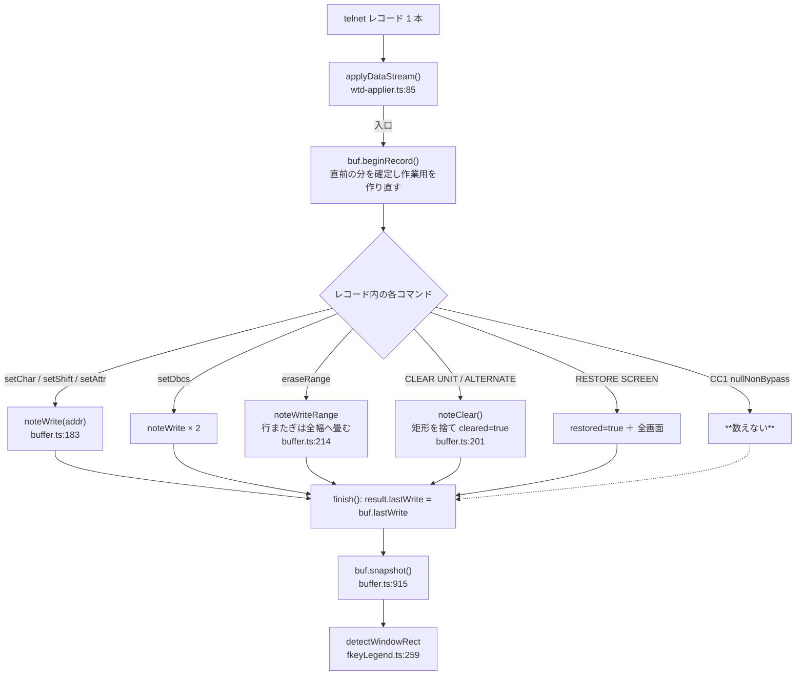
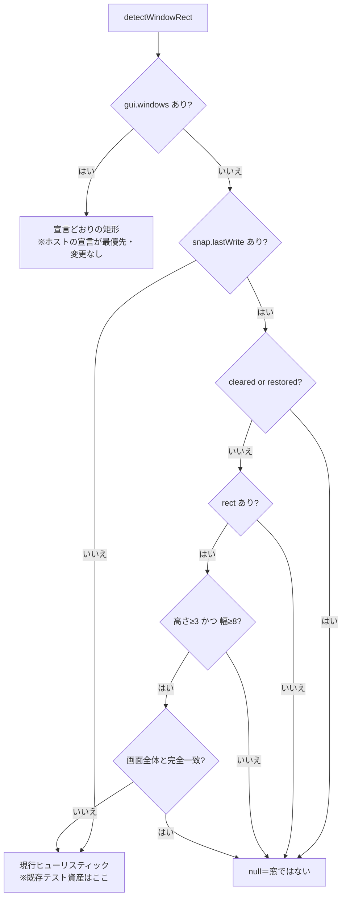
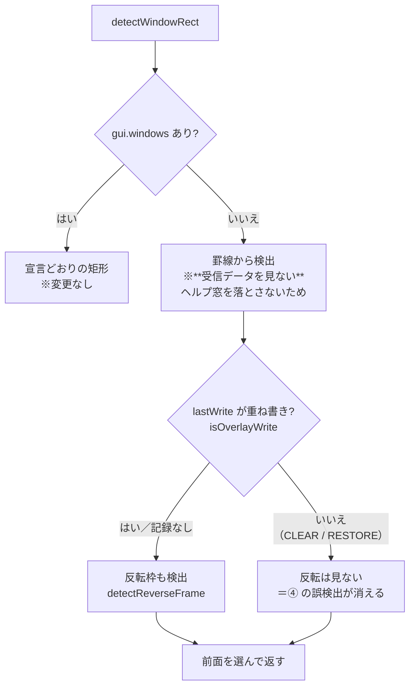

# レビューガイド: ウィンドウ判定を「受信データの書き込み範囲」で決める

> **⚠️ 実機検証（2026-07-29）で前提が半分崩れ、設計を縮小した。**
> 以下の「重要ポイント 1」は**当初の設計**を説明しており、**そのままでは通用しない**。
> 最終的な設計は末尾の「追記: 実機検証で分かったこと」を読むこと。

## 変更概要 / 目的

ウィンドウ装飾（`windowFrame` / `windowBackdrop`）を出す範囲を**画面に描かれた罫線から推測**していた。
2026-07-28 の実測で、この推測は **2 経路とも誤検出する**ことが分かっている。

| 画面 | 従来 | 誤る経路 |
|---|---|---|
| ① 本物の窓（F1 ヘルプ相当） | 検出（正） | — |
| ② 一覧画面（`---` 区切り 2 本） | null（正） | — |
| ③ 表（左右に `:` が並ぶ帳票） | **誤検出** | 罫線 |
| ④ 反転バナー（見出し行＋末尾行が反転） | **誤検出** | 反転 |

**条件を締めても直らない。根本原因は材料不足**——窓かどうかは描画結果ではなく**受信データ**に
出ているのに、その情報を core が捨てていた（`ApplyResult` にも `ScreenSnapshot` にも
書き込み範囲が無かった）。

そこで core がレコードごとに**書き込みの外接矩形と CLEAR/RESTORE の有無**を記録して snapshot に載せ、
web-ui はそれで「窓ではないことが確定する場合」を門前払いする。罫線・反転は残すが、役割を
「窓かどうか」から「**枠がどこか**」へ降格させた。

## 重要ポイント（特に見てほしい所）

### 1. 判定の第一級条件は CLEAR の有無であって、面積比ではない

**実測が根拠。** リポジトリ同梱の実機採取レコード（`packages/core/test/fixtures/pub400-*.jsonl`）を
core のパーサで再生し、buffer の書き込みを記録して測ったところ:

| fixture / レコード | 外接矩形 | 面積比 | CLEAR |
|---|---|---|---|
| `pub400-signon-to-menu` rec0 / rec1 | r1-24, c1-80 | 100% | **あり** |
| `pub400-autosignon-menu` rec2 | r1-24, c1-80 | 100% | **あり** |
| `pub400-jobinfo` rec2 | r1-24, c1-80 | 100% | **あり** |
| `pub400-jobinfo` rec3 / rec4 | r1-23, c1-80 | **96%** | **あり** |

**通常の全画面遷移 6/6 すべてに CLEAR が付いていた**一方、面積は 96% に落ちることがある
（メッセージ行を書かない遷移）。逆に本物のヘルプ窓は画面の大半を覆いうる。
よって面積は「小さすぎる更新」を弾く**下限**にしか使えない。

### 2. `lastWrite` は**任意**フィールドで、不在時は 1 行も挙動が変わらない

既存の窓テスト 4 本（`window-view` / `stacked-window` / `reverse-frame-window` /
`pane-cursor-window`）は**手組み snapshot・描画済み fixture**で作られており、書き込み範囲を持たない。
必須にすると 4 本とも壊れる。門は `if (!w) return false;`（`fkeyLegend.ts:215`）で素通りする。

### 3. CC1（`nullNonBypass`）は書き込みに数えない

入力欄は画面中に散っているので、数えると**矩形が全画面へ膨らみ、窓を描く WTD が CC1 を伴った
場合に本物の窓を弾く**。「数えるべき」と言える実データが無いため安全側に倒した。
理由は `buffer.ts:799-805` にコメントで残し、`write-extent.test.ts` で「数えていたら膨らむ」形を固定している。

### 4. 書き込みが無いレコードは前回の値を残す

ホストは「窓を描くレコード」と「入力を待つだけのレコード」を別々に送ることがある。
毎レコードで素直に上書きすると**後続の書き込み無しレコードで窓が消える**。
`beginRecord()` は作業用を作り直すだけで、**何も起きなかったレコードは確定値を触らない**。

### 5. `lastWrite` の読み取りは純粋（review ラウンド 1 の指摘で直した）

当初は getter が確定処理を兼ねていたため、**レコードの途中で読むと前半の記録が消える**構造だった
（現在の呼び出し順では到達しないが、`snapshot()` が getter を呼ぶ以上いつか踏む）。
確定は `beginRecord()` だけが行い、getter は値を組み立てて返すだけにした。
`write-extent.test.ts` の「lastWrite の読み取りは純粋」がこれを固定している。

詳細な判断は [`decisions.md`](decisions.md)（D1〜D4）を参照。

## 処理フロー



判定側の門（`ruledOutByWriteExtent`）:



## 主要な変更箇所

| 場所 | 要点 |
|---|---|
| `packages/core/src/screen/types.ts:185` | `WriteExtent` 型を追加。`rect?` / `cleared` / `restored` / `cells` |
| `packages/core/src/screen/types.ts:216` | `ScreenSnapshot.lastWrite?` を**任意**で追加（既存 fixture が持たないため） |
| `packages/core/src/screen/buffer.ts:166` | `beginRecord()`。**確定を行う唯一の場所** |
| `packages/core/src/screen/buffer.ts:178` | `lastWrite` getter。**純粋な読み取り** |
| `packages/core/src/screen/buffer.ts:183,214` | `noteWrite` / `noteWriteRange`（min/max 更新のみ。走査を増やさない） |
| `packages/core/src/screen/buffer.ts:201` | `noteClear`。クリアで矩形を捨てる（桁数が変わるため座標が意味を失う） |
| `packages/core/src/screen/buffer.ts:799` | `nullNonBypass` に「数えない」理由 |
| `packages/core/src/protocol/wtd-applier.ts:85` | レコード境界＝`applyDataStream` の入口。全 return が `finish()` を通る |
| `packages/web-ui/src/composables/fkeyLegend.ts:213` | `ruledOutByWriteExtent`（門の本体） |
| `packages/web-ui/src/composables/fkeyLegend.ts:259` | 罫線検出の**手前**に門を置く。通れば従来どおりの経路 |

新規テスト: `packages/core/test/write-extent.test.ts`（14 件）/
`packages/web-ui/test/window-write-extent.test.ts`（11 件）

## リスク / 確認してほしい点

- **実機の窓レコードで検証できていない**（`decisions.md` D4）。実機へ接続はできるが
  **認証情報が無い**（`connections.json` にユーザー/パスワードが無く `.env` は `AS400_SECRET_KEY` のみ）。
  通常画面側は実機採取レコードの再生で実測済み、窓側は合成ストリーム。
  窓が「SAVE SCREEN → CLEAR なしの部分書き込み」で来ることは、リポジトリ内の実機記録
  （`window-backdrop.test.ts` 冒頭の GRIDCL5/GRIDCL7 の受信バイト内訳）が裏付けている。
- **下限（高さ 3 行・幅 8 桁）の妥当性**。幅は既存の罫線最小連続長 `MIN_BORDER_RUN` に合わせたが、
  極端に小さい窓を出すアプリがあれば弾いてしまう。実害が出たら緩める前提の値。
- **補助条件（入力欄が矩形内に収まるか）は入れていない**（`decisions.md` D1）。
  ③ の誤検出は CLEAR だけで消えており、`fields` を見る条件は実機 5 パターンで調整済みの
  前面判定（`containedIn`）と干渉するリスクの方が大きいと判断した。
- **`WriteExtent.cells` は判定に未使用**（review の nit で許容）。重複書き込みを二重計上しうる。
  使うことになった時点で意味を決め直す。

## 空振りでないことの確認

門（`fkeyLegend.ts:259`）を一時的に外すと **7 件が落ちる**（③④ を含む）:

```
× ③ 帳票は罫線が揃っていても窓と判定しない
× ④ 反転バナーは閉じた矩形でも窓と判定しない
× RESTORE SCREEN（窓を閉じた直後）は窓と判定しない
× メッセージ行だけの書き換えは窓と判定しない
× 細すぎる書き込みは窓と判定しない
× 1 セルも書いていないレコードでは窓と判定しない
× CLEAR 付きで画面の一部しか書かなくても窓と判定しない
```

加えて ③④ のケースは `lastWrite` **無し**でも `not.toBeNull()` を assert しており、
**改修前は誤検出していたこと自体をテストが示している**（回帰の再現を兼ねる）。


---

## 追記: 実機検証で分かったこと（2026-07-29・最終設計）

利用者からパスワードの提供を受け、実機（IBM i 7.5）で `lastWrite` を実測した。

| 画面 | `lastWrite` |
|---|---|
| Attn の窓（ATNPGM。反転枠） | `cleared=false` / `rect=r18-24` / `cells=353` ＝**重ね書き** |
| **F1 ヘルプ窓（① 本物の窓）** | **`cleared=true` / `rect=r1-24` / `cells=1892` ＝全画面書き直し** |
| 通常画面（メニュー・PDM・DSPLIBL） | `cleared=true` / `rect=r1-24` |
| 窓を閉じた（F3 / F12） | `restored=true` / `rect=r1-24` |

**ヘルプ窓はホストが画面をクリアしてから背景の見出しごと箱を描き直す。**
つまり「本物の窓は背景を消さずに窓の領域だけ書く」は IBM i のヘルプ・パネルには当てはまらず、
受信データ上、ヘルプ窓（①）と通常画面（③ を含む）は**同一の形**をしている。

### 当初の門は本物のヘルプ窓を落としていた

実機のヘルプ画面を fixture 化して直接測った:

| 入力 | `detectWindowRect` の結果 |
|---|---|
| `lastWrite` なし（改修前の挙動） | `{row1:3, row2:23, col1:3, col2:78}` **正しく検出** |
| `lastWrite` あり（当初の門） | **`null`** ← 回帰 |

### 最終設計: 門は反転経路にだけ掛ける

`packages/web-ui/src/composables/fkeyLegend.ts` の `isOverlayWrite`（`!cleared && !restored`）を
**`detectReverseFrame` の呼び出しにのみ**適用する。罫線経路（ヘルプ窓の道）には掛けない。



### 直った範囲・直らなかった範囲

| | 結果 |
|---|---|
| ④ 反転バナーの誤検出 | **解消** |
| ③ 帳票の誤検出 | **残る**（受信データでは ① と区別できない。backlog へ差し戻し） |
| ① ヘルプ窓 / ② 一覧画面 | 従来どおり（**回帰なし**。実機 fixture で固定） |

### レビュアーへ

- **`test/real-help-window.test.ts` と `fixtures/window-stack/real-help-menu.json` が要**。
  実機のヘルプ窓そのもので、「受信データでは ① と ③ を分けられない」という限界を固定している。
  **同じ設計を再度試させないための証拠**として置いた。
- core 側（`WriteExtent` の記録）は当初のまま。実測はこの実装が出す値をそのまま読んで行った。
