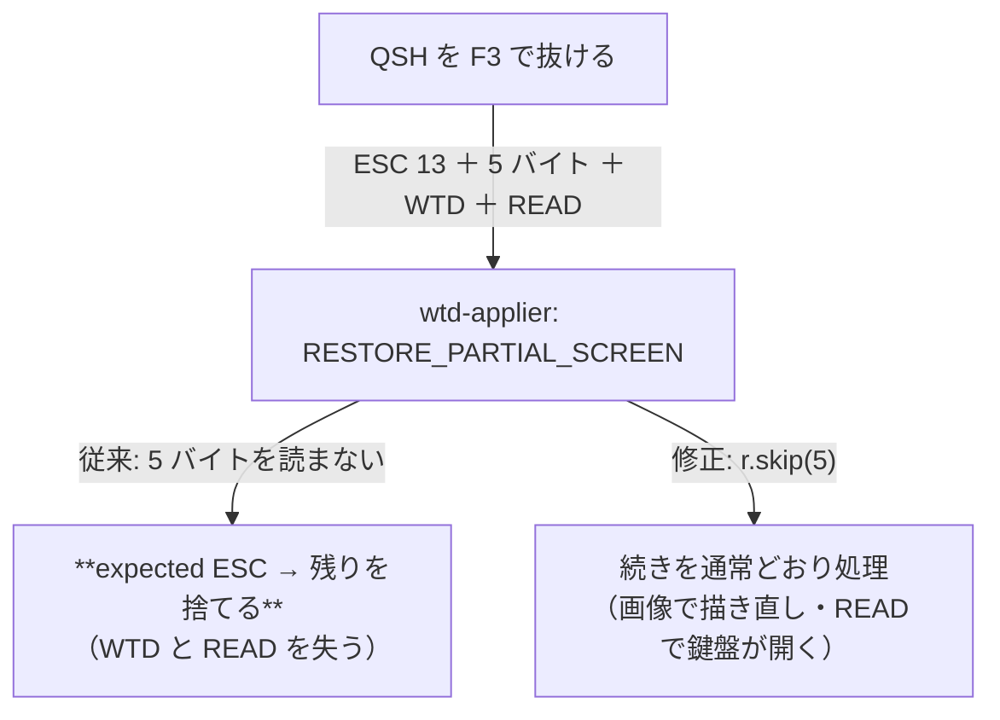

# 調査: 実機が実際に使うコマンドを数えたら、直すべき不備が 1 件出た

## 調査の問い

- Q1: 実機の画面は**どのコマンドを使うのか**（未実装のものは届くのか）
- Q2: `RESTORE PARTIAL SCREEN`（0x13）は届くのか。届くなら形式は
- Q3: `ROLL`（0x23）を使う画面はあるのか
- Q4: `READ IMMEDIATE`（0x72 / 0x83）・`READ SCREEN TO PRINT`（0x66…）は届くのか

## 数え方

再現手段: `scripts/census-5250-commands.mjs`

**正確さの度合いを分けて出す**（推測と事実を混ぜないため）:

1. **レコード先頭のコマンド**（ヘッダ 10 バイトの直後）——位置が確定していて**正確**
2. **実装が「未知」と判定したもの**——実装そのものの判定なので**決定的**
3. レコード全体の素朴な走査——WTD のデータ内の `0x04` も拾う**参考値**

巡った画面（**読み取り専用のものだけ**・11 件）:
`STRSQL` / `DSPMSG` / `WRKACTJOB` / `WRKSYSSTS` / `DSPJOBLOG` / `WRKSPLF` /
`DSPLIBL` / `WRKOBJ` / `STRPDM` / `GO CMDIFS` / `QSH`。
各画面で PageDown・PageDown・PageUp も送っている（**流れる画面ほど ROLL の候補**）。

## 判明した事実（実機・IBM i 7.5・83 レコード）

### F1: 先頭コマンドの分布（Q1）

| コマンド | 回数 |
|---|---|
| `CLEAR_UNIT`(0x40) | 50 |
| `WRITE_TO_DISPLAY`(0x11) | 17 |
| **`SAVE_PARTIAL_SCREEN`(0x03)** | 2 |
| `WRITE_STRUCTURED_FIELD`(0xf3) | 1 |
| **`RESTORE_PARTIAL_SCREEN`(0x13)** | 1 |

**未知のコマンドは 1 件も出なかった**（実装の判定で 0 件）。

### F2: **`0x13` は届く**——QSH を F3 で抜けるときに（Q2）

画面ごとの内訳で、`QSH（退出）` にだけ `RESTORE_PARTIAL_SCREEN` が現れた。
生バイト（`scripts/diag-qsh.mjs` で採取）:

```
04 13 | 00 00 00 00 00 | 04 11 00 00 | 11 01 01 3a d4 c1 c9 d5 … | … 04 52 …
ESC 13   **パラメータ 5 バイト**  ＝こちらが送った WTD（"MAIN"）      ＝READ
```

**ホストはこちらが送った保管物をそのまま返してくる**（`0x03` の応答に写した 5 バイトも含めて）。

### F3: **その 0x13 の扱いに不備があった**（この作業の主成果）

`0x13` の分岐が**パラメータ 5 バイトを読み飛ばしていなかった**ため、
続きを ESC と読み違えて警告が出ていた:

```
QSH（退出）: expected ESC, got 0x0 — discarding rest of record
```

捨てていたのは **ホストが返した画面イメージ（WTD）と、その後ろの READ MDT FIELDS**。
——`0x03` を直したときに**同じ轍の半分だけを直していた**ことになる。

見えていなかった理由: F3 の直後にホストが**別のレコードで画面を描き直す**
（`CLEAR_UNIT` ＋ WTD ＋ READ の 759 バイト）ので、症状として現れなかった。
**警告は出ていた**が、E2E は画面の文字だけを見ていて気づけなかった。

→ `r.skip(5)` を足し、実機で警告が消えることを確認した。

### F4: **`ROLL`（0x23）を使う画面は見つからなかった**（Q3）

11 画面・PageUp/PageDown を含めて **1 件も届かなかった**（先頭・全走査のどちらでも 0）。
流れる画面（`DSPJOBLOG` / `WRKACTJOB` / `STRSQL` / `QSH`）でも、
ホストは `CLEAR_UNIT` ＋ `WTD` で**描き直していた**。

### F5: `READ IMMEDIATE`（0x72 / 0x83）・`READ SCREEN TO PRINT`（0x66…）も届かない（Q4）

同じ 11 画面で 1 件も無し。**未知のコマンドの警告が 0 件**であることが裏付け。

### F6: 接続に失敗するときだけ別の警告が出る

装置名が使用中で接続を断られる際に
`expected ESC, got 0xc0 — discarding rest of record` が出る。
5250 のレコードではないものを読んでいる（ホストが閉じる前に何か送っている）。
**接続はどのみち失敗する**ので実害は無いが、由来は未解明。

## 影響範囲



## 実現性 / リスク

- 修正は 1 行（`r.skip(5)`）＋テスト。実機で警告が消えることを確認済み
- **リスク: 5 バイト固定は「こちらが送った形」に依存する**。
  `0x03` のパラメータが 5 バイトであることは実機で確認済みで、`0x13` はその写しが返るので
  同じ長さになる。**別の長さで送ってくるホストがあれば崩れる**（未確認）
- 届かなかったコマンド（0x23 / 0x72 / 0x83 / 0x66）は**実装しない**——
  形式を推測で書かない方針のまま、「この範囲では届かなかった」を根拠として残す

## spec への申し送り

1. `0x13` は**パラメータ 5 バイトを読み飛ばす**（F3）
2. 実機の形（`ESC 13 ＋ 5 バイト ＋ WTD ＋ READ`）をテストで固定する
3. backlog へ結論を書く: `0x13` は**届く・確認済み**／`0x23`・`0x72`・`0x83`・`0x66` は
   **11 画面では届かなかった**（数え方と再現手段つき）
4. `0x03` のパラメータの意味は**依然として未解明**（写しが返ることは分かった）
