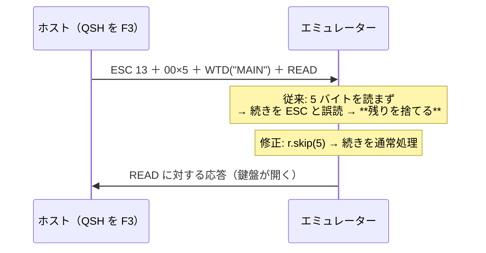

# レビューガイド: 実機で数え、0x13 の不備を直した

## 変更概要 / 目的

backlog `datastream-commands.md` の各項目（未実測・未実装）を進めるため、
**実機が実際に使うコマンドを数えた**。その結果、直前の作業で入れた `0x13` の扱いに
不備が見つかったので直した。

## 重要ポイント（特に見てほしい所）

1. **`0x13` はパラメータ 5 バイトを読み飛ばしていなかった**
   （`packages/core/src/protocol/wtd-applier.ts:145`）。
   実機の中身は `04 13 | 00×5 | 04 11 …（WTD）| … 04 52（READ）` で、
   読み飛ばさないと続きを ESC と読み違え、**画像と READ を捨てていた**。
   **前回の作業は半分だけ直していた**ことになる。
2. **症状としては見えていなかった**——F3 の直後にホストが別レコードで描き直すため。
   警告（`expected ESC, got 0x0`）は出ていたが、E2E は画面の文字しか見ていなかった。
3. **届かなかったコマンドは実装しない**（decisions D2）。
   `ROLL`(0x23) / `READ IMMEDIATE`(0x72,0x83) / `READ SCREEN TO PRINT`(0x66…) は
   11 画面・83 レコードで 1 件も届かなかった。**数えた事実を backlog に残す**にとどめた。
4. **数え方の正確さを 3 段に分けた**（decisions D3）——先頭コマンド（正確）／
   実装の未知判定（決定的）／全走査（参考）。道具側に applier の写しを作らないため。

## 処理フロー

## 主要な変更箇所

- `packages/core/src/protocol/wtd-applier.ts:145` — `r.skip(5)` と実機の形のコメント
- `packages/core/test/save-partial-screen.test.ts` — **実機の形**を固定（1 件追加、既存 3 件を実機の形へ）
- `scripts/census-5250-commands.mjs` — **新規**（数え方の再現手段）
- `scripts/diag-qsh.mjs` — F3 退出時の生バイトを見る節
- `.aidev/backlog/datastream-commands.md` — 各項目に結論（届く／届かない・根拠）

## リスク / 確認してほしい点

- **読み飛ばす長さ 5 は「こちらが送った形」に依存**（decisions D1）。
  可変長の推定を推測で作らない判断でよいか
- `ROLL` 等は「この 11 画面では届かなかった」だけ。**存在しないとは言っていない**
- `packages/server/test/zip-writer.test.ts` の 4 件は `unzip` が無いため失敗（`main` でも同じ）
