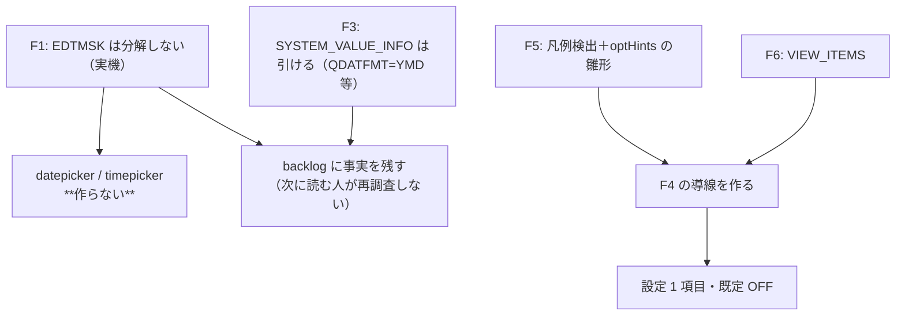

# 調査: 入力支援 UI の材料は実機に本当にあるか

## 調査の問い

- Q1: **`EDTMSK` は実機で欄を分解するか**（datepicker の判定材料そのもの）
- Q2: `EDTMSK` のマスクの綴りはどれが通るか（推測しない）
- Q3: システム値（`QDATFMT` / `QDATSEP` / `QTIMSEP`）は引けるか。ビュー名は何か
- Q4: 分解が起きないなら、日付欄を見分ける材料は他にあるか
- Q5: `F4=Prompt` の導線は既存の仕組みで作れるか

## 判明した事実

### F1: **`EDTMSK` は欄を分解しない**（Q1。backlog の前提が崩れた）

実機（IBM i 7.5）に `TESTLIB/DTMDSPF` + `DTMPGM` を作り
（`scripts/build-dttest.mjs`）、受信を実測した（`scripts/research-edtmsk.mjs`）。

| DDS | 画面 | core が見た欄 |
|---|---|---|
| `EDTCDE(Y)` ＋ `EDTMSK('&& && &&')` | `0/00/00` | **1 欄**・長 8・`value=" 0/00/00"` |
| `EDTCDE(Y)` ＋ `EDTMSK('  /  /  ')` | `0/00/00` | **1 欄**・長 8・同 |
| `EDTCDE(Y)` ＋ `EDTMSK('&&/&&/&&')` | `0/00/00` | **1 欄**・長 8・同 |
| `EDTCDE(Y)` のみ（対照） | `0/00/00` | **1 欄**・長 8・同 |
| `EDTWRD('  :  :  ')` ＋ `EDTMSK` | （空） | **1 欄**・長 8・`value=""` |
| `EDTWRD('  :  :  ')` のみ | （空） | **1 欄**・長 8・`value=""` |
| `EDTWRD('   -  -    ')` ＋ `EDTMSK`（SSN） | （空） | **1 欄**・長 11 |
| 素の `6 0`（対照） | （空） | **1 欄**・長 7・shift=signed-num |

**どの構成も 1 欄で来る。** backlog が前提にしていた「同一行に連続する数値欄＋間の保護された
1 桁の区切り文字」は**実機では発生しない**。編集文字は**欄の中の値として**入って来る
（`" 0/00/00"`）——これは PR #212 で `EDTCDE`/`EDTWRD` について実測した結論と同じ形。

backlog の署名（`2/2/2` / `2:2:2` / `3-2-4`）は**合成データストリームで測った値**（backlog 26 行目に明記）で、
実機の挙動ではなかった。

> **独立パースの限界を正直に書く**: `research-edtmsk.mjs` の自作パーサは
> 受信 1 レコードから SF を 4 件しか復元できなかった（編集済みデータの途中で同期を失った）。
> 復元できた 4 件（行 11/13/15/17）は core と長さが一致し、いずれも 1 欄だった。
> 行 3〜9 は **core の解釈と画面の文字**（`DMA   0/00/00` が 1 つの入力欄の中にある）で判断している。
> 分解されていれば core は複数欄として報告する（他の画面ではそうなっている）ので結論は動かない。

### F2: `EDTMSK` はどの綴りでもコンパイルが通る（Q2）

`&` / 空白 / `&&/&&/&&` の 3 通りとも `CRTDSPF` が通った（8 件すべて OK）。
**つまり「書けるか」では分解の有無を判別できない**——通っても効果がワイヤに出ない。

### F3: システム値は `QSYS2.SYSTEM_VALUE_INFO` で引ける（Q3）

`scripts/research-sysval.mjs` で実測:

```
SYSTEM_VALUE_NAME  CURRENT_CHARACTER_VALUE
QDATFMT            YMD
QDATSEP            /
QTIMSEP            :
```

- ビュー名は backlog の推測どおり **`QSYS2.SYSTEM_VALUE_INFO`**（実在した）
- 値は `CURRENT_CHARACTER_VALUE`。`CURRENT_NUMERIC_VALUE` は `null`
- `QDECFMT` / `QDATE` / `QYEAR` も同じ表から引ける

**ただし今回は使い道が無くなった**（F1 で日付欄を見分けられないため）。
事実として記録し、将来の利用者に渡す。

### F4: 分解が無い以上、日付欄を見分ける材料は無い（Q4）

考えられる代替を検討して、いずれも成立しない。

| 案 | なぜ駄目か |
|---|---|
| **欄の現在値に `/` があるか** | 値があるときだけ効く。`EDTWRD` の 0 は全桁空白で来る（F1 の表）。**新規入力の空欄では材料ゼロ**——出たり出なかったりは、無いより悪い |
| 長 8 の num-only 欄を日付とみなす | 編集コードの有無で長さが変わるだけ。金額（`EDTCDE(1)` で 8 桁）と区別できない |
| ラベルの文字（「日付」「DATE」）で判定 | ラベルは任意の文字列で、位置も欄との対応も保証されない。**推測を真実として扱う**ことになる |
| FFW のビット | 日付を示すビットは無い（`constants.ts` の全ビットを確認済み） |

→ **datepicker / timepicker は作らない。** requirement の「前提が崩れたときの扱い」に
あらかじめ書いた条件（`EDTMSK` が分解しないなら作らない）に該当する。

### F5: `F4` の導線は既存の凡例検出で作れる（Q5）

- `detectFkeyLegends(snap)`（`fkeyLegend.ts:478`）が `F<n>=` を検出して `FkeySpan[]` を返す。
  **窓の内側だけ**を見る／`gui.selectionFields` の行は避ける、という歯止めが既に入っている
- `optHints` の実装が**そのまま雛形になる**（`ScreenGrid.vue`）:
  - フォーカス中の欄に従属する小さなボタン（`.opt-btn`、`▾`）を絶対配置で置く
  - `@mousedown.stop.prevent` で伝播とフォーカス移動を止め、**キーイベントを 1 つも購読しない**
    ＝矩形選択・コピー＆ペーストを妨げない（利用者指示。`opt-hints-ui.test.ts` が守っている）
  - 位置は `left: col-1 + "ch"` / `top: (row-1)*1.25 + "em"`（`optBtnStyle`）
- **ラベルは凡例から取る**。`F4` が必ず「プロンプト」とは限らず、実機では
  カタカナ（`F4=ﾌﾟﾛﾝﾌﾟﾄ`）で来る。**語で判定せず `key === "F4"` で判定し、
  表示にはホストが書いたラベルを使う**（UI 側で言い換えない）

### F6: 設定は `VIEW_ITEMS` に 1 行足すだけ

`viewSettings.ts` の `VIEW_ITEMS` は「画面設定メニューとキー設定で共有する単一の出どころ」。
`linkify`（ON/OFF の 2 択）と `optHints`（意匠 4 択・`expandable`）の両方の前例がある。
`FALLBACK` に既定値を書く（`optHints: "none" // 推測を含むので既定は出さない`）。

## 影響範囲



## 実現性 / リスク

- **datepicker は実現不可**（F1・F4）。材料が無い。作れば「推測を真実として扱う」ことになり、
  リポジトリの原則に反する
- **`F4` の導線は実現可能**（F5）。既存の検出と UI の雛形があり、新しい判定を持ち込まない
- リスク: **画面に重ねる部品は矩形選択・コピーを壊しやすい**。`optHints` で一度踏んで
  対策済みなので、同じ作法（キーを購読しない・`mousedown.stop.prevent`）を守る
- リスク: `F4` が凡例にあっても、欄によっては意味が無いことがある。
  **押すのは利用者の明示操作**に限る（フォーカスしただけでは何も送らない）

## spec への申し送り

1. **datepicker / timepicker は作らない**（F1・F4）。backlog に実測を残して閉じる
2. **システム値の引き方は事実として記録**（F3）。使う先が無いので実装しない
3. **`F4` の導線を作る**（F5）。判定は `key === "F4"`、**表示はホストのラベル**
4. 設定は `VIEW_ITEMS` に 1 項目・**既定 OFF**（F6。「勝手に有効化しない」）
5. `optHints` の作法（キーを購読しない・`mousedown.stop.prevent`）をそのまま守る
