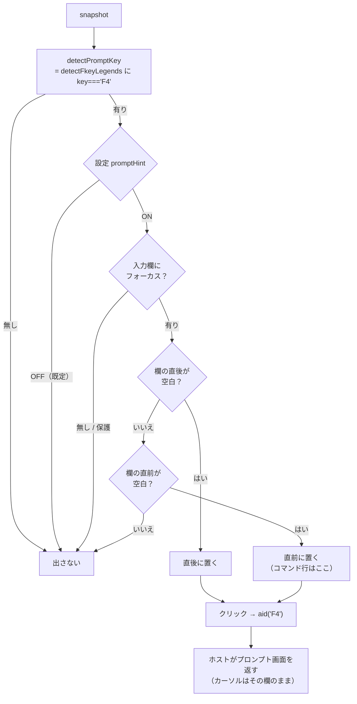

# レビューガイド: 入力支援 UI（datepicker は作らない／`F4` の導線を作る）

## 変更概要 / 目的

`.aidev/backlog/input-assist.md` の未着手 5 件。**この PR の主成果は実測**で、
コードは 1 機能に絞っています。

**datepicker / timepicker は作りません。** 判定材料である「`EDTMSK` が付いた欄は
分解されて届く」が**実機で成立しない**と分かったからです。backlog のこの数値は
**合成データストリームで測ったもの**（backlog 自身が 26 行目に明記）でした。

## 特に見てほしい所

### 1. 実測（実機・IBM i 7.5）

`scripts/build-dttest.mjs` で 8 通りの DDS を作り、
`scripts/research-edtmsk.mjs` で受信を見ました。

| DDS | 画面 | 届いた形 |
|---|---|---|
| `EDTCDE(Y)` ＋ `EDTMSK('&& && &&')` | `0/00/00` | **1 欄**・長 8・`value=" 0/00/00"` |
| `EDTCDE(Y)` ＋ `EDTMSK('  /  /  ')` | `0/00/00` | **1 欄**・長 8・同 |
| `EDTCDE(Y)` ＋ `EDTMSK('&&/&&/&&')` | `0/00/00` | **1 欄**・長 8・同 |
| `EDTCDE(Y)` のみ（対照） | `0/00/00` | **1 欄**・長 8・同 |
| `EDTWRD('  :  :  ')` ±`EDTMSK` | （空） | **1 欄**・長 8・`value=""` |
| `EDTWRD('   -  -    ')`（SSN） | （空） | **1 欄**・長 11 |
| 素の `6 0`（対照） | （空） | **1 欄**・長 7・signed-num |

- **どの構成も 1 欄**で、編集文字は**欄の中の値**に入る（PR #212 の `EDTCDE`/`EDTWRD` と同じ形）
- `EDTMSK` のマスクは**3 通りとも `CRTDSPF` が通る**。つまり「書けるか」では判別できない
- **マスクの綴りも推測しませんでした**（1 件ずつ単独コンパイルして実機に教えてもらう方式）

代替も成立しません（research F4）。とくに「現在値に `/` があるか」は**値があるときだけ**効き、
`EDTWRD` の 0 は全桁空白で来るので**新規入力の空欄では材料ゼロ**。
出たり出なかったりは無いより悪いので採りませんでした。

**副産物**: システム値の引き方は確かめました——`QSYS2.SYSTEM_VALUE_INFO` は実在し、
`QDATFMT=YMD` / `QDATSEP=/` / `QTIMSEP=:` が `CURRENT_CHARACTER_VALUE` から引けます。
**消費側が無いので実装はしていません**（使わない配線を先に作らない）。

### 2. `F4` は語ではなくキーで判定する（decisions D3）

backlog は「凡例に **`F4=Prompt`** がある画面では」と書いていますが、
**ラベルは地域語**で来ます。実機の凡例は `F4=ﾎﾟﾜ]ﾎﾟn`（化けたカタカナ）でした——
**語で探す設計なら日本語環境で機能しませんでした**。

`detectPromptKey` は `key === "F4"` で判定し、`title` / `aria-label` には
**ホストが書いたラベルをそのまま**入れます。F4 が別の意味の画面でも嘘になりません。

### 3. 置き場は実機で作り直した（test-result）

1 回目の実機 E2E は「**ボタンが出ない**」で落ちました。原因は置き場の計算で、
`f.col + fieldSpan(f)` としていたところ **コマンド行の入力欄は実機で長さ 153**（行またぎ）。
`7 + 153 = 160 > 80` で画面外と判定し、**永久に出ない**状態でした。
**`F4` が最も要る欄がまさにコマンド行**なので、これでは機能しないに等しい状態でした。

→ `posOfOffset` で欄の終わりを出し、右に場所が無ければ**欄の直前**（SF の属性バイトの桁＝空白。
`probe-opt-adjacency.mjs` の実測と今回の `左隣=桁6(" ")` で裏付け）へ退避します。

## 処理フロー

## 主要な変更箇所

- `packages/web-ui/src/composables/fkeyLegend.ts:618` — `detectPromptKey()`。
  **なぜ語で判定しないか**が JSDoc にある
- `packages/web-ui/src/components/ScreenGrid.vue:932` — `promptTarget`。
  **置き場の 2 段構え**と、その根拠（コマンド行は長さ 153）がコメントにある
- `packages/web-ui/src/components/ScreenGrid.vue:3236` — ボタン。
  キーを購読せず `mousedown.stop.prevent`／`tabindex="-1"`
- `packages/web-ui/src/stores/viewSettings.ts:80` — `promptHint`（既定 OFF の理由つき）
- `scripts/build-dttest.mjs` / `research-edtmsk.mjs` / `research-sysval.mjs` /
  `verify-browser-prompt.mjs` — 実測の再現手段。`scripts/README.md` に登録済み
- `.aidev/backlog/input-assist.md` — **5 件すべてに結論**。datepicker は実測つきで「作らない」

## リスク / 確認してほしい点

- **要望（datepicker を出したい）には応えられていません。** 材料が実機に無いためです。
  やるとしたら**欄ごとのオプトイン**（利用者が「この欄は日付」と指定して覚えさせる）で、
  これは backlog が数値スピナーについて出した結論と同じ形です。**指示があれば作れます**
- **`F4` が「プロンプト以外」の画面での実挙動は試していません**。ラベルをそのまま出す設計なので
  嘘にはなりませんが、そういう画面を探して押してはいません
- **27x132 の画面での置き場は未確認**（24x80 で実測。桁の計算は `cols` 依存）
- **既定 OFF** なので、使うには画面設定で ON にする必要があります（メニューとキー設定の両方に出ます）
- 空振り検証 11/11。初回に空振りした 1 件（**ラベルの決め打ち**）は、
  日本語の凡例だけで確かめていたためテストが見逃していたもので、
  ホストが別の語を書く画面のテストを足して塞ぎました
