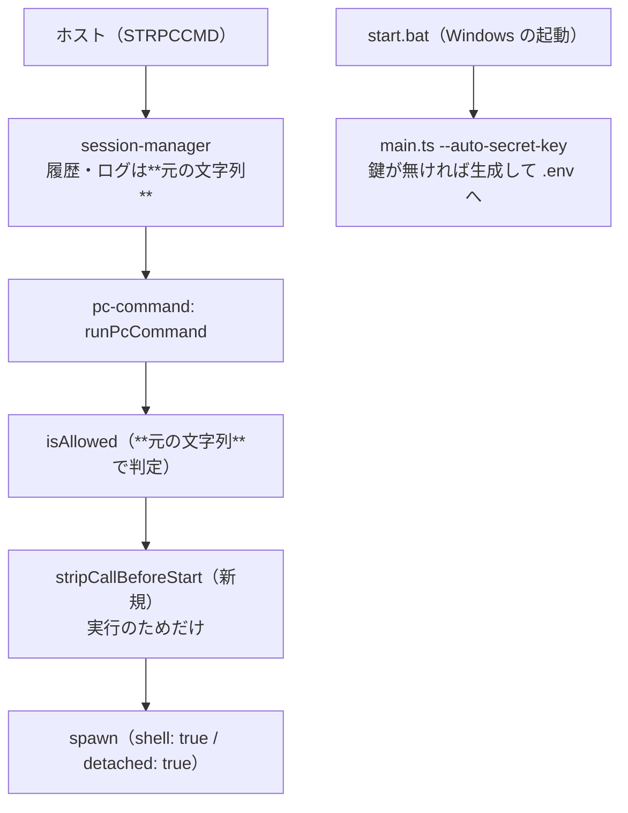

# 調査: 持ち込まれた修正の裏取りと、置換の範囲を決める

原資料は 3 ページのスキャン PDF（`fix_STRPCCMD` / 2026-07-30 17:55）。
**PDF 自体はリポジトリに入れない**（4MB の画像で差分に載せる意味が無い）——
内容は本ファイルと `pc-command.ts` の docstring に**漏れなく書き起こした**
（症状・原因・修正 diff・効かなかった手・適用手順）。

## 調査の問い

- Q1: `start.bat` と `start.sh` の差は本当に `--auto-secret-key` だけか。足す位置はどこか
- Q2: `--auto-secret-key` は何をするか（付けて安全か）
- Q3: 置換した文字列で `allow` 判定や記録をしていないか（許可した文面と実際がずれないか）
- Q4: 置換は**1 回だけ**でよいか（`&` で 2 つ以上並ぶ場合）
- Q5: `\bCALL\s+START\b` は誤爆しないか
- Q6: `detached: true` を入れると既存の挙動（待ち・上限打ち切り）が変わるか

## 判明した事実

### F1: 差は `--auto-secret-key` だけ。足す位置は「profiles の直後」（Q1）

- `start.sh:69-71` は profiles を積んだ直後に、**理由を 2 行のコメントで書いてから**
  `ARGS+=(--auto-secret-key)` を足している
- `start.bat:86-90` は同じ位置で profiles を積んだあと、**そのまま起動**している
  （`ARGS` に `--auto-secret-key` を足す行が無い）
- 他の差（`--trace-records` の分岐など）はこの不具合とは無関係

→ 原資料の diff（`@@ -87,6 +87,9 @@`）は現物と**位置も文脈も一致する**。そのまま当てられる。

### F2: `--auto-secret-key` は「無ければ生成して保存」する単一利用者向けの指定（Q2）

`main.ts:189` で `args.autoSecretKey`、`main.ts:211` で
`SecretCrypto.fromEnvOrCreate("AS400_SECRET_KEY", args.secretKeyFile)` を呼ぶ。
**既に鍵があれば何もしない**（`generated` が false）。付けても既存環境の鍵を壊さない。

付けない場合は `SecretCrypto.fromEnv()` だけで、鍵が無ければ
「AS400_SECRET_KEY not set: saved auto-signon passwords are disabled」と警告して**保存機能が死ぬ**
——これが Windows で出ていた `secret key not configured; cannot store password` の正体。

### F3: 記録と許可判定は**元の文字列**のまま（Q3）

- `session-manager.ts:448` の履歴（`PcCommandEvent.command`）とログは `cmd.command` を使う
  ——`runPcCommand` の中で作る置換後の文字列は外に出ない
- `runPcCommand` は `isAllowed(command, cfg.allow)` を**置換の前**に呼べば、
  許可判定も利用者が書いた文面のままになる

→ **置換は `isAllowed` より後、`spawn` の直前**に置く。そうすれば
「`CALL START …` を許可したのに `START …` で判定されて弾かれる」も
「`CALL` 付きを禁止したのに置換後の文面で通る」も起きない。

### F4: 置換は**全体に効かせる**必要がある（Q4）

原資料の正規表現は `/\bCALL(\s+)START\b/i`（**フラグに `g` が無い＝最初の 1 つだけ**）。
`&` で 2 つ並べた場合を手元で確かめた:

| 入力 | 1 回だけ置換 | 全体置換 |
|---|---|---|
| `CMD /C "call start "A" … & call start "B" …"` | 2 つ目が **`call start` のまま残る** | 両方 `START` |

`&` で繋ぐ形は**原資料の実例そのもの**（`NET USE … & call start …`）なので、
2 つ並ぶ書き方は現実に起こりうる。残った 2 つ目は同じ不具合（起動直後に消える）を起こす。

→ **`g` を付ける**（原資料からの意図的な逸脱。decisions に残す）。

### F5: `\bCALL\s+START\b` の誤爆は 1 つだけ、実害は極小（Q5）

手元で確かめた:

| 入力 | 結果 |
|---|---|
| `CALLSTART "T"` | 変わらない（`\b` が効く） |
| `MYCALL START "T"` | **変わらない**（`CALL` の前が単語文字） |
| `CALL  START`（空白 2 つ）/ `CALL\tSTART` | 置換される |
| `call start`（小文字） | 置換される |
| **`echo "CALL START"`** | **置換される**（＝引用符の中も落とす） |

引用符の中まで見分けるには cmd の構文解析が要る。
`echo "CALL START"` を PC コマンドとして送る業務 CL は考えにくく、
**釣り合わない**ので取らない（既知の限界としてコメントに書く）。

### F6: `detached: true` は既存の挙動を変えない（Q6）

- `wait: false`（PAUSE(*NO)）: 既に `child.unref()` している。`detached` はそこに揃う
- `wait: true`（PAUSE(*YES)）: 終了は `close` で受けるので変わらない。
  上限超過の `child.kill()` は**もともとシェルだけを殺す**（孫は残る）ので、
  `detached` を足しても殺せる範囲は変わらない（プロセスグループを殺すなら
  `process.kill(-pid)` が要るが、それは今回の変更ではない）
- Windows では `windowsHide: true` を既に指定しているのでコンソールは出ない

→ **入れても既存テスト（終了コード・上限打ち切り・作業ディレクトリー）の意味は変わらない**。
実測で確認する（実行して確かめる）。

### F7: この作業は backlog の未検証項目を踏んだ結果である

`.aidev/backlog/pc-command.md`:

> - [ ] **Windows での実行経路**（`spawn(..., { shell: true })` → `cmd.exe /c`）
>   - Linux でしか確認していない。Electron 版を Windows で動かして `start` / `notepad` を試す

**Windows 実機で実際に試された**結果がこの 2 件。項目に結論（何が起きて何で直ったか）を書く。

## 原資料が記録している「効かなかった手」（再調査の手戻り防止）

| 試したこと | 結果 |
|---|---|
| `spawn()` に `detached: true` を足すだけ | **単体の再現スクリプトでは効くが、実際のサーバープロセスからの実行では効かない**（原因不明） |
| `shell: true` を使わず `cmd.exe` を直接呼んで入れ子を 1 段減らす | 効果なし。**さらに「実行ファイル単体＋引数」ケースを壊す退行**を起こした（Node の `shell:true` が付ける外側の引用符が exe パス自身の引用符を守るクッションになっており、外すと `cmd.exe` の `/S` が「先頭と最後の引用符を剥がす」処理で exe パスの引用符ごと剥がす） |
| CCSID/EBCDIC デコード起因の文字化け | 実機の生バイトを直接確認し、正しく変換されていた（**原因ではない**） |
| セキュリティソフト（EDR）によるブロック | `NET USE` の有無・ネットワーク共有の有無を変えても再現パターンが変わらず、**`CALL` の有無だけが唯一の分岐点**と判明したため否定 |

## 影響範囲

## 実現性 / リスク

- **実現できる。** 変更は 3 ファイル（`start.bat` / `pc-command.ts` / テスト）
- **リスク 1: この環境に Windows が無い。** 実機の裏付けは原資料に依存する
  ——ここで確かめられるのは「置換の結果」「Linux の実行経路が壊れないこと」まで。
  **PR に未検証の穴として明記する**
- **リスク 2: 引用符の中の `CALL START` も落とす**（F5）。既知の限界として書く
- **リスク 3: 根本原因が未特定**。回避策なので、Windows 側の事情が変われば再訪が要る
  ——**何が分かっていて何が分かっていないか**をコメントに残す

## spec への申し送り

1. `start.bat` は原資料の diff どおり（位置・コメントの趣旨も `start.sh` に合わせる）
2. 置換は **`isAllowed` の後・`spawn` の直前**（F3）
3. 正規表現は **`g` を付ける**（F4）。`i` も付ける
4. `detached: true` を入れる（F6。原資料の「両方残す方が安全側」を踏襲）
5. **効かなかった手を docstring に残す**（原資料の表。同じ道を 2 度歩かせない）
6. backlog に結論を書く（F7）
