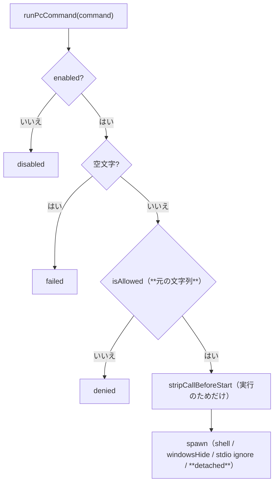

# 仕様: Windows 実機で見つかった 2 件を直す

## 概要

持ち込まれた修正を**そのまま当てられることを確かめたうえで**適用する（research F1）。
変更は 3 ファイル。`start.bat` は 1 行＋コメント、`pc-command.ts` は純関数 1 つと
`spawn` オプション 1 つ、あとは回帰テスト。

## 設計方針

### 方針1: 置換は「実行のためだけ」。判定と記録は**利用者が書いた文字列**

`isAllowed` の**後**、`spawn` の**直前**で置換する（research F3）。

- 許可パターンは利用者が書いた文面（`CALL START …`）と照合される
- 履歴・ログ（`session-manager`）は元の文字列のまま残る
  ——「送られた文字列」と「実行した文字列」が違うことを隠さないため、
  置換したことは docstring に書き、**元の文字列で追える**状態を保つ

順序を逆にすると、利用者が `CALL START …` を許可したのに `START …` で判定されて弾かれる
（またはその逆）ことになる。

### 方針2: 置換は**全体**に効かせる（原資料からの逸脱）

原資料の正規表現はフラグが `i` だけで、**最初の 1 つしか置換しない**。
`&` で 2 つ並べた形（原資料の実例と同じ書き方）では 2 つ目が残り、同じ不具合を起こす
（research F4）。**`gi` にする。**

### 方針3: 純関数として切り出し、**分かっていること／いないこと**を書き残す

`stripCallBeforeStart(command: string): string` を `export` する
（テストから直接叩けるようにする。実行を伴わずに境界を固定できる）。

docstring に書くのは 3 点:

1. **実機で分かっている事実**——`CALL START` は消える／`CALL` を外せば毎回生き残る
2. **分かっていないこと**——根本原因（ジョブオブジェクト絡みと見られるが未特定）
3. **効かなかった手**（research の表）。同じ道を 2 度歩かせない

### 方針4: `detached: true` も入れる

原資料は「単体の再現では効果が確認できているので残す。実機で効いているのは主に
`stripCallBeforeStart` と考えられるが、**両方残す方が安全側**」としている。
既存の挙動は変わらない（research F6）。この判断の根拠をコメントに書く。

### 方針5: `start.bat` は `start.sh` と**同じ意味**にする

位置（profiles の直後）・コメントの趣旨（単一利用者向け／マルチユーザーでは使わない）を
`start.sh:69-71` に合わせる。**Windows だけ機能が欠けている**状態を無くすのが目的。

## 対象範囲

| ファイル | 変更 |
|---|---|
| `start.bat` | `--auto-secret-key` を足す（＋理由 2 行） |
| `packages/server/src/pc-command.ts` | `stripCallBeforeStart()` 追加／`spawn` 前で適用／`detached: true` |
| `packages/server/test/pc-command.test.ts` | 回帰テスト（置換の境界・順序） |
| `.aidev/backlog/pc-command.md` | 「Windows での実行経路」に結論 |

## インターフェース / データ構造

```ts
/**
 * `START` の直前の `CALL` を落とす（Windows 実機の回避策）。
 *
 * `CALL` は本来バッチファイル・ラベル呼び出し用で、`START` のような内部コマンドに
 * 付けても意味は変わらないため、実行前に安全に取り除ける。
 */
export function stripCallBeforeStart(command: string): string;
```

`PcCommandOutcome` は変えない（応答の形は同じ）。

## 振る舞いの詳細



### 置換の境界（テストで固定する）

| 入力 | 出力 |
|---|---|
| `CALL START "WINMERGE" /B "app.exe"` | `START "WINMERGE" /B "app.exe"` |
| `CMD /C "NET USE \\SRV  & call start "T" /B "app.exe" arg1 arg2"` | `… & START "T" /B "app.exe" arg1 arg2"` |
| `… & call start "A" … & call start "B" …`（2 つ） | **両方** `START`（方針2） |
| `START "T" /B "app.exe"`（`CALL` 無し） | そのまま |
| `echo hi` | そのまま |
| `CALLSTART "T"` / `MYCALL START "T"` | **そのまま**（語境界） |
| `CALL  START "T"` / `CALL\tSTART "T"` | `START "T"`（空白の数・種類を問わない） |
| `echo "CALL START"` | 置換される（**既知の限界**。引用符の中は見分けない） |

## ドメイン固有の考慮

- **ホスト起点の任意コード実行**なので、置換で許可判定の意味を変えてはならない（方針1）
- Windows でしか再現しない。**この環境では実機確認ができない**
  ——確かめられるのは置換の結果と Linux 経路の無変化まで
- `start.bat` の変更は**既存の鍵を壊さない**（`fromEnvOrCreate` は有れば何もしない。research F2）

## エラー処理 / 異常系

| 事象 | 扱い |
|---|---|
| 置換対象が無い | そのまま実行（現状と同じ） |
| `spawn` が投げる | 現状どおり `failed` で返す（例外は投げない） |
| 上限超過 | 現状どおり `kill` して `failed`（`detached` でも変わらない） |

## 受け入れ基準との対応

| requirement の完了条件 | 満たし方 |
|---|---|
| `start.bat` に `--auto-secret-key` | 原資料の diff（`start.sh` と同じ位置・趣旨） |
| `CALL START` が `START` に落ちる | `stripCallBeforeStart` ＋ `spawn` 前で適用 |
| 大文字小文字・`&` の実例で効く | `gi` ＋ 境界テスト |
| `CALL` 無し・無関係は変わらない | 境界テスト |
| 判定と記録は元の文字列 | 置換を `isAllowed` の後に置く＋テストで順序を固定 |
| 回帰テストが通る | 既存 11 件＋新規 |
| 効かなかった手が残っている | `pc-command.ts` の docstring（research の表） |
| backlog に結論 | 「Windows での実行経路」に書く |
