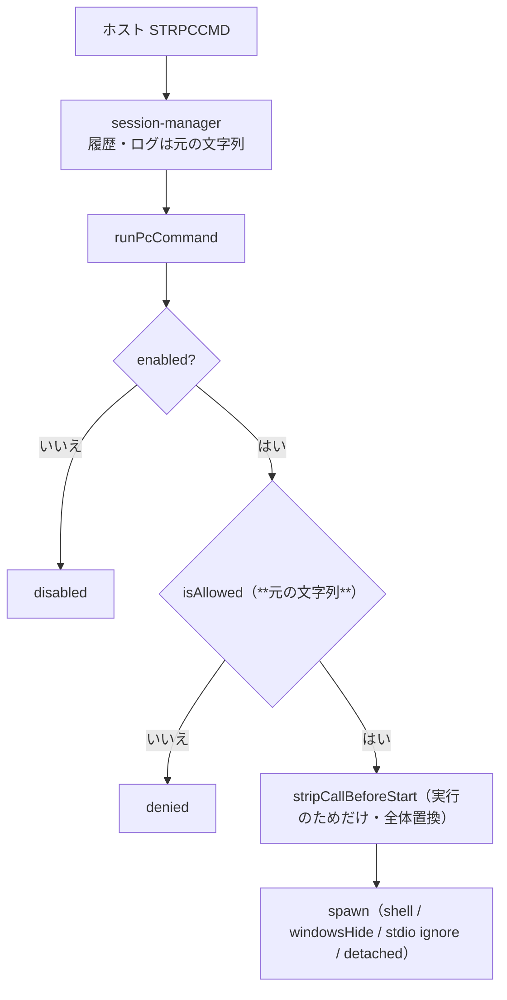

# レビューガイド: Windows 実機で見つかった 2 件を直す

## 変更概要 / 目的

**Windows 実機で動かした利用者から届いた 2 件**を適用した（原資料は別環境の実測。
`.aidev/backlog/pc-command.md` の未検証項目「Windows での実行経路」を実機で踏んだ結果）。

1. **`start.bat` に `--auto-secret-key` が無かった** → Windows だけ
   自動サインオンのパスワード保存が使えず `secret key not configured` になっていた
2. **`CALL START "title" /B "app.exe"` で起動したアプリが直後に消える**
   → `START` の直前の `CALL` を実行前に落とす

## 重要ポイント（特に見てほしい所）

1. **置換は許可判定の後・実行の直前だけ**（`packages/server/src/pc-command.ts:139`）。
   逆順にすると「`CALL START …` を許可したのに `START …` で照合される」ことになり、
   **許可した文面と実際の判定がずれる**。履歴・ログも元の文字列のまま
   （`session-manager.ts:448`）。テストで両方向を固定した。
2. **`g` を付けた**（原資料は最初の 1 つだけ。decisions D1）。
   `&` で 2 つ並ぶ書き方は原資料の実例そのもので、残った 2 つ目は同じ不具合を起こす。
3. **分かっていないことを書き残した**（`pc-command.ts` の docstring）。
   根本原因は未特定で、これは回避策である。**効かなかった手**（`detached` 単独・
   `cmd.exe` 直接呼び出し・CCSID・EDR）を表で残し、同じ道を 2 度歩かせない。
4. **Windows での再検証はしていない**（この環境に Windows が無い。decisions D5）。
   ここで固定したのは「置換の結果」「許可判定との順序」「**実際に渡る文字列**
   （シェルに書かせて読む）」「Linux 経路の無変化」まで。
5. `detached: true` は原資料の判断を踏襲して残したが、**主に効いているのは置換の方**と
   コメントに明記した（万能薬と誤解させない）。

## 処理フロー

## 主要な変更箇所

- `packages/server/src/pc-command.ts:84` — `stripCallBeforeStart`（実機で分かっていること・
  分かっていないこと・効かなかった手の表）
- `packages/server/src/pc-command.ts:139` — 適用位置（`isAllowed` の後）と `detached: true`
- `start.bat:90` — `--auto-secret-key`（`start.sh:69-71` と同じ位置・趣旨）
- `packages/server/test/pc-command.test.ts` — 新規 11 件
- `.aidev/backlog/pc-command.md` — 結論＋新項目 2 件（根本原因の特定／Windows 回帰の自動化）

## リスク / 確認してほしい点

- **Windows 実機での動作は原資料に依る**（アプリが生き残ること・`start.bat` からの起動）。
  この PR で新たに実機確認はしていない
- **`start.bat` はテストで守れない**（Windows 専用スクリプト）。空振り検証でも
  「`--auto-secret-key` を落とす」ミュータントは検出できない——正直に記録した
- **根本原因は未特定**。Windows 側の事情が変われば再訪が要る（backlog に項目を起こした）
- 引用符の中の `CALL START` も落とす（`echo "CALL START"`）。既知の限界
- `packages/server/test/zip-writer.test.ts` の 4 件は `unzip` が無いため失敗（`main` でも同じ）
