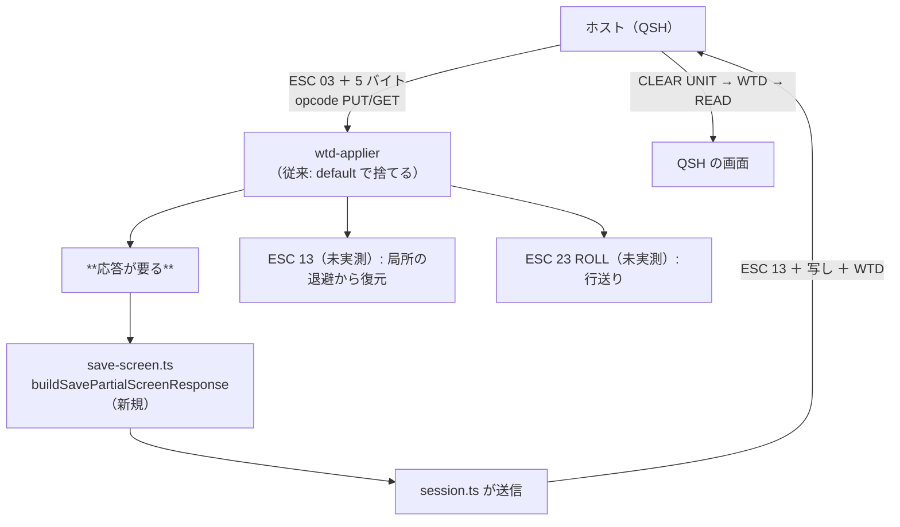

# 調査: QSH が固まるのは SAVE PARTIAL SCREEN を捨てているから

## 調査の問い

- Q1: QSH の起動時にホストは何を送ってくるか。**どのコマンドで捨てているか**
- Q2: そのコマンドの形式（パラメータのバイト数）は何か
- Q3: 応答は要るか。要るならどんな形式か
- Q4: 直したら QSH は使えるようになるか（起動・コマンド実行・出力）
- Q5: QSH は他に未実装のコマンドを使うか（`ROLL` など）

## 判明した事実（すべて実機・IBM i 7.5 で実測）

再現手段: `scripts/diag-qsh.mjs`

### F1: 捨てていたのは **`ESC 0x03`＝SAVE PARTIAL SCREEN**（Q1・Q2）

メインメニューで `QSH` を実行した直後に届いたレコード:

| # | 長さ | opcode | データ |
|---|---|---|---|
| 1 | 16 | `02`（OUTPUT ONLY） | `04 11 00 00`＝WTD（副作用なし） |
| 2 | 19 | **`03`（PUT/GET）** | **`04 03 00 00 00 00 00`** |
| 3 | 19 | **`03`（PUT/GET）** | 同上（**2 回続けて来る**） |

そこで出ていた警告:

```
WARN unknown command 0x3 — discarding rest of record
```

- コマンドは `0x03`、**パラメータは 5 バイト**（実機はすべて `00`）
- opcode が **PUT/GET（0x03）＝「送ったから返せ」**。つまり**応答を待っている**
- 応答しないので**ホストはそこで止まり**、こちらは入力を待ったまま
  ——これが「待機中・ホストから応答がない」の正体

利用者の見立て（「必要なバイトを捨てて待機に陥っている」）は**そのとおりだった**。

### F2: 応答を返した瞬間にホストが先へ進む（Q3・Q4）

`ESC 0x13`（RESTORE PARTIAL SCREEN）＋**受け取った 5 バイトをそのまま写し**＋
現在の画面を再現する WTD ストリーム、opcode は `RESTORE_SCREEN(0x05)` で返したところ、
**1 回目の試行でホストが先へ進んだ**:

```
record #4（513 バイト）: CLEAR_UNIT → WTD … → READ_MDT_FIELDS
→ 画面に「QSH コマンド入力」が出る
```

形式を何通りも試す必要は無かった。ホストにとってこの中身は**不透明な保管物**
（あとで `0x13` としてそのまま返ってくる）なので、既存の SAVE SCREEN 応答
（`buildSaveScreenResponse`）と同じ直列化がそのまま通る。

### F3: QSH は実際に使える（Q4）

修正後、同じスクリプトで:

- `ls -l /` → **13 行の一覧が画面に出る**（`bin -> /usr/bin` 等）
- `echo A; echo B; echo C` → 前の出力が上へ流れ、`A` `B` `C` が出る
- 警告は 0（`unknown command` は 1 件も出ない）

### F4: **QSH は `ROLL`（0x23）を使わなかった**（Q5）

出力が流れる場面でも、ホストは `CLEAR_UNIT` ＋ `WTD` で**画面を描き直していた**。
`ROLL` も `RESTORE PARTIAL SCREEN`（0x13）も**この経路では 1 度も届かなかった**。

→ `0x13` と `0x23` の**実装は入れるが、実機では未確認**（形式は SC30-3533 / tn5250 の
定義に従う）。**確認できていないことを確認できたことのように書かない**——
docstring と backlog にその旨を残す。

### F5: 未知のコマンドを捨てる既定は「レコードの残りごと」

`wtd-applier.ts` の `default` 節は `return` して**レコードの残りを捨てる**。
パラメータ長が分からない以上これは妥当だが、**捨てた後ろに READ があると待ちに入る**。
同じ轍を既に 2 回踏んでいる:

- `SAVE SCREEN`（0x02）を返さず SEU の F1 ヘルプが 30 秒返らなかった
- `WRITE ERROR CODE TO WINDOW`（0x22）未処理で後続の READ MDT FIELDS ごと捨てた

→ **今回もまったく同じ形**。警告は出ていたが、利用者には「待機中」としか見えない。

## 影響範囲



## 実現性 / リスク

- **実現できた**（実機で QSH が起動し、コマンドの実行と出力まで確認済み）
- **リスク 1: `0x13` / `0x23` が未実測**。形式は原典の定義に従うが、
  実機で届いていないので**動作は確認できていない**。捨てずに前へ進めることが目的で、
  誤っていても「捨てて固まる」より悪くはならない（と考えているが、それも仮説である）
- **リスク 2: SAVE PARTIAL SCREEN のパラメータの意味は未解明**。実機は全て `00` だった。
  写して返す扱いにしており、意味を解釈していない（ホストにとって不透明なため実害は無い）
- **リスク 3: 退避スタックを共用**。`0x03` は `saveScreen()` を呼び、`0x13` は
  `restoreScreen()` を呼ぶ（`0x02`/`0x12` と同じスタック）。
  ホストが 0x02 と 0x03 を交互に使う画面があれば順序が狂いうるが、そういう画面は未確認

## spec への申し送り

1. `0x03` は**パラメータ 5 バイトを消費**し、**応答を送る**（F1・F2）
2. 応答は SAVE SCREEN と同じ直列化＋先頭を `ESC 0x13` にし、**5 バイトを写す**（F2）
3. `0x13` は局所の退避から復元、`0x23`（ROLL）は行送り。
   **どちらも未実測であることを docstring と backlog に明記**（F4）
4. 「捨てた後ろに READ があると待ちに入る」ことをテストで固定する（F5）
   ——**同じレコードの後続コマンドが生き残る**ことを見る
