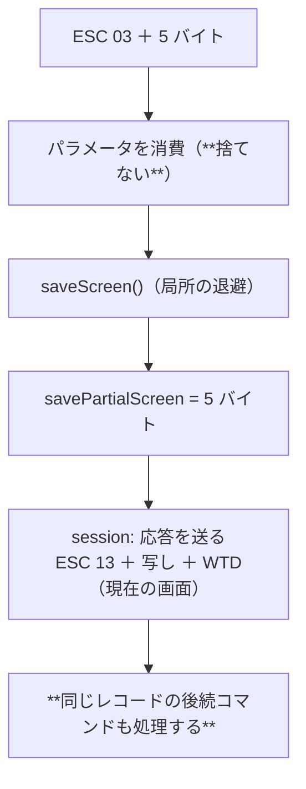

# 仕様: SAVE PARTIAL SCREEN に応答し、QSH を通す

## 概要

**捨てていたコマンドを受理し、ホストが待っている応答を返す。**
形式は実機で確かめた（research F1・F2）。併せて同じ族の `0x13` / `0x23` も受理して
「レコードの残りごと捨てる」経路から外す（**こちらは未実測**）。

## 設計方針

### 方針1: 応答は SAVE SCREEN と同じ直列化を**共有**する

`buildSaveScreenResponse` の中身（現在の画面を再現する WTD ストリーム）を
`writeScreenAsWtd()` に切り出し、`buildSavePartialScreenResponse` と共有する。

違いは 2 つだけ:

- 先頭が `ESC RESTORE_PARTIAL_SCREEN(0x13)`（本家は `ESC RESTORE_SCREEN(0x12)`）
- **受け取った 5 バイトのパラメータをそのまま写す**

ホストにとって中身は**不透明な保管物**（あとで 0x13 でそのまま返ってくる）。
実機は 1 回目の試行で受理した（research F2）。

### 方針2: パラメータの意味は**解釈しない**

実機は 5 バイトすべて `00` だった。範囲（上端・左端・深さ・幅）と見られるが、
**確かめられていない**ので解釈しない——写して返し、退避は画面全体で行う。
「分かっていないことを分かっているように書かない」ため、docstring にもそう書く。

### 方針3: `0x13` / `0x23` は**未実測**と明記して実装する

- `0x13`（RESTORE PARTIAL SCREEN）: 局所の退避スタックから復元（`0x12` と同じ）
- `0x23`（ROLL）: `方向＋行数(1) 上端(1) 下端(1)`。上位ビットで方向、下位 5 ビットで行数

どちらも**この経路では届かなかった**（research F4）。実装の目的は
「捨ててレコードの残りを失わない」ことで、**画面効果の正しさは実機で確かめていない**。
docstring と backlog にその区別を書く。

### 方針4: ROLL はフィールド定義を動かさない

ROLL は表示イメージの移動。フィールドまで動かすと入力欄の位置が実機とずれる
（ホストは送ったあと必要なら書き直してくる）。**セルだけ動かす**。

## 対象範囲

| ファイル | 変更 |
|---|---|
| `packages/core/src/protocol/constants.ts` | `SAVE_PARTIAL_SCREEN` / `RESTORE_PARTIAL_SCREEN` |
| `packages/core/src/protocol/wtd-applier.ts` | `0x03` / `0x13` / `0x23` の分岐 |
| `packages/core/src/protocol/save-screen.ts` | `buildSavePartialScreenResponse` ＋ 直列化の共有 |
| `packages/core/src/screen/buffer.ts` | `roll(top, bottom, lines)` |
| `packages/core/src/session/session.ts` | 応答の送信 |
| `packages/core/test/save-partial-screen.test.ts` | **新規** |
| `packages/core/test/screen-roll.test.ts` | **新規** |
| `scripts/diag-qsh.mjs` | **新規**（実測の再現手段） |
| `scripts/verify-browser-qsh.mjs` | **新規**（実ブラウザ＋実機の回帰） |
| `docs/PROTOCOL.md` | コマンド表に 03 / 13 を追加 |
| `.aidev/backlog/*` | 未実測の 2 件を残す |

## インターフェース / データ構造

```ts
/** SAVE PARTIAL SCREEN を受けた（**応答が要る**）。付いてきた 5 バイトをそのまま渡す */
interface ApplyResult {
  savePartialScreen?: Uint8Array;
}

/** 応答レコード（opcode は RESTORE_SCREEN） */
export function buildSavePartialScreenResponse(
  buf: ScreenBuffer,
  codec: Codec,
  params: Uint8Array
): Uint8Array;

/** ROLL: `top`〜`bottom` を `lines` 行送る（正で上へ）。範囲外・0 行は何もしない */
roll(top: number, bottom: number, lines: number): void;
```

## 振る舞いの詳細



### 境界

| 場合 | 結果 |
|---|---|
| `0x03` の後ろに WTD や READ が続く | **続きも処理される**（従来は捨てていた） |
| `0x13` で退避が空 | 警告して何もしない（`0x12` と同じ） |
| ROLL の行数 0 | 何もしない |
| ROLL の範囲が逆・範囲外 | 何もしない（丸める） |
| ROLL の行数が範囲以上 | 範囲を全消し |

## ドメイン固有の考慮

- **応答を返さないとホストは止まる**。この形の不具合は 3 度目（SAVE SCREEN・
  WRITE ERROR CODE TO WINDOW・今回）。テストで「後続が生き残る」ことを固定する
- 実機で確かめたこと（0x03 の形式と応答）と、確かめていないこと（0x13 / 0x23 の効果）を
  **コメント上で区別する**

## エラー処理 / 異常系

| 事象 | 扱い |
|---|---|
| `0x03` のパラメータが 5 バイト無い | `ByteReader` が短さで投げる → 既存の「解析エラーで切断しない」経路 |
| 退避が空で `0x13` | 警告のみ |
| 未知のコマンド（引き続き） | 従来どおり警告してレコードの残りを捨てる |

## 受け入れ基準との対応

| requirement の完了条件 | 満たし方 |
|---|---|
| 実機で QSH が起動する | research F2・F3（＋ブラウザ E2E で画面を撮る） |
| 出力が読める | research F3（`ls -l /` の 13 行） |
| `0x13` / `0x23` を捨てない | 分岐を足す（未実測と明記） |
| 既存テストが通る | 直列化の共有以外は既存経路に触らない |
| 確かめたこと／いないことの記録 | research・docstring・backlog |
