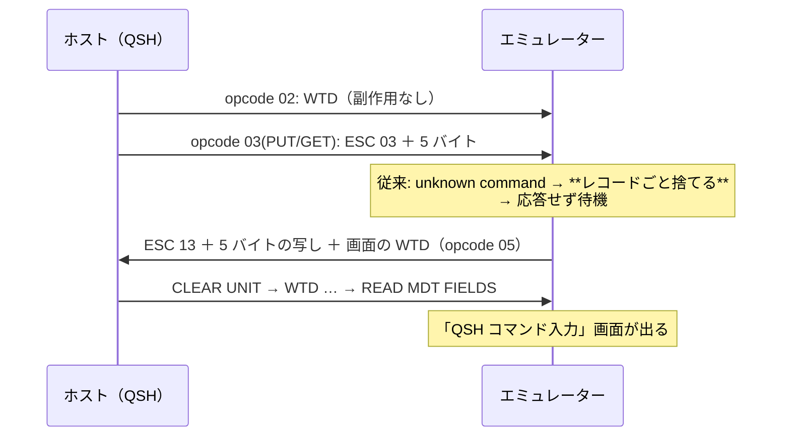

# レビューガイド: QSH の固まりを直す

## 変更概要 / 目的

**`QSH` が「待機中・ホストから応答がない」で固まる**という報告。
利用者の見立て（「必要なバイトを捨てて待機に陥っている」）は**そのとおりだった**。

実機（）で採ったところ、QSH 起動直後にホストが送ってくるのは:

```
opcode 03（PUT/GET）: 04 03 00 00 00 00 00   ← ESC 0x03 ＝ SAVE PARTIAL SCREEN
WARN unknown command 0x3 — discarding rest of record
```

`ESC 0x03` は**端末に画面を送り返させる要求**で、opcode が PUT/GET＝「送ったから返せ」。
返さない限りホストは次を送ってこない。**捨てていたので永久に待っていた。**

## 重要ポイント（特に見てほしい所）

1. **応答を返す**（`packages/core/src/protocol/save-screen.ts` の
   `buildSavePartialScreenResponse`）。形式は**実機の反応で決めた**——
   `ESC 0x13` ＋受け取った 5 バイトの写し ＋ 画面を再現する WTD、opcode は `RESTORE SCREEN`。
   1 回目の試行でホストが先へ進んだ（decisions D1）。
2. **パラメータ 5 バイトを消費する**（`wtd-applier.ts`）。消費しないと後続がずれる。
   意味は**解釈しない**（実機は全て `00`。decisions D2）。
3. **`0x13` / `0x23` は実装したが実機では未確認**（decisions D3）。
   QSH は `0x23`（ROLL）を使わず `CLEAR UNIT` ＋ `WTD` で描き直していた。
   docstring・テスト・backlog に「未実測」と書いてある——**そこは信用しないでほしい**。
4. **ROLL はフィールド定義を動かさない**（decisions D4）。動かすと入力欄がずれる。
5. この形の不具合は**3 回目**（SAVE SCREEN・WRITE ERROR CODE TO WINDOW・今回）。
   `.aidev/backlog/datastream-commands.md` を新設し、
   「未知のコマンドで残りごと捨てる」構造の危うさと未実装の一覧を 1 か所にまとめた。

## 処理フロー



## 主要な変更箇所

- `packages/core/src/protocol/constants.ts:62` — `SAVE_PARTIAL_SCREEN` / `RESTORE_PARTIAL_SCREEN`
- `packages/core/src/protocol/wtd-applier.ts:131` — `0x03` / `0x13` / `0x23` の分岐
- `packages/core/src/protocol/save-screen.ts:24` — 応答（直列化は SAVE SCREEN と共有）
- `packages/core/src/screen/buffer.ts:497` — `roll(top, bottom, lines)`
- `packages/core/src/session/session.ts:446` — 応答の送信
- `scripts/diag-qsh.mjs` / `scripts/verify-browser-qsh.mjs` — **新規**
- `docs/PROTOCOL.md` / `.aidev/backlog/datastream-commands.md`（**新設**）

## リスク / 確認してほしい点

- **`0x13` / `0x23` は未実測**。落ちる先が「レコードごと捨てる」なので受け止める方が安全と判断したが、
  この判断でよいか（decisions D3）
- **退避スタックを `0x02`/`0x12` と共用**している（decisions D5）。
  `0x02` と `0x03` を交ぜる画面があれば順序が狂いうる（未確認）
- 応答の形式は「実機が受理した」以上のことは分かっていない（decisions D1）
- `packages/server/test/zip-writer.test.ts` の 4 件は `unzip` が無いため失敗（`main` でも同じ）
