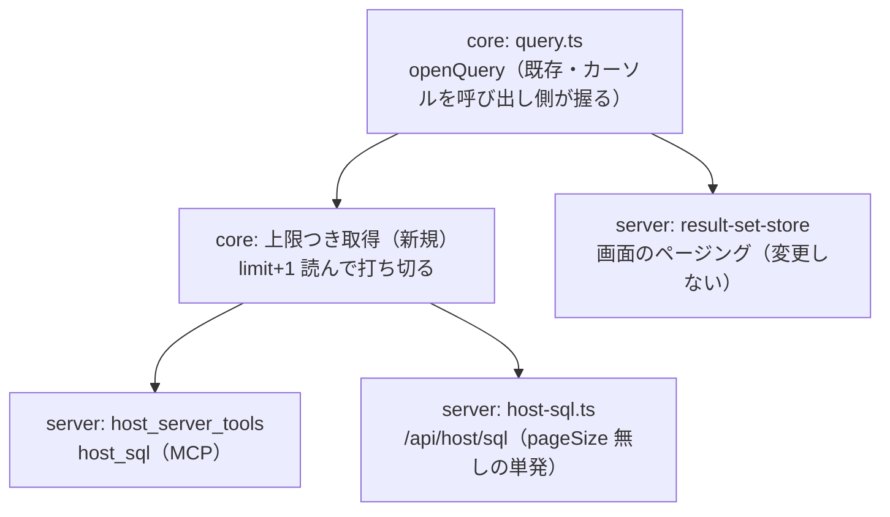

# 調査: 結果セットの早期打ち切りは安全で、取得量は実際に減る

## 調査の問い

- Q1: 途中でカーソルを閉じた（`openQuery` の `return()`）後、**同じ接続で次の SQL が通るか**
- Q2: **ホストからの取得は実際に減るか**（往復回数・受信バイト数）
- Q3: ブロッキング係数（既定 100）の境界で打ち切っても同じか
- Q4: 打ち切りを繰り返しても接続が壊れないか。直後に更新系も通るか
- Q5: 「**まだ続きがあるか**」を正しく知る方法は何か
- Q6: ブロッキング係数を上限に合わせると受信量はさらに減るか
- Q7: 大きな表でどれだけ差が出るか

## 判明した事実（すべて実機・IBM i 7.5 で実測）

再現手段: `scripts/research-sql-cancel.mjs`

### F1: **早期打ち切りは安全**（Q1・Q3・Q4）

上限 1 / 50 / 99 / 100 / 101 / 200 / 250 の**すべて**で、打ち切った直後に
同じ接続で `SELECT COUNT(*)` が通った（1000 行を正しく返す）。

- **10 回続けて打ち切っても壊れない**
- **打ち切った直後に `UPDATE`（非クエリ経路）も通る**（1 行更新に成功）
- ブロック境界のちょうど（100）・前（99）・後（101）で差は無い

→ backlog の「カーソルを途中で閉じる経路が未検証」は**これで閉じられる**。

### F2: 取得量は**往復回数と受信バイト数の両方**で減る（Q2・Q7）

1000 行（`CHAR(20)`）:

| 取り方 | fetch 往復 | 受信バイト | 所要 |
|---|---|---|---|
| 全件 | 11 | 29,696 | 126ms |
| 上限 200 | 2 | 5,912 | 60ms |
| 上限 1 | 1 | 2,956 | 42ms |

20,000 行（`CHAR(50)`）:

| 取り方 | fetch 往復 | 受信バイト | 所要 |
|---|---|---|---|
| 全件 | 201 | **1,191,336** | **2,072ms** |
| 上限 200 | 2 | **11,912** | **44ms** |

→ **受信量は 100 分の 1、所要時間は 47 分の 1**。
「`maxRows` は取得量を減らさない」という現状の説明は、
**減らせるのに減らしていない**ことを表していた。

### F3: **上限が小さいときはブロッキング係数も絞らないと無駄が残る**（Q6）

既定のブロッキング係数（100）のままだと、**上限 1 でも 100 行ぶん届く**。

| 上限 | ブロック | fetch 往復 | 受信バイト |
|---|---|---|---|
| 1 | 既定(100) | 1 | 2,956 |
| **1** | **1** | 1 | **184** |
| 10 | 既定(100) | 1 | 2,956 |
| **10** | **10** | 1 | **436** |
| 200 | 既定(100) | 2 | 5,912 |
| 200 | 200 | **1** | 5,756 |

→ 上限が小さいほど効く（1 行で **16 分の 1**）。
ブロックを上限に合わせると往復も 1 回に収まる。
**ただし大きくしすぎない**——1 往復の応答が上限ぶん丸ごと載るため、
既定（100）を超えるときは既定のままブロックを刻む方が応答が小さい。

### F4: 「続きがあるか」は **上限＋1 行読む**と正しく分かる（Q5）

| 場合 | n+1 まで読んだ結果 | 判定 |
|---|---|---|
| 1000 行を 200 で切る | 201 行取れた | 続きが**ある** |
| 1000 行を 1000 で切る（ちょうど） | 1000 行で止まった | 続きは**ない** |
| 1000 行を 1500 で切る | 1000 行で止まった | 続きは**ない** |

→ **上限ちょうどで嘘をつかない**。`rows.length === limit` を「続きがある」と
見なす実装は、ちょうどのときに嘘になる（`truncated: true` と言ってしまう）。

### F5: ジェネレータを**閉じずに放置**すると、次の SQL は既存の歯止めが断る

`openQuery` の反復を 1 行で放置したまま次の `query` を呼ぶと
`another query is in progress on this connection` で断られた
（`DbConnection.acquire` の占有チェック）。
**静かにデータが混ざることはない**が、放置すると接続が使えなくなるので
**呼び出し側が必ず閉じる**設計は変えられない。

## 影響範囲

- `query()`（全件取得）は CSV ダウンロード・取り込み前の検査などが使っている。**触らない**
- 画面のページング（`pageSize` 指定）は結果セットを保持する形で既に正しい。**触らない**

## 実現性 / リスク

- **実現できる。** 早期打ち切りはホストに副作用を残さない（F1）
- **リスク 1: 打ち切りが失敗したとき**——`closeCursor` は失敗を握り潰す実装なので
  「閉じられなかった」を呼び出し側が知れない。単発経路は接続を閉じるので影響は無いが、
  **プールに戻す経路では戻さない**判断が要る（`/api/host/sql` の単発は都度接続を開いて閉じている）
- **リスク 2: ブロックを上限に合わせすぎると 1 往復が大きくなる**（F3 の注意）。
  上限が既定（100）を超えるときは既定のままにする
- **リスク 3: LOB** ——`query` は LOB をロケーターから取り直す処理を含む。
  上限つき取得でも同じ扱いにしないと LOB 列が空で返る（既存の `fillLobs` を通す必要がある）

## spec への申し送り

1. **上限つき取得を core に足す**（`query` は変えない）。`limit + 1` 行まで読んで打ち切り、
   `truncated` を**測った事実として**返す（F4）
2. **ブロッキング係数は `min(既定 100, limit + 1)`**（F3）
3. `host_sql`（MCP）と `/api/host/sql` の単発経路を載せ替え、
   **「取得量は減らない」という説明を書き換える**（現状の記述は実態と食い違うことになる）
4. LOB は既存の `fillLobs` を通す（リスク 3）
5. 画面のページングと `query`（全件）は触らない
