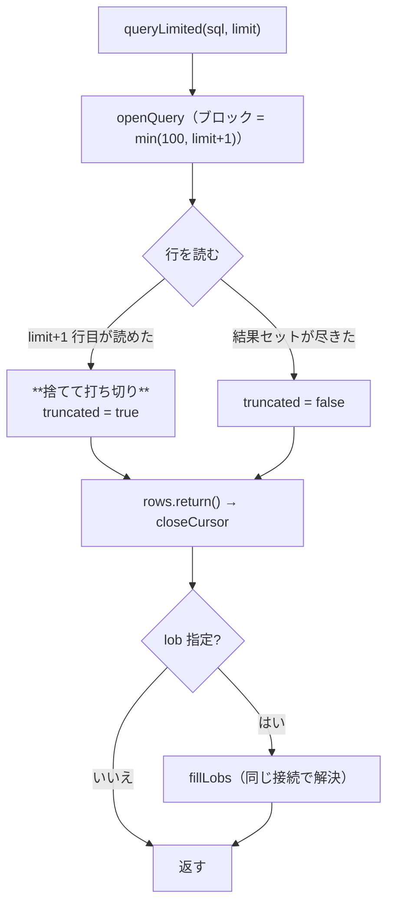

# 仕様: 取得する行数を実際に抑える（早期打ち切り）

## 概要

**新しいプロトコル調査は要らない。** 早期打ち切りは実機で安全と分かった（research F1）。
`query()` の隣に**上限つき取得**を足し、`host_sql`（MCP）と `/api/host/sql` の単発経路を
そこへ載せ替える。全件取得（`query`）と画面のページングは触らない。

## 設計方針

### 方針1: `query()` を変えず、**別の入口**を足す

```ts
queryLimited(conn, sql, { limit, lob? }): Promise<LimitedResult>
```

`query()` にオプションを足す形は採らない。全件取得は CSV ダウンロード・取り込み前の検査が
使っており、**「上限を渡し忘れると全件」**という穴が残る。
入口を分ければ、呼び出し側は**どちらの意味で読むかを必ず選ぶ**。

### 方針2: `limit + 1` 行読んで、**続きの有無を測った事実として返す**（research F4）

`rows.length === limit` を「続きがある」と見なすと、
**上限ちょうどの結果セットで嘘になる**（`truncated: true` と言ってしまう）。
1 行余分に読んで、余った 1 行を**捨てる**。

| 読めた行数 | 返す `rows` | `truncated` |
|---|---|---|
| `limit + 1` | 先頭 `limit` 行 | **true** |
| `limit` 以下 | そのまま | **false** |

### 方針3: ブロッキング係数は `min(既定 100, limit + 1)`（research F3）

上限が小さいときは**既定のままだと 100 行ぶん届く**（上限 1 で 2,956 バイト → 184 バイト）。
逆に上限が既定より大きいときは**既定のまま刻む**——1 往復の応答が上限ぶん丸ごと載ると
メモリと待ちが増える（抑えたい相手そのもの）。

### 方針4: 打ち切りは**必ず行う**。失敗したら呼び出し側に伝える

`openQuery` のジェネレータは `finally` で `closeCursor` → `release` する。
`closeCursor` は失敗を握り潰す実装（片付けの失敗で結果を捨てないため）なので、
**「閉じられなかった」を上位が知る手段が無い**。

今回の経路では:

- 単発経路（MCP・`/api/host/sql` の `pageSize` 無し）は**接続を閉じる**ので影響が無い
- そのため `queryLimited` 自体は現状の握り潰しに乗る。**握り潰しの範囲を広げない**
  （プールへ戻す経路をこの入口から作らない。作るときは `closeCursor` の失敗を
  返す形に変える——その判断を decisions に残す）

### 方針5: LOB は既存の `fillLobs` を通す（research リスク 3）

上限つき取得でも `lob` オプションを受け、**打ち切った後・カーソルを閉じた後**に
同じ接続でロケーターを解決する（`query` と同じ順序）。

## 対象範囲

| ファイル | 変更 |
|---|---|
| `packages/core/src/hostserver/db/query.ts` | `queryLimited()` を追加（`query` は変更しない） |
| `packages/core/src/index.ts` | 公開 |
| `packages/server/src/host-server-tools.ts` | `host_sql` を載せ替え、**説明文を実態に合わせる** |
| `packages/server/src/host-sql.ts` | `pageSize` 無しの単発経路を載せ替え |
| `packages/core/test/sql-query-limited.test.ts` | **新規** |
| `packages/server/test/host-sql-limit.test.ts` | **新規** |
| `scripts/research-sql-cancel.mjs` | **新規**（実測の再現手段） |
| `.aidev/backlog/hostserver.md` | 該当 2 項目に結論 |

## インターフェース / データ構造

```ts
/** 上限つき取得の結果 */
export interface LimitedResult extends QueryResult {
  /**
   * 上限で切ったか。**測った事実**（`limit + 1` 行目が読めたか）であって、
   * `rows.length === limit` からの推測ではない。
   */
  truncated: boolean;
}

/**
 * SELECT を**上限まで**取得する。上限に達したらカーソルを閉じて打ち切る。
 *
 * `query()` との違いは「ホストから取ってくる量」。`query()` は全件取得してから返すので、
 * 大きな表では全行がメモリに載る（20,000 行で 1.2MB / 2.1 秒。research F2）。
 */
export function queryLimited(
  conn: DbConnection,
  sql: string,
  opts: { limit: number; lob?: LobOptions }
): Promise<LimitedResult>;
```

`host_sql`（MCP）の応答は形を変えない（`rows` / `rowCount` / `truncated` は既にある）。
**変わるのは `truncated` の意味**——「応答で切った」から「**取得を打ち切った**」になる。

`/api/host/sql`（単発）も同じ（既存の `truncated` を流用）。

## 振る舞いの詳細



### 境界

| 場合 | 結果 |
|---|---|
| 結果 0 行 | `rows: []` / `truncated: false` |
| 結果が上限より少ない | 全部返す / `false` |
| 結果が**上限ちょうど** | 全部返す / **`false`**（嘘をつかない） |
| 結果が上限＋1 以上 | 上限ぶん / **`true`** |
| `limit` が 0 以下 | `CONFIG_ERROR`（呼び出し側の誤り。黙って全件にしない） |
| 途中で SQL エラー | そのまま投げる（カーソルは `finally` で閉じる） |

## ドメイン固有の考慮

- **打ち切りはホストに副作用を残さない**（research F1。同じ接続で SELECT も UPDATE も通る）
- **放置は許されない**（research F5）。`queryLimited` は自分で閉じるので呼び出し側の
  規律に依存しない——それが `openQuery` を直接使わせない理由
- 画面のページングは**別の要求**（結果セットを保持して続きを読む）。混ぜない

## エラー処理 / 異常系

| 事象 | 扱い |
|---|---|
| `limit <= 0` / 整数でない | `CONFIG_ERROR` |
| SQL エラー | `SqlError`（既存のまま） |
| 打ち切り時の `closeCursor` 失敗 | 現状どおり握り潰す（単発経路は接続を閉じる。方針4） |
| LOB の取得失敗 | 既存の `fillLobs` の扱いを変えない |

## 受け入れ基準との対応

| requirement の完了条件 | 満たし方 |
|---|---|
| 打ち切り後に同じ接続で次の SQL が通る | research F1（7 境界 ＋ 10 回連続 ＋ 直後の UPDATE） |
| 取得が実際に減る | research F2（往復・バイト・時間）＋ 単体テストで往復回数を固定 |
| `host_sql` の `maxRows` が取得量の上限になる | `queryLimited` へ載せ替え |
| `/api/host/sql`（単発）も同じ | 同 |
| 「続きがある」が正直 | 方針2 ＋ 上限ちょうどのテスト |
| 打ち切りに失敗した接続を使い回さない | 単発経路は接続を閉じる（方針4。プール経路は作らない） |
| 既存テストが通る | `query` / ページングに触らない |
| 説明の書き換え | `host_sql` の description ＋ `host-sql.ts` の該当コメント |
| backlog に結論 | 2 項目に実測を書く |
