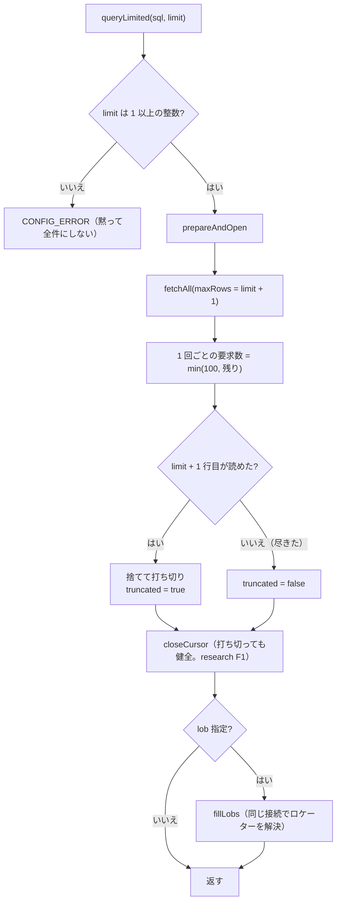

# レビューガイド: 取得する行数を実際に抑える（早期打ち切り）

## 変更概要 / 目的

`host_sql`（MCP）と `/api/host/sql`（単発）の `maxRows` は、**名前どおりに働いていなかった**
——応答に載せる行数の上限であって、ホストから取ってくる量は減らしていなかった。
`query()` が全件取得してから返すので、大きな表では全行がメモリに載る。

backlog は「早期打ち切りには `stream` が要るが、**カーソルを途中で閉じる経路が未検証**」と
書いており、それが採用できない理由だった。**その未検証を実測で閉じた**うえで、
上限つき取得（`queryLimited`）を足して 2 つの入口を載せ替えた。

実機・20,000 行 × `CHAR(50)`:

| 取り方 | fetch 往復 | 受信バイト | 所要 |
|---|---|---|---|
| 全件（変更前） | 201 | 1,191,336 | 2,072ms |
| 上限 200（変更後） | 2〜3 | 約 12,000 | 44ms |

## 重要ポイント（特に見てほしい所）

1. **`truncated` は測った事実**（`packages/core/src/hostserver/db/query.ts:186`）。
   上限＋1 行目を読んで決める。`rows.length === limit` で推測すると
   **上限ちょうどの結果セットで嘘になる**（decisions D3）。余りの 1 行は捨てる。
2. **ブロッキング係数を「残り」に合わせる**（`query.ts:376` の `want`）。
   既定 100 のままだと**上限 1 でも 100 行ぶん届く**（実測 2,956 → 184 バイト）。
   上限が既定を超えるときは既定のまま刻む——1 往復の応答が上限ぶん丸ごと載るのは
   抑えたい相手そのもの。要求列は上限 200 で `[100, 100, 1]`（decisions D2）。
3. **`openQuery` の占有漏れを直した**（`query.ts:246`）。prepare の失敗で `release()` されず、
   **SQL の誤り 1 回でその接続が二度と使えなくなっていた**（以降すべて
   「another query is in progress」）。実機で確認済み（decisions D1）。
   単発接続では接続ごと閉じるので隠れていた。
4. **`limit <= 0` を黙って全件にしない**（`query.ts:191`）。
   上限のつもりで 0 を渡した呼び出しが全件取得になるのが最悪。
5. **画面のページング経路は触っていない**（decisions D4）。あちらは結果セットを保持して
   続きを読む別の要求。テストで「変えていない」ことを固定した。

## 処理フロー

## 主要な変更箇所

- `packages/core/src/hostserver/db/query.ts:154` — `LimitedResult` / `queryLimited`
- `packages/core/src/hostserver/db/query.ts:246` — `openQuery` の占有漏れ修正（4 行）
- `packages/core/src/hostserver/db/query.ts:362` — `fetchAll` に `maxRows`。
  終端判定を `blockSize` から**その回に要求した数**へ
- `packages/server/src/host-server-tools.ts:132` — `host_sql` の説明文と実装
- `packages/server/src/host-sql.ts:255` — 単発経路
- `scripts/research-sql-cancel.mjs` / `scripts/verify-sql-limit.mjs` — **新規**

## リスク / 確認してほしい点

- **`truncated` の意味が変わる**（応答側で切ったか → 取得を打ち切ったか）。
  値の出方は変わらない（大きな表では以前も true）が、意味の変化は文書に明記した
- **MCP の LOB 取得回数が減る**（上限ぶんの行しか解決しないため）。
  以前は全行ぶん取ってから捨てていた——速くなるが、挙動の違いとして意識しておきたい
- 早期打ち切りの検証は **IBM i 7.5 の 1 台（実機）**のみ
  （「PUB400 以外の IBM i での検証」は backlog の既存項目）
- `packages/server/test/zip-writer.test.ts` の 4 件は**環境に `unzip` が無い**ため失敗する
  （`main` でも同じ。この変更とは無関係）
