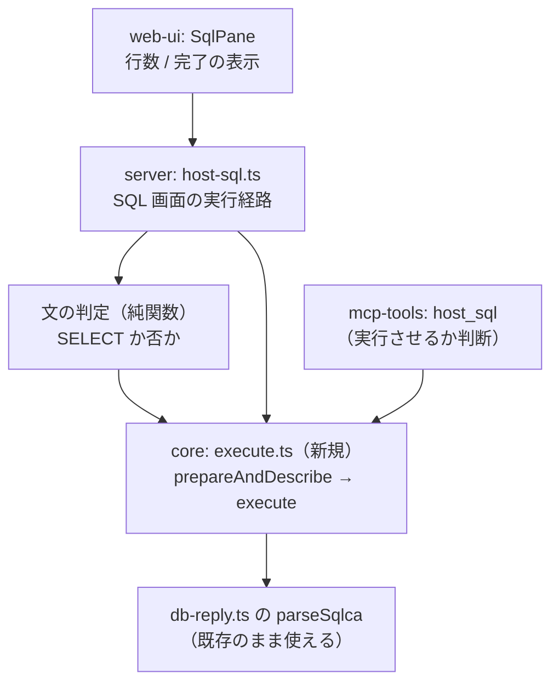

# 調査: 結果を返さない SQL 文は既存の要求で実行できる

## 調査の問い

- Q1: `prepareAndDescribe`(0x1803) → `execute`(0x1805) は**マーカーが無い文**で通るか
- Q2: DML（INSERT/UPDATE/DELETE）と DDL（CREATE/DROP）の両方が通るか
- Q3: 影響行数はどこから取るか
- Q4: 文型（`sqlStatementType`）は何を送るべきか
- Q5: 失敗・警告はどう見分けるか。経路を間違えたらどうなるか
- Q6: 利用者のライブラリー（QTEMP 以外）に書けるか

## 判明した事実（すべて実機・IBM i 7.5 で実測）

再現手段: `scripts/research-sql-exec.mjs`

### F1: **`executeImmediate` は要らなかった。既存の 2 要求で全部通る**（Q1・Q2）

| 文 | prepare | execute | `updateCount` |
|---|---|---|---|
| `CREATE TABLE QTEMP.T (…)` | 0 | **0** | 0 |
| `INSERT INTO QTEMP.T VALUES(1,'a')` | 0 | **0** | **1** |
| `UPDATE QTEMP.T SET S='z'`（2 行） | 0 | 0（警告 `01504`） | **2** |
| `DELETE FROM QTEMP.T WHERE ID=1` | 0 | **0** | **1** |
| `DROP TABLE QTEMP.T` | 0 | **0** | 0 |

**最後に SELECT で中身を確かめ、DML が実際に効いていることを確認した**（`{"ID":2,"S":"y"}`
——ID 1 が消え、S が更新されている）。

backlog の見立て（「拡張形式の文テキストか RPB の設定が鍵」）は**別の道を指していた**。
`executeImmediate`(0x1806) / `prepare`(0x1800) が `-215` で拒まれるのは事実だが、
**その 2 つを通す必要が無い**。`insert.ts` が既に使っている道がそのまま使える。

### F2: マーカー形式は**空（0 バイト）で返る**。`changeDescriptor` は要らない（Q1）

マーカーが 1 つも無い文でも `parameterMarkerFormat` は返る（`markerBytes: 0`）。
`insert.ts` は「無ければ投げる」ので、**この経路では `changeDescriptor` を省いて
`execute` にマーカーデータを載せない**形で足りる（実測でそのまま通った）。

### F3: 影響行数は SQLCA の `updateCount`。**既存の `parseSqlca` がそのまま使える**（Q3）

`db-reply.ts:185` の `updateCount`（SQLCA オフセット 104）に入る。
DDL では 0（行の概念が無い）。

### F4: 文型は **1 でも 0 でも通る**（Q4）

`UPDATE` を `sqlStatementType = 0` でも送って通った。既存の `insert.ts` が 1 を使い、
それで DDL も DML も通ったので、**1 で揃える**のが素直（原典 JTOpen の SELECT=2 / OTHER=1
とは対応していないが、当方の SELECT が 0 で動いているのと同じで「原典と一致していない」
のは既知。動く値を変える理由が無い）。

### F5: 成否は **SQLCODE の符号**で見る。正の値は**警告つき成功**（Q5）

| 事象 | SQLCODE | SQLSTATE | 意味 |
|---|---|---|---|
| 正常 | 0 | `00000` | 成功 |
| `WHERE` 無しの UPDATE | 0 | **`01504`** | 成功（警告） |
| 実ライブラリーへの `CREATE TABLE` | **7905** | `01567` | **成功**（警告。表は作られた） |
| 構文誤り | **-104** | `42601` | 失敗（prepare 段） |
| 存在しない表 | **-204** | `42704` | 失敗（prepare 段） |
| **SELECT を非クエリ経路に流した** | **-518** | `07003` | 失敗（execute 段） |

**`sqlCode < 0` が失敗、`>= 0` は成功**（正なら警告を添えたい）。
経路を間違えたときは `-518` で明確に落ちるので、**判定を誤っても黙って壊れない**。

### F6: 利用者のライブラリーにも書ける（Q6）

`CREATE TABLE TESTLIB.SQLEXEC2 (ID INT)` は **`7905`（警告つき成功）**。
続けて同じ表をシステム命名（`TESTLIB/SQLEXEC2`）で作ろうとすると `-601`（既に存在）＝
**どちらの命名でも解決される**。`DROP TABLE TESTLIB.SQLEXEC2` も 0 で通った。

### F7: **検証スクリプトで踏んだ罠が、実装でも同じ罠になる**

最初の版は成否を `reply.rcClass` で見ていたが、**`Reply` にその欄は無い**（`DbTemplate` 側にある）。
常に `undefined !== 0` ＝ 常に失敗扱いになり、「`CREATE` が -204 で失敗した」と読み違えた。
実際は prepare が成功していて、その後 `execute` を呼んでいなかっただけ。

→ **実装では SQLCODE を見る**（F5）。`insert.ts` の `assertOk` も
`dbTemplate` 経由の判定と SQLCA を併用しているので、そちらに倣う。

## 影響範囲

## 実現性 / リスク

- **実現できる。**新しい要求 ID もプロトコル調査も要らない（F1）
- **リスク 1: 書き込みは取り消せない。** 判定を誤って DML を「成功」と表示するのは避ける
  ——`insert.ts` と同じく **SQLCA が読めないときは失敗**として扱う
- **リスク 2: 文の判定を誤ると `-518` で落ちる**（F5）。落ちるだけで壊れないが、
  利用者には「SELECT を書いたのに実行できない」と見えるので判定は丁寧に作る
  （コメント・`WITH`・`VALUES`・括弧始まり）
- **リスク 3: 警告を捨てると「作られたのに何も言われない」**（F6 の 7905）。
  正の SQLCODE は表示に載せる
- **リスク 4: 同じ接続で文名（`prepareStatementName`）を共有する**。`insert.ts` は
  `ASUPLOAD` を固定で使い「この関数の間は他の SQL を流すな」と注記している。
  非クエリ経路も**別の文名**を使い、同じ注意を書く

## spec への申し送り

1. **`executeImmediate` は追わない**（F1）。`prepareAndDescribe` → `execute` で実装する。
   `-215` の理由の解明は backlog に残す
2. **`changeDescriptor` は省く**（F2）。マーカーが無い文だけを対象にする
   ——マーカー付きの非クエリ文（`?` を含む DML）は今回のスコープ外にし、その旨を書く
3. **影響行数は `updateCount`**（F3）。DDL では 0 なので「行数」と「完了」を出し分ける
4. **文型は 1**（F4）
5. **`sqlCode < 0` が失敗、正は警告つき成功**（F5）。警告は表示に載せる
6. **文名は `insert.ts` と別にする**（リスク 4）。占有の注意をコメントに書く
