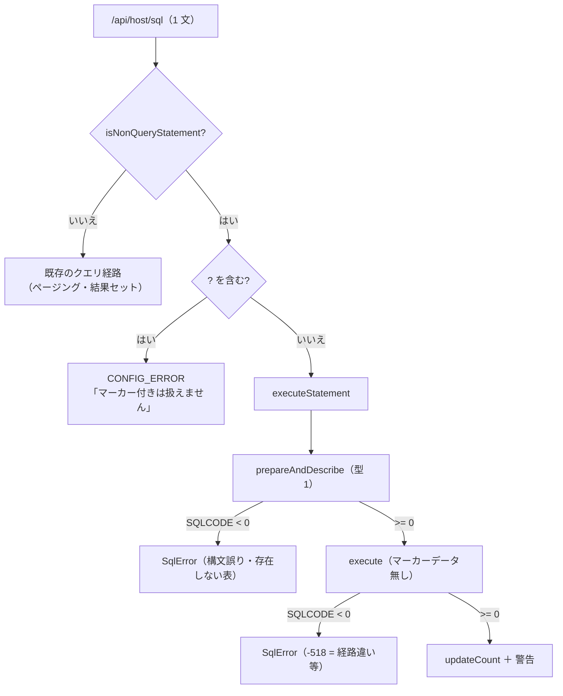

# 仕様: 結果を返さない SQL 文を実行する

## 概要

**新しいプロトコル調査は要らない。** `prepareAndDescribe`(0x1803) → `execute`(0x1805) が
DML も DDL も通ることを実機で確かめた（research F1）。`executeImmediate` は追わない。

core に `executeStatement()` を足し、**サーバー側で文を振り分ける**。
SQL 画面は返ってきたものを描くだけ。

## 設計方針

### 方針1: 振り分けは**サーバー**で行う（画面に判定を持たせない）

`/api/host/sql` は 1 文を受け取る（`SqlPane` が `;` で割って 1 文ずつ投げる既存の形）。
そこで「クエリか否か」を決め、応答の形を変える。

- 画面・MCP・将来の入口が**同じ判定**を共有できる（判定を 2 か所に書かない）
- 画面は「行が返る／行数が返る」を見分けるだけでよい

### 方針2: 判定は純関数。**迷ったらクエリとして扱う**

`isNonQueryStatement(sql)` を core に置く（純関数・単体テスト）。

判定は**先頭のキーワード**で行い、前置きを取り除く:

- 行コメント `--…` / ブロックコメント `/*…*/`
- 先頭の括弧（`(SELECT …) UNION …`）
- `WITH …` は**クエリ**（共通表式）
- `SELECT` / `VALUES` / `WITH` / 括弧始まり → **クエリ**
- それ以外（`INSERT` / `UPDATE` / `DELETE` / `MERGE` / `CREATE` / `DROP` / `ALTER` /
  `GRANT` / `REVOKE` / `COMMENT` / `LABEL` / `CALL` / `SET` / `TRUNCATE` / `RENAME` …）
  → **非クエリ**

**「知らない語は非クエリ」ではなく「知っているクエリ語だけクエリ」**にする理由:
非クエリ経路へ誤って送った場合は `-518`（`07003`）で**明確に落ちる**（research F5）。
逆にクエリ経路へ非クエリを送ると「結果セットが取得できません」で落ちる。
どちらも落ちるだけだが、**DDL/DML を実行できないほうが利用者の損が大きい**ので
非クエリ側を既定にする。

### 方針3: 成否は **SQLCODE の符号**。正の値は**警告つき成功**（research F5）

| SQLCODE | 扱い |
|---|---|
| `0` | 成功 |
| `> 0` | **成功**。警告として SQLSTATE を添える（例 `7905`＝表は作られた） |
| `< 0` | 失敗（`SqlError` を投げる） |
| SQLCA が読めない | **失敗**（書き込みは取り消せないので安全側に倒す。`insert.ts` と同じ） |

### 方針4: マーカー（`?`）付きの非クエリ文はスコープ外

`changeDescriptor` を省くので、`?` を含む文は扱わない（research F2）。
**含んでいたら実行前に断る**——通してしまうとマーカーが埋まらないまま実行され、
何が起きるか分からない。CSV 取り込み（`insert.ts`）が別経路で担っている。

### 方針5: 文名は `insert.ts` と別にし、占有の注意を書く

`insert.ts` は `ASUPLOAD` を固定で使い「この関数の間は他の SQL を流すな」と注記している。
非クエリ経路も同じ性質（同じ RPB に別の文を準備されると失われる）なので
**別の文名（`ASEXEC`）**にし、同じ注意をコメントに書く。

## 対象範囲

| ファイル | 変更 |
|---|---|
| `packages/core/src/hostserver/db/execute.ts` | **新規**。`executeStatement()` |
| `packages/core/src/hostserver/db/statement-kind.ts` | **新規**。`isNonQueryStatement()`（純関数） |
| `packages/core/src/index.ts` | 公開 |
| `packages/server/src/host-sql.ts` | 非クエリなら `executeStatement` へ振り分け |
| `packages/web-ui/src/components/SqlPane.vue` | 行数 / 完了 / 警告の表示 |
| `packages/core/test/sql-statement-kind.test.ts` | **新規** |
| `packages/core/test/sql-execute.test.ts` | **新規**（偽の接続で要求の形と判定を見る） |
| `packages/server/test/host-sql-execute.test.ts` | **新規**（振り分けと応答） |
| `packages/web-ui/test/sql-pane-execute.test.ts` | **新規**（表示） |
| `scripts/research-sql-exec.mjs` | **新規**（実測の再現手段） |
| `.aidev/backlog/hostserver.md` | 当該項目に結論 |

## インターフェース / データ構造

```ts
/** 結果を返さない文の実行結果 */
export interface ExecuteResult {
  /**
   * 影響した行数。**行の概念が無い文（DDL）では 0** なので、
   * 「0 行更新」と「行数の無い完了」を呼び出し側が区別できるよう `hasRowCount` を添える。
   */
  updateCount: number;
  /** 影響行数に意味があるか（DML なら true） */
  hasRowCount: boolean;
  /** 警告（SQLCODE > 0）。成功だが伝えるべきこと */
  warning?: { sqlCode: number; sqlState: string };
}

/**
 * 結果を返さない文（DML / DDL）を実行する。
 *
 * ⚠ この関数を呼んでいる間、その接続に他の SQL を流してはならない
 * （同じ RPB に別の文を準備されると、こちらの文が失われる。`insert.ts` と同じ）。
 */
export function executeStatement(conn: DbConnection, sql: string): Promise<ExecuteResult>;

/** その SQL は「結果を返さない文」か（迷ったら false＝クエリ扱い。spec 方針2） */
export function isNonQueryStatement(sql: string): boolean;
```

`/api/host/sql` の応答（非クエリのとき）:

```jsonc
{
  "kind": "execute",          // クエリのときは付かない（既存の応答と混ざらない）
  "updateCount": 2,
  "hasRowCount": true,
  "warning": { "sqlCode": 7905, "sqlState": "01567" },  // あれば
  "connection": { … }         // 既存と同じ
}
```

**`kind` を足すのは、画面が「行が無い応答」と「0 行の SELECT」を見分けるため。**
`columns` の有無で判ると、列が 0 の結果セットと区別できない。

## 振る舞いの詳細

### 実行の流れ



### 画面の表示

| 場合 | 表示 |
|---|---|
| DML（`hasRowCount`） | 「**N 行に影響しました**」 |
| DDL | 「**実行しました**」 |
| 警告つき | 上に加えて `SQLCODE=7905 SQLSTATE=01567` を添える |
| 失敗 | 既存のエラー表示（`SQLCODE` / `SQLSTATE` 付き） |

複数文のときは既存どおり**文ごとにタブ**を作り、非クエリのタブは表の代わりに上記を出す。
**失敗したらそこで止める**（既存の挙動を変えない）。

### 判定の境界（テストで固定する）

| SQL | 判定 |
|---|---|
| `SELECT …` / `  select …` | クエリ |
| `-- コメント\nSELECT …` | クエリ |
| `/* c */ SELECT …` | クエリ |
| `WITH t AS (…) SELECT …` | クエリ |
| `(SELECT …) UNION (SELECT …)` | クエリ |
| `VALUES(1)` | クエリ |
| `INSERT` / `UPDATE` / `DELETE` / `MERGE` | 非クエリ |
| `CREATE` / `DROP` / `ALTER` / `RENAME` / `TRUNCATE` | 非クエリ |
| `GRANT` / `REVOKE` / `COMMENT` / `LABEL` / `SET` / `CALL` | 非クエリ |
| `SELECTX …`（語の途中） | **クエリではない**（語境界で判定する） |
| 空文字・コメントだけ | クエリ（実行させず既存の経路が断る） |

## ドメイン固有の考慮

- **書き込みは取り消せない。** コミットメント制御は使っていない（`COMMIT(*NONE)` 相当）
- **`insert.ts` の経路は触らない**（CSV 取り込みが動いている）
- 実ライブラリーへの DDL は**警告つき成功**になることがある（research F6 の 7905）。
  警告を捨てると「作られたのに何も言われない」になる

## エラー処理 / 異常系

| 事象 | 扱い |
|---|---|
| 構文誤り | `SqlError`（prepare 段の SQLCODE） |
| 存在しない表 | 同（`-204`） |
| クエリを非クエリ経路に流した | `-518`。**明確に落ちる**（黙って壊れない） |
| SQLCA が読めない | 失敗（安全側） |
| `?` を含む非クエリ文 | 実行前に `CONFIG_ERROR` |

## 受け入れ基準との対応

| requirement の完了条件 | 満たし方 |
|---|---|
| 実機で通るかを確かめ記録した | research F1〜F7（`scripts/research-sql-exec.mjs`） |
| DML が実行でき行数が返る | `executeStatement` ＋ `updateCount` |
| DDL が実行でき完了が返る | `hasRowCount: false` |
| 失敗が理由付き | `SqlError`（SQLCODE / SQLSTATE） |
| 判定が純関数でコメント・`WITH` を誤らない | `isNonQueryStatement` ＋ 境界テスト |
| SQL 画面で読める | `SqlPane` の表示 |
| `;` 区切りで混在 | 既存の分割はそのまま。振り分けはサーバー |
| 既存が壊れない | `insert.ts`・クエリ経路に触らない（既存テスト） |
| backlog に結論 | 当該項目に実測を書く |
