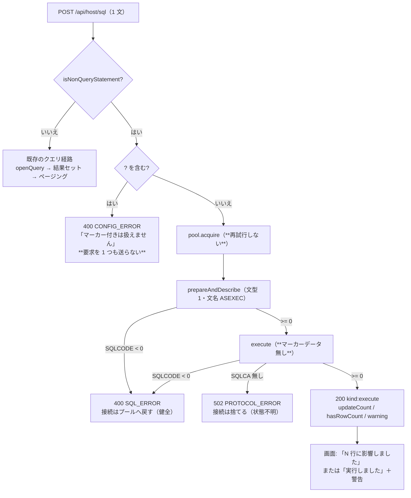

# レビューガイド: 結果を返さない SQL 文を実行する

## 変更概要 / 目的

SQL 画面から **INSERT / UPDATE / DELETE / CREATE / DROP …** を実行できるようにした。

backlog は「`executeImmediate`(0x1806) が `-215` で拒まれるのが壁」「拡張形式の文テキストか
RPB の設定が鍵」と見立てを残していたが、**その道は要らなかった**。
`insert.ts` が既に使っている `prepareAndDescribe`(0x1803) → `execute`(0x1805) を
**マーカーデータ無し**で送れば DML も DDL も通る（実機で実測。research F1）。

## 重要ポイント（特に見てほしい所）

1. **`hasRowCount` を SQLCA の件数で決めてはいけない**（`decisions.md` D1）。
   実機は **DDL でも `updateCount: 0`** を返すので、件数からは
   「DDL の完了」と「0 行に影響した DML」を区別できない。文の先頭語で決めている
   （`packages/core/src/hostserver/db/statement-kind.ts:60` `isRowCountStatement`）。
2. **書き込みの失敗では接続を張り直さない**（D3）。クエリ経路は 1 度だけ張り直すが、
   同じことをすると `execute` が届いた後に応答だけ失われた場合に**同じ INSERT が 2 度走る**
   （`packages/server/src/host-sql.ts:139` の docstring）。
3. **正の SQLCODE は成功**（`7905 / 01567`＝実ライブラリーへの `CREATE TABLE`）。
   捨てると「作られたのに何も言われない」になるので画面まで運ぶ
   （`packages/core/src/hostserver/db/execute.ts:113`）。
4. **迷ったらクエリ扱い**（`statement-kind.ts:16`）。知っているクエリ語だけをクエリと認める。
   誤って非クエリ経路へ流れた SELECT は `-518 / 07003` で**明確に落ちる**ので黙って壊れない。
5. **腐った説明の是正**（D5）。`host-sql.ts` 冒頭は長く「構造的に読み取り専用」と説明しており、
   `app.ts` / `host-upload.ts` / 既存テスト / `SqlPane.vue` がそれを参照していた。
   **同じ PR で全部直した**——残すと次の変更が誤った前提で始まる。

## 処理フロー

## 主要な変更箇所

- `packages/core/src/hostserver/db/statement-kind.ts` — **新規**。純関数 2 つ＋行数判定。
  `hasParameterMarker` は**文字列リテラルとコメントの中の `?` を数えない**（D2）
- `packages/core/src/hostserver/db/execute.ts` — **新規**。`executeStatement`。
  `checkSqlca`（:134）が唯一の成否判定。**`reply.rcClass` は見ない**
  ——`Reply` に無い欄で、参照すると常に失敗扱いになる（research F7 で実際に踏んだ）
- `packages/server/src/host-sql.ts:144` `runNonQuery` — 振り分け・応答・プールの扱い。
  **接続先の解決も `try` の中**（外に置くと資格情報の不備が 500 になる。既存テストが検出）
- `packages/web-ui/src/components/SqlPane.vue:671` — 表の代わりに出す結果表示。
  タブ帯は行数の意味が無い文で「済」（0 と出さない）
- `scripts/verify-browser-sql-exec.mjs` — **新規**。実機 E2E 13 項目（表は自動で作って消す）

## リスク / 確認してほしい点

- **取り消せない操作をブラウザから通す**ようになった。歯止めは
  「SQLCA が読めない応答を成功にしない」「失敗を再試行しない」「権限は IBM i に任せる」の 3 点。
  この線引きでよいか（`host-sql.ts` 冒頭に検討結果として書いてある）
- **MCP の `host_sql` は SELECT 専用のまま**にした（D4）。
  人が押す画面と AI が自律的に叩く入口を同じ危険度で扱うべきか、は方針の判断なので残した
- **マーカー（`?`）付きの非クエリ文はスコープ外**（実行前に断る）。backlog に残した
- `packages/server/test/zip-writer.test.ts` の 4 件は**環境に `unzip` が無い**ため失敗する
  （`main` でも同じ。この変更とは無関係）
