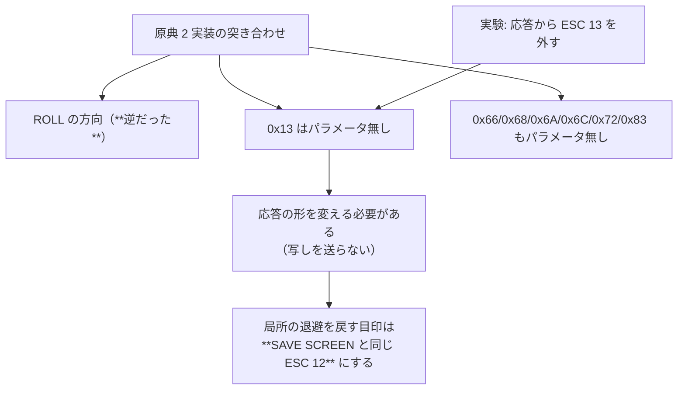

# 調査: 原典 2 実装との突き合わせ ＋ 「5 バイトは誰が付けたか」の実験

## 調査の問い

- Q1: `ROLL`(0x23) の方向・行数・範囲の解釈は
- Q2: `SAVE PARTIAL SCREEN`(0x03) のパラメータ 5 バイトの意味は
- Q3: `RESTORE PARTIAL SCREEN`(0x13) はパラメータを持つのか
- Q4: `READ IMMEDIATE`(0x72) 等、当方が捨てているコマンドのパラメータ長は
- Q5: **`0x13` の直後の 5 バイトは誰が付けたのか**（ホスト／こちらの応答の写し）

## 読んだ原典

| 実装 | 取得元 | 見たファイル |
|---|---|---|
| tn5250（C） | `raw.githubusercontent.com/tn5250/tn5250/master/lib5250/` | `codes5250.h` / `session.c` / `dbuffer.c` |
| tn5250j（Java） | `raw.githubusercontent.com/tn5250j/tn5250j/master/src/org/tn5250j/framework/tn5250/` | `tnvt.java` / `Screen5250.java` |

**2 つを独立に読む**のは、片方の書き間違いに引きずられないため（実際 tn5250j 側に
死んだ分岐が見つかった。F1）。

## 判明した事実

### F1: **ROLL の方向ビットが当方だけ逆だった**（Q1）

tn5250 `session.c`:

```c
lines = (direction & 0x1f);
if ((direction & 0x80) == 0) lines = -lines;   /* ビットが落ちていれば負 */
tn5250_display_roll(This->display, top, bot, lines);
```

tn5250 `dbuffer.c` の `tn5250_dbuffer_roll`: **`lines < 0` が "Move text up"**。
つまり **`0x80` が落ちている＝上へ / 立っている＝下へ**。

tn5250j `Screen5250.rollScreen` のコメント:

```java
// get the direction of the roll which is the first bit
//    0 - up
//    1 - down
```

**2 実装が一致**（tn5250j は `switch (direction & 0x80)` に `case 1:` を書いていて
**下方向の分岐が死んでいる**——だが「0=up / 1=down」という意図は明記されている）。

当方の実装は `(dir & 0x80) !== 0 ? 上へ : 下へ` で、**逆**だった。

| 論点 | tn5250 | tn5250j | 当方（修正前） | 判定 |
|---|---|---|---|---|
| 方向ビット | 落ち=上 / 立ち=下 | 同（コメント） | **立ち=上**（逆） | **バグ・要修正** |
| 行数のマスク | `& 0x1f` | `& 0x7f` | `& 0x1f` | 24〜27 行の画面では**差が出ない**（32 以上は画面を超える）。tn5250 側に合わせる |
| パラメータ | 3 バイト | 3 バイト | 3 バイト | 一致 |
| 空いた行 | **消さない** | **消す** | 消す | tn5250j と一致（消さないと前の行が残る） |

### F2: `0x03` のパラメータ 5 バイトの**意味が判明**（Q2）

tn5250 `session.c`:

```c
flagbyte = tn5250_record_get_byte(This->record);
toprow   = tn5250_record_get_byte(This->record);
leftcol  = tn5250_record_get_byte(This->record);
windepth = tn5250_record_get_byte(This->record);
winwidth = tn5250_record_get_byte(This->record);
```

**フラグ・上端行・左端桁・窓の深さ・窓の幅**。長さ 5 は当方の実測と一致。
ただし**tn5250 も値を使っていない**（読み捨てて画面全体を返す）。
実機は全て `00` を送ってきており、**値が意味を持つ例は未見**。

### F3: **`0x13` はパラメータを持たない**（Q3）——当方の実装と食い違う

tn5250 `session.c` の分岐:

```c
case CMD_RESTORE_PARTIAL_SCREEN:
    /* Ignored, the data following this should be a valid
     * Write To Display command because we do basically the
     * same thing for SAVE PARTIAL SCREEN as we do for SAVE SCREEN. */
    TN5250_LOG(("RestorePartialScreen (ignored)\n"));
    break;
```

**1 バイトも読まない。** 当方は直前の作業で `r.skip(5)` を入れていた。

### F4: **その 5 バイトは「こちらが送った写し」だった**（Q5）——実験で決着

当方の `0x03` 応答は `ESC 13 ＋ 写した 5 バイト ＋ WTD` の形だった。
**応答から `ESC 13 ＋ 写し` を外して（tn5250 と同じ純粋な WTD にして）**同じ操作をすると:

| 応答の形 | ホストが復元時に送ってくるレコード | 長さ |
|---|---|---|
| `ESC 13` ＋ 5 バイト ＋ WTD（従来） | `0x13` → `0x11` → `0x52` | 828 バイト |
| **WTD のみ**（tn5250 式） | **`0x11` → `0x52`**（`0x13` が**消えた**） | **821 バイト**（＝ちょうど 7 バイト減） |

→ **ホストは預けた積荷をそのまま返しているだけ**で、`ESC 13` を自分では付けない。
当方が見ていた `0x13` は**自作自演**だった（`r.skip(5)` は自分の形にだけ効く規則）。

### F5: 当方が捨てているコマンドの**パラメータ長は 0**（Q4）

tn5250 の分岐は、いずれも**バイトを読まずに `break`** している:

| コマンド | tn5250 の扱い |
|---|---|
| `READ_SCREEN_EXTENDED`(0x64) | 無視（当方は実装済み） |
| `READ_SCREEN_PRINT`(0x66) / `…EXTENDED`(0x68) / `…GRID`(0x6A) / `…EXT_GRID`(0x6C) | 無視 |
| `READ_IMMEDIATE_ALT`(0x83) | 無視 |
| `READ_IMMEDIATE`(0x72) | **実装**（MDT の有無に関わらず全フィールドを即送信。`send_fields(This, 0)`） |
| `RESTORE_SCREEN`(0x12) / `RESTORE_PARTIAL_SCREEN`(0x13) | 無視（後続は WTD のはず） |

→ **これらはパラメータを持たない**ので、当方も「レコードごと捨てる」必要が無い
（捨てると後続の READ を失う＝固まる）。

### F6: 未知のコマンドに対する原典の振る舞い

- tn5250: `tn5250_session_send_error(This, TN5250_NR_INVALID_COMMAND)` を**ホストへ返す**
- tn5250j: `sendNegResponse(NR_REQUEST_ERROR, 03, 01, 01, …)` を返して**解析を打ち切る**

当方は警告してレコードの残りを捨てるだけで、**ホストへは何も言っていない**。
（今回は変えない——負応答の形式を実機で確かめられないため。backlog に残す）

## 影響範囲



## 実現性 / リスク

- **ROLL の方向**は原典 2 つが一致。実機で ROLL を送ってくる画面が見つかっていないので、
  **直したこと自体は実機で確かめられない**（原典に合わせる、が根拠）
- **`0x13` をパラメータ無しにするには、応答から写しを外す必要がある**（F4）。
  外すと局所の退避スタックを戻す目印が消えるので、**SAVE SCREEN と同じ `ESC 12` を前置**する
  ——これは長く実機で動いている形で、目印としての役割も同じ
- `0x72` は原典に実装があるが、**応答の正しさを実機で確かめられない**ので入れない
  （無視して後続を処理するに留め、recipe を backlog に残す）

## spec への申し送り

1. **ROLL の方向を反転**（`0x80` 立ち＝下・落ち＝上）。行数は `& 0x1f` のまま（差が出ない）
2. **`0x13` はパラメータを読まない**（原典どおり）。そのために
   **応答を `ESC 12 ＋ WTD`（SAVE SCREEN と同一）へ揃える**
3. **パラメータ無しと分かったコマンド**（0x66/0x68/0x6A/0x6C/0x72/0x83）は
   **警告して次のコマンドへ進む**（レコードを捨てない）
4. `0x72` の応答は入れない。原典の recipe を backlog に残す
5. 未知コマンドへの負応答（F6）も今回は入れない（形式を実機で確かめられない）
