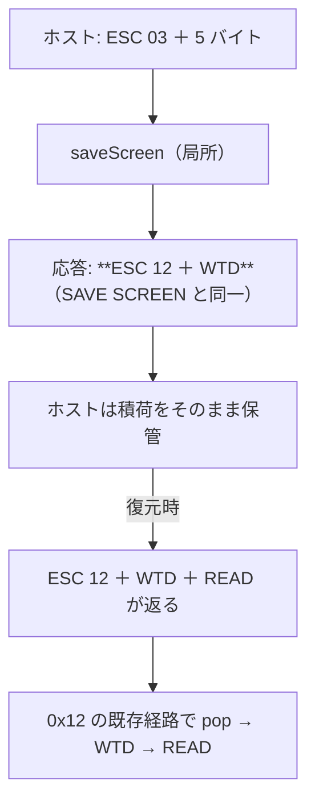

# レビューガイド: 原典（tn5250 / tn5250j）との突き合わせ

## 変更概要 / 目的

「実機に届かないので未実測」で止まっていた項目を、**原典を読んで**進めた。
tn5250（C）と tn5250j（Java）を**独立に 2 つ**読み、当方と 1 つずつ突き合わせた結果:

1. **`ROLL`(0x23) の方向ビットが逆だった**（バグ）→ 直した
2. **`0x13` の 5 バイトは自作自演だった**（こちらの応答の写しが返っていただけ）→ 応答の形を揃えて解消
3. **`0x66/68/6A/6C/72/83` はパラメータ無し**と確定 → 「レコードごと捨てる」から外した

## 重要ポイント（特に見てほしい所）

1. **ROLL の方向**（`wtd-applier.ts:172`）——`0x80` **落ち＝上へ / 立ち＝下へ**。
   tn5250（`session.c` で負にし `dbuffer.c` が負を "Move text up"）と
   tn5250j（コメント「0 - up / 1 - down」）が一致。
   ⚠ **実機で送ってくる画面が無いので、直したこと自体は実測できていない**。
2. **`0x13` の 5 バイトは自分の出力だった**（decisions D2）。
   応答から先頭 7 バイトを外すと、**戻りもちょうど 7 バイト短くなり `0x13` が消えた**
   ——ホストは積荷をそのまま返すだけ。前回「実機の形」と信じてテストに固定したものが、
   実は自分の鏡像だった。**実測は自分を映していることがある**。
3. **応答は `ESC 12 ＋ WTD` に一本化**（decisions D3）。
   原典は目印を付けないが、当方は局所の退避を戻す契機が要るので `0x12` を残す
   （`0x02` と同じ・長く実機で動いている形）。
4. **`0x72`/`0x83` は受理するが応答しない**（decisions D4）。
   黙って受理すると「対応済み」に見えるので、**警告で「応答していない」と明示**する。

## 処理フロー

## 主要な変更箇所

- `packages/core/src/protocol/wtd-applier.ts:172` — ROLL の方向（原典の根拠つき）
- 同 `:145` — `0x13` はパラメータを読まない
- 同 `:186` — パラメータ無し 6 コマンドを受理（`0x72`/`0x83` は応答しない旨を警告）
- `packages/core/src/protocol/save-screen.ts:96` — 応答を SAVE SCREEN と同一に
- `docs/PROTOCOL.md` — **原典由来のパラメータ長の表**と保管物の扱い
- `.aidev/backlog/datastream-commands.md` — 確定した点／残る点

## リスク / 確認してほしい点

- **ROLL の方向は原典 2 実装の一致のみが根拠**（実機で確かめられない）
- **`0x72`/`0x83` に応答していない**——届けばホストは無反応になる。原典の実装方法は backlog に控えた
- 応答の形を変えたので、**実機で QSH の起動・退出を確認済み**（E2E 6/6・警告 0）
- `packages/server/test/zip-writer.test.ts` の 4 件は `unzip` が無いため失敗（`main` でも同じ）
