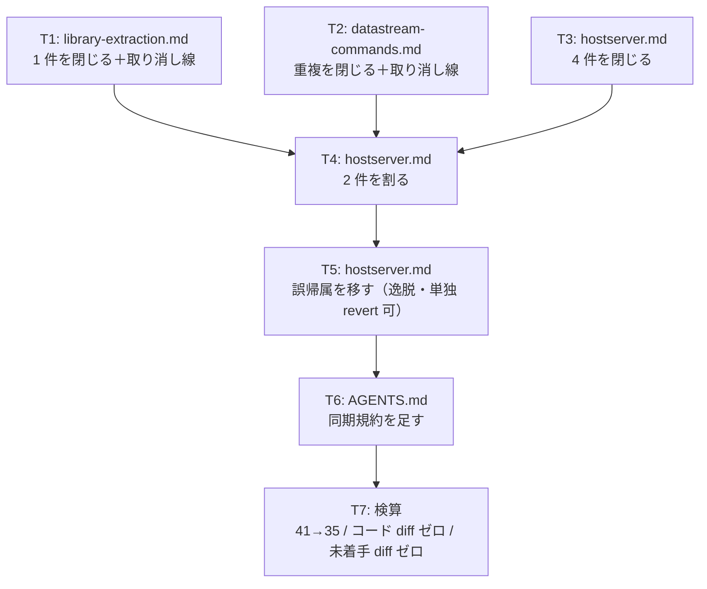

# 計画: backlog の完了済み項目を消し込み、deliver 時の同期を規約にする

## subtask 分割の判定: **分割しない**

`aidev-docs/DESIGN.md`「5.」の決定木に当てる。

- 判定軸「そのピースは単独で検証・デリバリ可能か」→ **各ファイルの編集は独立に検証できる**が、
  **規模が小さい**（docs 4 ファイル・7 タスク）。subtask は「高結合かつ大規模で漸進レビューの価値がある」
  ときの道具なので当たらない
- 別 work / 別 PR に割る候補でもない。**6 件の消し込みは 1 つの事実（台帳が実態から遅れている）への対応**で、
  バラバラの PR にすると「なぜ今これを閉じるのか」の文脈が失われる
- → **単一 tasks.md で進める**（過剰分割の禁止）

## 実装方針

**ファイル単位で完結させ、1 ファイル直したら次へ移る。** 部分適用でも矛盾しない順序にする。

軽いファイルから重いファイルへ進む。`hostserver.md` は 3 種類の変更（閉じる・割る・移す）が
入るので最後に置き、しかも**3 タスクに割って別々に検証できるようにする**
——とくに誤帰属の移動（D-C）はスコープの逸脱なので、**単独で revert できる形**にしておく必要がある。

T1〜T3 は互いに独立（別ファイル、または同ファイルの別セクション）。
T4 は T3 と同じファイルなので後に置く。T5 は T4 の後（行番号のずれを一度に扱う）。

## 作業順序と依存関係

1. **T1** `library-extraction.md`（依存: なし）— 1 件を閉じる。完了注記を先頭子項目に置き、
   `（作業自体は未着手）` と 2026-07-27 追記の古い実測を取り消す
2. **T2** `datastream-commands.md`（依存: なし）— 重複項目を閉じ、解消済みの ⚠ を取り消す
3. **T3** `hostserver.md` の 4 件を閉じる（依存: なし）— `:38` MCP 公開 / `:39` Web UI /
   `:208` README / `:264` LAN 接続時間
4. **T4** `hostserver.md` の 2 件を割る（依存: T3。同一ファイル）— `:48` DES / `:172` 別ホスト検証
5. **T5** `hostserver.md` の誤帰属を移す（依存: T4。同一ファイル）— **逸脱。単独 revert 可に保つ**
6. **T6** `AGENTS.md` に同期規約の節を足す（依存: なし。最後にまとめる）
7. **T7** 検算（依存: T1〜T6 すべて）

## リスク / 留意点

| リスク | 対応 |
|---|---|
| **未着手項目を誤って触る** | T7 で `git diff` を目視。触ってよいのは閉じる 6 件・割る 2 件・移す 1 件だけ |
| **件数が 35 にならない** | `grep -c '^- \[ \]'` をファイルごとに出して spec の表と突き合わせる。行頭 `- [ ]` だけを数える |
| **`aidev status` と `grep` が食い違う** | CLI の数え方を確認する。食い違ったら CLI 実装を読んで合わせる（CLI が真） |
| **T5 の逸脱がレビューで戻される** | T5 を単独タスクにし、他の変更と行が重ならないようにする。`decisions.md` D-C ＋ PR 本文で名指しする |
| **取り消し線を引きすぎる** | spec D4 の線引き（手法・経緯は残す／誤解を招く事実主張だけ消す）に照らす。迷ったら残す |
| **既存の子項目を巻き込んで消す** | `hostserver.md:39` の「`DECIMAL(5,0)` の落とし穴」・`:264` の動機 2 行・`library-extraction.md:62-73` の原因分析は**残す**（spec のエッジケース） |

## テスト方針

docs のみの変更なので、検証は「**何を変えて、何を変えていないか**」の確認が中心になる。

- **件数**: `grep -c '^- \[ \]' .aidev/backlog/*.md` がファイルごとに 5 / 0 / 19 / 0 / 2 / 8 / 0 / 1（合計 **35**）。
  `aidev status` の BACKLOG 表とも一致すること
- **閉じた項目の根拠**: 6 件すべてに works slug ＋ PR 番号 ＋ ファイル:行/実測値の 3 点があること
- **割った 2 件**: `[x]` と `[ ]` が**兄弟**（同じインデント）で並んでいること。
  親子にすると `^- \[ \]` に引っかからず件数から消える——**実際に grep して残っていることを確認する**
- **コード diff ゼロ**: `git diff --stat` に `packages/` と `tools/` が出ないこと
- **未着手項目の diff ゼロ**: `git diff` を読み、触れたのが意図した箇所だけであること
- **回帰**: `npm test` と `npm run lint`。docs しか触っていないので落ちたら無関係
  （`zip-writer.test.ts` の 4 件は `unzip` 不在の既知の環境要因）
- **リンク切れ**: 注記に書いたファイル:行が実在すること（`README.md:162-164`・
  `packages/ebcdic/src/katakana.ts`・`packages/web-ui/src/components/TransferPane.vue`・
  `packages/core/src/hostserver/des.ts`・`wtd-applier.ts:143-152`）
