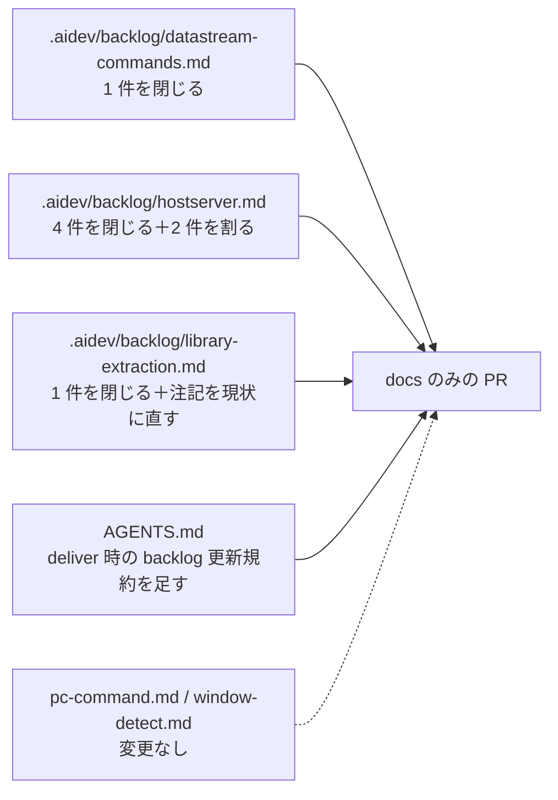

# 調査: backlog 未着手 41 件をリポジトリの実装と突き合わせる

## 調査の問い

- Q1: 未チェック 41 件のうち、実際には完了しているものはどれか
- Q2: 部分的にしか完了していない項目はあるか（項目を割る必要があるか）
- Q3: `AGENTS.md` の `## 残課題` 5 件は現状と合っているか
- Q4: 判定に使える根拠は何か（PR / works / ファイル:行 / 実測値）
- Q5: 実機（IBM i）が要る項目と、リポジトリ内で裏が取れる項目の境界はどこか

## 判明した事実

### F0. 判定の前提となる横断的事実 — 実機は 2 台ある

多くの項目が「PUB400 でしか確認していない」を理由に開いたままだが、
**2026-07-26 以降の作業はすべて実機で実測している。**

| | PUB400 | 実機 |
|---|---|---|
| 位置 | インターネット越し・TLS | 社内機 |
| バージョン | IBM i 7.5 | IBM i 7.5 |
| 接続所要 | **4〜7 秒/呼び出し** | **接続込み 177ms**（`20260730-sql-fetch-limit/test-result.md:22`） |

根拠: `20260723-session-job-info-rework/research.md:145`（「社内機（実機）でも…（PUB400 でのみ確認）」）、
`20260730-sql-fetch-limit/research.md:13` / `20260730-sql-non-query-statements/research.md:12`
（いずれも「すべて実機・IBM i 7.5 で実測」）。

この 1 点だけで H4（PUB400 以外での検証）と H17（LAN 内の接続所要時間）の前提が変わる。

### F1. 完全に完了している項目 — 6 件

| # | 場所 | 項目 | 根拠（実測） |
|---|---|---|---|
| D5 | `datastream-commands.md:83` | SAVE PARTIAL SCREEN のパラメータ 5 バイトの意味 | **同ファイル `:49` で既に `- [x]`**。フラグ・上端行・左端桁・窓の深さ・窓の幅（tn5250 `session.c`）。重複項目 |
| H1 | `hostserver.md:38` | MCP ツールとして公開 | `packages/server/src/host-server-tools.ts` に `host_sql`/`host_upload_table`/`host_command`/`host_call_program`/`host_list_spools`/`host_get_spool`/`host_read_file`/`host_write_file`/`host_dtaq_*` が実在（PR #93、`host_upload_table` は PR #104） |
| H2 | `hostserver.md:39` | Web UI から操作（テーブル選択→CSV DL、CSV ドロップで UL） | `packages/web-ui/src/components/TransferPane.vue`。`:15` に「データ転送（表 ⇄ CSV）。ACS の Data Transfer に相当」、`:311` に「CSV をここに落とすか、クリックして選ぶ」。DL は PR #94 / UL は PR #104 |
| H10 | `hostserver.md:208` | CLI 引数を README に追記 | `README.md:162-164` に `--ifs-read-max-bytes` / `--ifs-zip-max-bytes`・`-files`・`-dirs` / `--ifs-delete-max-entries`・`-dirs` が既定値つきで表になっている |
| H17 | `hostserver.md:264` | LAN 内 IBM i での接続所要時間の実測 | 実機で **接続込み 177ms**（`20260730-sql-fetch-limit/test-result.md:22`、REST 単発は 117ms）。PUB400 の 4〜7 秒に対し 25〜40 倍速い。項目が定めた条件「実測して許容できないと分かった場合にのみ接続プールを検討する」→ **許容できるので不要**（PR #219） |
| L1 | `library-extraction.md:61` | CCSID テーブルの同梱単位を見直す | PR #171（`20260726-ccsid-table-bundling`）。下記 F1-a |

#### F1-a. L1 の実測（2026-08-01 に `npm run build -w @as400web/web-ui` を実行）

| | baseline（backlog 記載・2026-07-26） | 2026-08-01 実測 |
|---|---|---|
| 本番バンドル | 1,407,469 バイト | **358,354 バイト**（`dist/assets/index-CriyTupr.js`） |
| `ibm-930_P120-1999`（DBCS 込み合成） | 入る | **0 件** |
| `ibm-939_P120-1999`（DBCS 込み合成） | 入る | **0 件** |
| `ibm-1399` / `ibm-37` / `ibm-273` | 入らない | 0 件 |
| 残っているもの | — | `ibm-930_P120-1999_SBCS` / `ibm-939_P120-1999_SBCS` の 2 つだけ |

残る 2 つは**両方必要**（`packages/ebcdic/src/katakana.ts` の JSDoc: CCSID 930 の SBCS 部＝CP290 と
939 の SBCS 部＝CP1027 は互いの鏡像で、切替とは「もう一方の表で読み直すこと」。
930 の表しか持たないと 930 のセッションで切替が無反応になる）。

**backlog の「2026-07-27 追記」は着手前の状態の記述**で、現状と食い違う 2 点がある:

- 「web-ui の本番バンドルは 1,407,469 バイト」→ 現在 358,354 バイト
- 「到達経路は `ScreenGrid.vue:41` の `katakanaChar` 1 関数だけ（`@as400web/core/codec` 経由）」→
  現在 `ScreenGrid.vue:42,66-68` は `@as400web/core/browser` から取っている。
  web-ui に `@as400web/core/codec` の import は 1 件も無い（`:55` のコメントで言及されるのみ）

再混入は `packages/ebcdic/test/katakana-no-dbcs.test.ts` が src の import グラフを辿って機械的に塞いでいる
（到達可能ファイルを 4 つに固定し、合計 16KB 未満をアサート。対照として `codec.ts` からは DBCS 部に
到達することも検査している）。

### F2. 部分的に完了している項目 — 2 件（割る必要がある）

#### H3 `hostserver.md:48` DES 経路（QPWDLVL < 2）の対応

**記述されている事実が 3 点とも現状と違う。**

| backlog の記述 | 現状 |
|---|---|
| 「未実装」 | **実装済み**（PR #109 `feature/password-level-0-des-auth`、2026-07-21 マージ） |
| 「手書き DES **700 行超**が必要」 | `packages/core/src/hostserver/des.ts` は **167 行**（FIPS 46-3 の標準テーブル） |
| 「明示的に `HOST_SERVER_UNSUPPORTED` で失敗する」 | `assertPasswordLevelSupported` は撤去済み。`signon.ts:222-229` と `server-connect.ts:156` が `passwordLevel < MIN_SHA_PASSWORD_LEVEL` で `passwordSubstituteDes` に分岐する |

テストも入っている——FIPS 既知解ベクタ（`des.test.ts`）と、jtopenlite `encryptPasswordDES` を
JDK でオラクル化した差分テストで **805/805 バイト一致**（代表ベクタを `hostserver-password.test.ts` に固定）。

**ただし PR #109 本文が「未検証の穴（要・実機確認）」を明示している**——
「パスワードレベル 0/1 の実機ハンドシェイクは、この環境から到達できないため未検証」。
`ddm-connection.ts` は DDM(DRDA) の SECCHK が SHA 前提のためレベル 0/1 では明示的に断る。

→ **実装は閉じ、「レベル 0/1 実機での認証成功の確認」を未着手として残す。**

#### H4 `hostserver.md:172` PUB400 以外の IBM i での検証（単一ホスト・7.5 のみで確認）

条件が 2 つ入っており、片方だけ解消している。

- **「単一ホスト」→ 解消**。SQL は実機でも実測済み（`20260730-sql-non-query-statements` PR #218、
  `20260730-sql-fetch-limit` PR #219。20,000 行 × `CHAR(50)` の全件取得 201 往復 / 1,191,336 バイト / 2,072ms を含む）
- **「7.5 のみ」→ 未解消**。実機も IBM i 7.5 で、別バージョンには当たっていない

→ **「別ホストでの検証」を閉じ、「7.5 以外のバージョンでの検証」を残す。**

### F3. 未着手のまま残る項目 — 33 件（すべて実装側で裏を取った）

**実機が要る／原典調査が要る（推測で閉じられない）: 12 件**

| # | 場所 | 確認結果 |
|---|---|---|
| D1 | `datastream-commands.md:67` | ROLL(0x23)。方向ビットの修正は `:44` で `[x]` 済みだが、`wtd-applier.ts:154-` の実装は**実機で一度も受信していない**（11 画面の census で 0 件） |
| D2 | `:72` | READ IMMEDIATE(0x72) の応答。未実装（届かなかった） |
| D3 | `:77` | READ SCREEN TO PRINT 系の応答。未実装 |
| D4 | `:79` | 未知コマンドへの負応答。`packages/core/src` に `negResponse` 相当が 1 件も無い |
| D6 | `:91` | `expected ESC, got 0xc0` の由来。未解明 |
| H5 | `hostserver.md:176` | MSGW 実在時の `retrieveMessage`/`answerMessage`。`20260718-hostserver-msgw` 以降に検証した work は無い |
| H19 | `:274` | LOB をまとめて取る要求形式。`20260720-sql-lob-locator/research.md` は単発形式（`0x1816`：ハンドル 1 個＋サイズ＋オフセット）を原典から書き起こしているが、**一括形式の有無は問うていない**（この項目自体が同 work の review で起票された後続） |
| H21 | `:282` | BLOB / 中身のある DBCLOB での検証。`20260720-sql-lob-locator/test-result.md:71-73` が未検証と明記 |
| H22 | `:283` | ロケーターの明示的な解放。`packages/core/src/hostserver/db/lob.ts` に free/release 相当が無い。同 research の F5 も「原典に該当の要求があるか未確認」 |
| P1 | `pc-command.md:14` | PCO 終了標識の実物確認。実機に `ENDPCO` が無い |
| P2 | `:32` | `CALL START` が消える根本原因。Windows 実機でしか追えない |
| P5 | `:40` | V7R2 以降の `PCCMD` 1023 文字上限 |

**リポジトリ内で未実装を確認できた: 13 件**

| # | 場所 | 確認したコード |
|---|---|---|
| H6 | `hostserver.md:195` | `host-ifs.ts:486` は `conn.writeFile(body.path, data, { create: … })` を呼ぶだけで **`dataCcsid` を渡していない**（受け口は `ifs-connection.ts:223,433` にある） |
| H7 | `:199` | `packages/ebcdic/src/tables/` に 850/437 は無い（37/273/930/939/1399 の 11 ファイルのみ） |
| H8 | `:202` | `IfsPane.vue:500-501` が「クライアント側にサイズ上限を設ける余地は残っている（decisions D11・backlog）」と自ら書いている |
| H9 | `:207` | `ifsApi.ts:60,66-69` の `TOO_LARGE` / `TOO_MANY_DIRECTORIES` は**実測値のみ**（「20.1 MB 以上」「600 個以上」）。同ファイルの `TOO_MANY` は `上限 ${b.max}` を出しており、対比で欠けが分かる |
| H11 | `:210` | `usePreview.ts` に世代トークン・`AbortController`・順序保証が無い |
| H13 | `:229` | `statement-kind.ts:88`「含む文は実行前に断る」 |
| H15 | `:237` | `SqlResultTable.vue:157` は `table-layout: auto` のまま。仮想化なし |
| H16 | `:260` | `host-sql.ts:192-193` の `pageSize` 指定時は**結果セットを保持**して `/next` で続きを返す形のまま |
| H18 | `:268` | `20260719-hostserver-mcp-tools/test-result.md:49`「⚠ 経路のみ。`MCH0802 Total parameters passed does not match number required.`」。以降に成功させた記録は無い |
| H20 | `:279` | `db-decode.ts:39` が `unavailable?: "not-requested" \| "too-large"` のまま。**`"failed"` が無い** |
| H23 | `:308` | `watch-registry.ts:46,181` は `kind: "dtaq"` のみ。`:3` のコメントも「1 種だけ」 |
| P6 | `pc-command.md:45` | `session-manager.ts:142,471` に `entry.pcCommands` はあるが、`ws-handler.ts:397` が配るのは `outputWarnings` だけ |
| W1 | `window-detect.md:88` | `snap.fields` の参照は `fkeyLegend.ts:545`（`detectOptionColumn`）1 箇所のみ。窓矩形への内包判定は無い（`containedIn`（`:409`）は矩形どうしの包含で別物） |

**意図的に開けてある（判断待ち・優先度の判断済み）: 4 件**

| # | 場所 | backlog に書かれた理由 |
|---|---|---|
| H12 | `hostserver.md:225` | `executeImmediate`/`prepare` の `-215`。「実用上は不要。通す動機が無いので追っていない」 |
| H14 | `:233` | MCP `host_sql` の非クエリ文。「AI から取り消せない書き込みを撃たせるかは方針の判断」。`host-server-tools.ts:135` が「**SELECT 専用**」と明記しており記述と一致 |
| P7 | `pc-command.md:48` | 実行結果をホストへ返す道。「5250 側にその経路が無いことは実測済み」 |
| P8 | `:51` | 許可パターンの書きやすさ。「運用してみて厳しければ」 |

**着手していない大きな作業: 4 件**

| # | 場所 | 確認結果 |
|---|---|---|
| L2 | `library-extraction.md:118` | ホストサーバーの切り出し。`packages/` は core / ebcdic / scs / server / web-ui の 5 つで、hostserver パッケージは無い |
| L3 | `:123` | TN5250 クライアント一式の切り出し。同上 |
| P3 | `pc-command.md:36` | Windows 実機での回帰確認の自動化。**`.github/workflows/` が存在しない**（CI 自体が無い） |
| P4 | `:39` | DBCS を含む PC コマンド。`packages/core/src/protocol/pc-command.ts` に SO/SI の扱いが無い |

### F4. `AGENTS.md` の残課題 5 件

| # | 項目 | 判定 | 根拠 |
|---|---|---|---|
| A1 | 複数行ペーストの帯幅を「文字数」で切っている | **未着手（記述は正確）** | `ScreenGrid.vue:2506-2511`: `const width = end - from + 1`（**桁**数）で求めた幅を `rest.slice(0, width)`（**文字**数）に渡している。全角が混ざれば桁とずれる |
| A2 | 挿入モードで 1 行が帯の幅を越えたときの ACS 挙動が未確認 | 未着手 | 実機確認が要る |
| A3 | `ORDER.UNKNOWN_1C`(0x1C) の正体が未確認 | 未着手 | `constants.ts:113` / `wtd-applier.ts:402` とも現状のまま |
| A4 | ログインセッション・監査ログが in-memory | 未着手 | `auth.ts:12,190`「Cookie セッション（in-memory・httpOnly）」。`audit.ts` に永続化なし |
| A5 | DBCS 欄が行末をまたぐとき全角の右半分が描けない | **保留（判断が要る）** | 下記 |

**A5 が保留な理由**: `ScreenGrid.vue:1381` は「クリップされ左半分が行末に出る）、次スライスは空白 1 桁で始める
**＝ACS の桁割りと一致させる**」、`:3356` は「対を失った全角セル。1 桁の箱に入れて左半分だけ見せる
（**ACS と同じ分断された見え方**）」と書いている。`20260726-dbcs-orphan-lead-clip` 以降、
**「右半分が描けない」ことは不具合ではなく ACS 準拠の意図した挙動**になっている。
ただし同 work が扱ったのは「tail が上書きされた lead」であって「行末またぎ」そのものではないため、
**残課題の記述を「未解決の不具合」として残すか「ACS 準拠として解決」と書き換えるかは判断が要る**。
本作業のスコープ（未着手項目の書き換えはしない）に照らすと、勝手に閉じるべきではない。

## 影響範囲

変更するのはドキュメントのみ。

`packages/` と `tools/` には触れない。

## 実現性 / リスク

- **リスクは低い**。docs のみで、コードの挙動に影響しない
- **`aidev status` の todo 件数**: 完全に閉じるのは 6 件なので **41 → 35**。
  割る 2 件（H3・H4）は `[x]` 1 行＋`[ ]` 1 行になるので**件数は変わらない**
- **注意**: `library-extraction.md:74-80` の「2026-07-27 追記」は着手前の実測を書いた段落で、
  数値も到達経路も現状と違う。**消さずに取り消し線で残す**（PR #209 の前例）。
  この段落は「比較の基準線として main を worktree に取って同一条件でビルドし突き合わせる手順が有効だった」
  という**手法の記録**でもあるので、そこは残す価値がある

## spec への申し送り

- **部分完了の書き方**: PR #209 は「未実装で残るのは Field− / Field+ だけなので、そこだけ未チェックにした」＝
  **項目を割って一部を閉じる**。H3・H4 はこれに倣う。書式（`[x]` の下に `[ ]` を子として置くか、
  兄弟として並べるか）を決めること
- **A5 は閉じない**。ACS 準拠として解決済みとも読めるが、行末またぎそのものを実機で確かめた記録が無い。
  `AGENTS.md` には**判断が要る旨だけを残す**か、そのまま触らないかを決める
- **`hostserver.md:283-284` に misattribution がある**。ロケーター解放の項目に
  「実機確認は `MCH0802`（パラメータ数不一致）までで」という子項目が付いているが、
  `MCH0802` は `host_call_program`（`:268`＝H18）の実測結果である
  （`20260719-hostserver-mcp-tools/test-result.md:49`）。**別項目の内容が紛れ込んでいる**。
  requirement のスコープ外（未着手項目の書き換えはしない）に触れるので、直すかは spec で決めること
- **再発防止の置き場**: aidev harness（`.claude/skills/aidev-70-deliver/`）はリポジトリ外にあり
  この PR に含められない。`AGENTS.md` に PJ 規約として置く。既存の
  `## 残課題（retro → issue 候補）` の近くが自然
- **閉じる根拠の粒度**: PR 番号だけだと後から辿るのに GitHub が要る。
  **works slug とファイル:行も併記**すると、リポジトリだけで裏が取れる
- **`aidev status` の todo が 41 → 35 になること**を受け入れ基準の検証に使う
