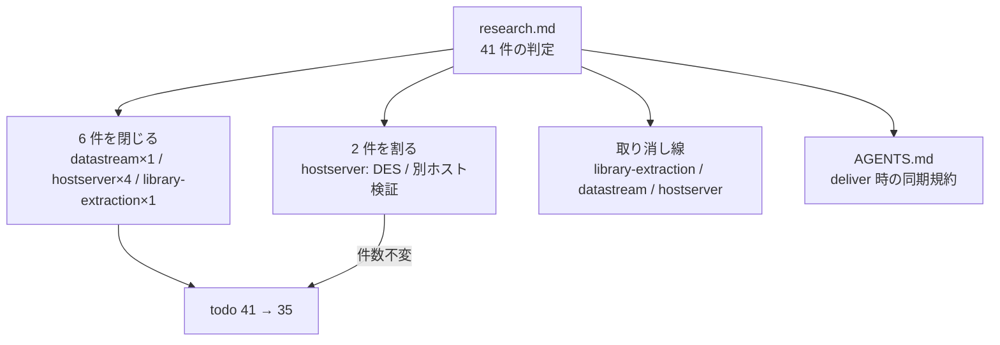

# 仕様: backlog の完了済み項目を消し込み、deliver 時の同期を規約にする

## 概要

`research.md` の照合結果を `.aidev/backlog/*.md` に反映する。

- **6 件を閉じる**（`- [ ]` → `- [x]` ＋ 根拠）
- **2 件を割る**（完了した部分を `- [x]` に、残りを `- [ ]` に分ける）
- 起票当時の記述で**事実と食い違うもの**を取り消し線で残す
- `AGENTS.md` に deliver 時の同期規約を足す

コードは変更しない。編集するのは 4 ファイル。



## 設計方針

### D1. 完了注記の書式は**ファイルごとの既存慣例に合わせる**（全体で統一しない）

backlog には 2 つの書式が既に共存している。

| 書式 | 例 |
|---|---|
| `→` 継続行 | `hostserver.md:205` 「`    → 20260723-ifs-pane-nav-file-ops で実装。**テンプレート長は 10**…`」 |
| `- **完了**` 子項目 | `library-extraction.md:23` 「`  - **2026-07-19 完了**（`.aidev/works/…`）。`」 |

**片方に寄せない。** 同じファイルの中で書式が混ざるほうが読みにくく、
かつ「既に閉じてある項目の書き方」を後から変えるのは本作業のスコープ外（未着手でない項目に触る）。

- `hostserver.md` → `→` 継続行
- `library-extraction.md` / `datastream-commands.md` → `- **完了**` 子項目

### D2. 根拠は **works slug ＋ PR 番号 ＋ リポジトリ内の裏取り**の 3 点を書く

PR 番号だけだと後から辿るのに GitHub が要る。**リポジトリだけで裏が取れる形**にする。

```
→ <works slug>（PR #N）で完了。<ファイル:行 または 実測値>
```

実測値がある項目（バンドルサイズ・接続時間）は**数値を書く**。
「速くなった」ではなく「1,407,469 → 358,354 バイト」と書けば、次に測る人が基準線を持てる。

### D3. 部分完了は `[x]` と `[ ]` を**兄弟として並べる**（親子にしない）

```markdown
- [x] DES 経路（QPWDLVL < 2）の実装
    → …
- [ ] パスワードレベル 0/1 の実機での認証成功の確認
  - …
```

親子（`- [x]` の下に `  - [ ]`）にしない理由:

- `aidev status` は行頭 `- [ ]` を数える（`^- \[ \]`）。インデントした子は**数に入らない**ので、
  残った作業が backlog の件数から消える
- 「実装は済んだが実機確認が残っている」は**別々に着手できる独立した作業**であって、
  親子関係ではない

### D4. 事実と食い違う記述は**消さずに取り消し線**（PR #209 の前例）

起票当時の見立てには、後から読んで価値のあるもの（手法・経緯）と、
現状と食い違って**誤解を招くもの**（古い実測値・古い到達経路）が混ざっている。
**後者だけに取り消し線を引き、前者は残す。**

判断の線引き:

| 残す | 取り消す |
|---|---|
| 調査手法（「main を worktree に取って同一条件でビルドし突き合わせる手順が有効だった」） | 古い実測値（「本番バンドルは 1,407,469 バイト」） |
| 原因分析の経緯（tree-shaking が効かない理由） | 古い到達経路（「`ScreenGrid.vue:41` の `katakanaChar`」→ 現在は `core/browser` 経由） |
| 「未着手」と書いた当時の判断 | 「作業自体は未着手」という**現在形の事実主張** |

### D5. `hostserver.md:283-284` の誤帰属は**直す**（スコープの逸脱を明示する）

requirement の対象外は「未着手と判定した項目の**内容の書き換え**（優先度の付け直し・分割・削除・
言い回しの改善はしない）」だった。今回直すのは**別項目の内容が紛れ込んでいる**という帰属の誤りで、
列挙されたどれにも当たらない。

```markdown
- [ ] ロケーターの明示的な解放（接続を閉じれば消えると見込んでいるが未確認）
  - 実機確認は `MCH0802`（パラメータ数不一致）までで、**呼び出し経路が通ることしか確かめていない**   ← これ
```

`MCH0802` は `host_call_program` の実測結果（`20260719-hostserver-mcp-tools/test-result.md:49`）で、
ロケーター解放とは無関係。**この子項目を `:268`（`host_call_program` の項目）へ移す**。

放置すると「ロケーター解放は実機で途中まで確かめた」と読めてしまい、
backlog を「正しい台帳に戻す」という本作業の目的と正面から衝突する。
**逸脱として `decisions.md` に記録し、PR 本文でも名指しする**（レビューで戻せる形にする）。

### D6. `AGENTS.md` の DBCS 行末またぎ（残課題）は**触らない**

ACS 準拠として解決済みとも読めるが（`ScreenGrid.vue:1381,3356` が「ACS と同じ分断された見え方」と書いている）、
**行末またぎそのものを実機で確かめた記録が無い**。requirement の制約
「実機が要る項目を推測で閉じない」に従い、判定を保留して現状のまま残す。

`decisions.md` に「保留した理由」を残し、次に触る人が拾えるようにする。

### D7. 再発防止は `AGENTS.md` の新設節に置く

aidev harness（`.claude/skills/aidev-70-deliver/`）はリポジトリ外にあり、この PR には含められない。
PJ 規約として `AGENTS.md` に置く。

置き場所は `## 残課題（retro → issue 候補）` の**直前**。残課題そのものが同期対象の台帳なので、
「この下の一覧も deliver で閉じる対象だ」と読める並びにする。

## 対象範囲

| ファイル | 変更 |
|---|---|
| `.aidev/backlog/datastream-commands.md` | 1 件を閉じる（重複解消）＋ 取り消し線 1 箇所 |
| `.aidev/backlog/hostserver.md` | 4 件を閉じる ＋ 2 件を割る ＋ 誤帰属の子項目を移す |
| `.aidev/backlog/library-extraction.md` | 1 件を閉じる ＋ 取り消し線 2 箇所 |
| `AGENTS.md` | 節を 1 つ足す |
| `.aidev/works/20260801-backlog-audit/` | 工程成果物（decisions.md 等） |

**触らない**: `pc-command.md` / `window-detect.md` / `field-input.md` / `input-assist.md` /
`session-lifetime.md` / `archive/` / `packages/` / `tools/` / `README.md`

## インターフェース / データ構造

### 閉じる 6 件の最終形

**1. `datastream-commands.md:83`**（`- **完了**` 子項目・重複解消）

```markdown
- [x] **SAVE PARTIAL SCREEN のパラメータ 5 バイトの意味**
  - **上の「原典で確定した」に同じ項目がある**（`20260730-tn5250-cross-check`）。
    **フラグ・上端行・左端桁・窓の深さ・窓の幅**（tn5250 `session.c`）。原典も値を使わず読み捨てる
  - 実機はすべて `00`。**その写しが `0x13` で返ってくる**
  - 現状は解釈せず写して返す（ホストにとって不透明な保管物なので実害は無い）
  - ~~⚠ **読み飛ばす長さ 5 は「こちらが送った形」に依存**している。
    別の長さで `0x13` を送るホストがあれば崩れる（未確認）~~
    **← 解消済み**。`0x13` は原典どおり 1 バイトも読まなくなった
    （`wtd-applier.ts:143-152`。写しを応答へ埋め込むのをやめたため）
```

**2. `hostserver.md:38`**（`→` 継続行）

```markdown
- [x] MCP ツールとして公開
    → 20260719-hostserver-mcp-tools（PR #93）で公開。`packages/server/src/host-server-tools.ts` に
      `host_sql` / `host_command` / `host_call_program` / `host_list_spools` / `host_get_spool` /
      `host_read_file` / `host_write_file` / `host_dtaq_*`。
      アップロードの `host_upload_table` は 20260720-csv-upload-ui（PR #104）で追加
```

**3. `hostserver.md:39`**（`→` 継続行。既存の子項目は残す）

```markdown
- [x] Web UI から操作（テーブル選択 → CSV ダウンロード、CSV をドロップしてアップロード）
    → ダウンロードは 20260719-hostserver-web-ui（PR #94。SQL ペイン＋CSV）、
      アップロードは 20260720-csv-upload-ui（PR #104）で完了。
      `packages/web-ui/src/components/TransferPane.vue`（「データ転送（表 ⇄ CSV）。ACS の Data Transfer に相当」）
  - ~~**アップロード側は未着手**——DDM の土台ができたので着手可能になった~~（PR #104 で完了）
  - 落とし穴（実機で確認）: …（既存のまま残す）
```

**4. `hostserver.md:208`**（`→` 継続行）

```markdown
- [x] CLI 引数 `--ifs-zip-max-bytes`/`-files`/`-dirs`/`--ifs-read-max-bytes`/
      `--ifs-delete-max-entries`/`--ifs-delete-max-dirs` を README に追記
    → `README.md:162-164` に既定値つきの表で記載済み
```

**5. `hostserver.md:264`**（`→` 継続行）

```markdown
- [x] **LAN 内 IBM i での接続所要時間の実測**
  - PUB400（インターネット越し・TLS）では **4〜7 秒/呼び出し**で、処理量に比例せず
    接続確立が支配的だった。LAN なら大幅に短いと**見込まれる**が未検証
  - 実測して許容できないと分かった場合にのみ、接続プールを検討する（先に複雑さを払わない）
    → 20260730-sql-fetch-limit（PR #219）で社内機実機を実測。**MCP 経路が接続込み 177ms**
      （REST 単発は 117ms）。PUB400 の 4〜7 秒に対し 25〜40 倍速い。
      **接続確立は支配的ではなく、接続プールは要らない**
```

**6. `library-extraction.md:61`**（`- **完了**` 子項目。完了注記を**先頭**に置く）

```markdown
- [x] CCSID テーブルの同梱単位を見直す（CCSID 37 の174行のために DBCS 込み18,900行が付いてくる）
  - **2026-07-27 完了**（`20260726-ccsid-table-bundling` / PR #171）。
    web-ui の本番バンドルは **1,407,469 → 358,354 バイト**（2026-08-01 に再測）。
    バンドルに残る表の識別子は `ibm-930_P120-1999_SBCS` / `ibm-939_P120-1999_SBCS` の**2 つだけ**で、
    DBCS 部・`ibm-1399`・`ibm-37`・`ibm-273` は 0 件。
    この 2 つは表示コード切替に**両方必要**（`packages/ebcdic/src/katakana.ts` の JSDoc に理由）。
    採った手は (b)＋(c)——SBCS 部を別モジュールに切り出し、`./katakana` サブパスを新設。
    web-ui は `@as400web/core/browser` から取る。
    再混入は `packages/ebcdic/test/katakana-no-dbcs.test.ts` が src の import グラフを辿って塞いでいる
  - **2026-07-19 に原因を実測**~~（作業自体は未着手）~~
    …（以下、原因分析はそのまま残す）
```

### 割る 2 件の最終形

**7. `hostserver.md:48`**

```markdown
- [x] DES 経路（QPWDLVL < 2）の対応
    → 20260721 完了（PR #109 `feature/password-level-0-des-auth`）。
      `packages/core/src/hostserver/des.ts`（**167 行**。FIPS 46-3 の標準テーブル）＋
      `password.ts` の `passwordSubstituteDes`。`signon.ts:222-229` と `server-connect.ts:156` が
      `passwordLevel < MIN_SHA_PASSWORD_LEVEL` で分岐する。
      jtopenlite `encryptPasswordDES` との差分テストで **805/805 バイト一致**
  - ~~PUB400 はレベル3のため未実装。手書きDES 700行超が必要で、現状は明示的に
    `HOST_SERVER_UNSUPPORTED` で失敗する。**レベル0/1 の実機に当たってから**でよい~~
    **← 3 点とも現状と違う**（実装済み／167 行／`assertPasswordLevelSupported` は撤去済み）
  - DDM(DRDA) の SECCHK は SHA 前提のままで、レベル 0/1 では明示的に断る（`ddm-connection.ts`）
- [ ] パスワードレベル 0/1 の実機での認証成功の確認
  - PR #109 本文が明示した穴——「この環境から到達できないため未検証」。
    参照実装とバイト単位で一致しているので確度は高いが、実機のハンドシェイクは通していない
  - 検証手順: `AS400_USER=xxx AS400_PASSWORD=yyy npm run cmd -w @as400web/hostserver-check -- --host <実機> [--tls]`
```

**8. `hostserver.md:172`**

```markdown
- [x] PUB400 以外の IBM i での検証
    → 社内機 **実機（IBM i 7.5）** で SQL を実測済み。
      20260730-sql-non-query-statements（PR #218）・20260730-sql-fetch-limit（PR #219）。
      後者は 20,000 行 × `CHAR(50)` の全件取得で 201 往復 / 1,191,336 バイト / 2,072ms
- [ ] IBM i 7.5 以外のバージョンでの検証
  - PUB400 も実機も 7.5。**バージョン差による違いには当たっていない**
```

### 誤帰属の移動（D5）

`hostserver.md:283-284` の子項目を `:268` の下へ移す。

```markdown
- [ ] `host_call_program` を正しいパラメータ列で成功させる検証
  - 実機確認は `MCH0802`（パラメータ数不一致）までで、**呼び出し経路が通ることしか確かめていない**
    （`20260719-hostserver-mcp-tools/test-result.md:49`）

  …

- [ ] ロケーターの明示的な解放（接続を閉じれば消えると見込んでいるが未確認）
  - 原典に該当の要求があるかも未確認（`20260720-sql-lob-locator/research.md` F5）
```

移動後、ロケーター側には**根拠のある代替の注記**（同 research の F5）を置く。空にしない。

### `AGENTS.md` に足す節

`## 残課題（retro → issue 候補）` の直前に挿入する。

```markdown
## 記録の同期（deliver 時）

作業を deliver するとき、その作業が閉じた項目を**同じ PR で**台帳に反映する。対象は
`.aidev/backlog/*.md` と、下の `## 残課題`。

- `- [ ]` → `- [x]` にし、**根拠を併記する**——works slug ＋ PR 番号 ＋
  リポジトリ内で裏が取れるもの（ファイル:行・実測値）。PR 番号だけだと後から GitHub が要る
- 起票当時の記述が**事実と食い違うなら取り消し線で残す**（消さない）。
  手法や経緯の記録は残す価値があるので、**誤解を招く事実主張だけ**を消す
- 一部だけ済んだ項目は**割る**。`- [x]`（済んだ分）と `- [ ]`（残り）を**兄弟として並べる**
  ——インデントした子は `aidev status` の件数に入らず、残作業が見えなくなる

**閉じ忘れると次に着手する人が完了済みの項目を選ぶ。** 2026-08-01 に実際に起きた——
「CCSID テーブルの同梱単位を見直す」に着手しようとしたが、PR #171 で 5 日前に完了していた
（`.aidev/works/20260801-backlog-audit`）。同時に 5 件の閉じ忘れが見つかっている。
```

## 振る舞いの詳細

### 編集の順序

ファイル単位で完結させる。1 ファイルを直したら次へ移る（部分適用でも矛盾しない）。

1. `library-extraction.md`（1 件・取り消し線 2 箇所）
2. `datastream-commands.md`（1 件・取り消し線 1 箇所）
3. `hostserver.md`（4 件＋割る 2 件＋移動 1 件。最も重い）
4. `AGENTS.md`（節の追加）

### 件数の検算

| | 変更前 | 変更後 |
|---|---|---|
| `datastream-commands.md` | 6 | **5** |
| `hostserver.md` | 23 | **19** |
| `library-extraction.md` | 3 | **2** |
| `pc-command.md` | 8 | 8 |
| `window-detect.md` | 1 | 1 |
| **合計** | **41** | **35** |

内訳: 閉じる 6 件で −6。割る 2 件は `[x]` 1 行＋`[ ]` 1 行なので ±0。

検算は `grep -c '^- \[ \]' .aidev/backlog/*.md` と `aidev status` の両方で行う。
**行頭 `- [ ]` だけを数える**（インデントした子は数えない）ことが D3 の前提と一致する。

### エッジケース

- **`hostserver.md:39` の既存の子項目**「落とし穴（実機で確認）: `DECIMAL(5,0)` が通らない」は
  完了とは無関係な**実装知見**なので残す。閉じた項目の下でも消さない
- **`hostserver.md:264` の既存の子項目 2 行**は「なぜ測るのか」の説明として残し、
  `→` の結論をその後ろに足す（順序: 動機 → 結論）
- **`library-extraction.md:62-73` の原因分析**は当時の実測として正確なので残す。
  `（作業自体は未着手）` の 1 語だけ取り消す

## ドメイン固有の考慮

- **`AGENTS.md` セキュリティ規約**: 追記する節に資格情報を書かない。
  DES の検証手順に含まれる `AS400_USER=xxx AS400_PASSWORD=yyy` は**プレースホルダのまま**書く
  （PR #109 本文がそう書いており、実値ではない）
- **`AGENTS.md` の文体**: 既存は「なぜそうするか」を必ず添える書き方（例: セキュリティ節の
  「足し忘れは『動くので気づけない』種類の漏れ」）。新設節も**理由と実例**を書く
- **backlog の文体**: 断定と留保を書き分けている（「実測」「未確認」「見込まれる」）。
  今回足す注記も同じ規律で書く——**実測したものだけ「実測」と書く**

## エラー処理 / 異常系

- **件数が 35 にならない**: 数え方の食い違い（インデントした `- [ ]` を拾っている等）か、
  編集漏れ。`grep -n '^- \[ \]'` で行を出して差分を突き合わせる
- **`aidev status` と `grep` が食い違う**: CLI の数え方を確認する。
  食い違ったら CLI の実装（`.claude/skills/aidev-docs/bin/aidev`）を読んで合わせる
- **`npm test` / `npm run lint` が落ちる**: docs しか触っていないので、落ちたら**この作業とは無関係**。
  変更前の状態でも同じか確かめてから判断する（`zip-writer.test.ts` の 4 件は `unzip` 不在の既知の環境要因）

## 受け入れ基準との対応

| requirement の完了条件 | 満たし方 |
|---|---|
| 未チェック 41 件すべてに判定と根拠 | `research.md` の F1〜F3 に全件を表で記載済み（完了 6 / 部分完了 2 / 未着手 33） |
| 完了と判定した項目が `- [x]` ＋ PR 番号または works slug | D2 の書式で works slug ＋ PR 番号 ＋ ファイル:行/実測値の 3 点を書く |
| 未着手と判定した項目の diff がゼロ | 触るのは閉じる 6 件・割る 2 件・移動 1 件だけ。`git diff` で確認する（例外は D5 の 1 件で、逸脱として明示） |
| コードの diff がゼロ | `packages/` と `tools/` を触らない。`git diff --stat` で確認 |
| `library-extraction.md:61` が実測値付きで閉じている | 上記「6.」で 1,407,469 → 358,354 バイトを記載 |
| `hostserver.md:38-39` が `host_upload_table` / `TransferPane.vue` を根拠に閉じている | 上記「2.」「3.」で明記 |
| `aidev status` の todo 減少数が閉じた件数と一致 | 41 → 35（−6 ＝ 完全に閉じた 6 件）。割る 2 件が ±0 であることも検算に含める |
| `AGENTS.md` に deliver 時の backlog 更新規約 | 上記「`AGENTS.md` に足す節」 |
| `npm test` / `npm run lint` が従来どおり通る | docs のみの変更。test 工程で実行して確認する |
