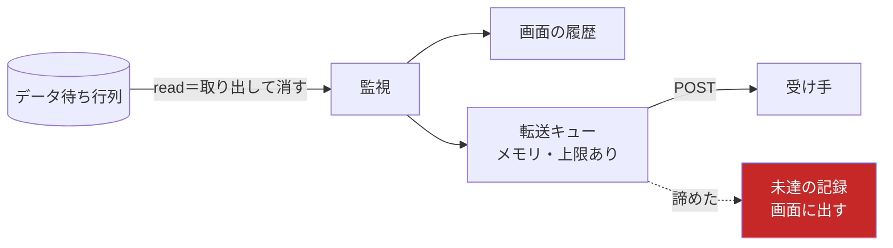
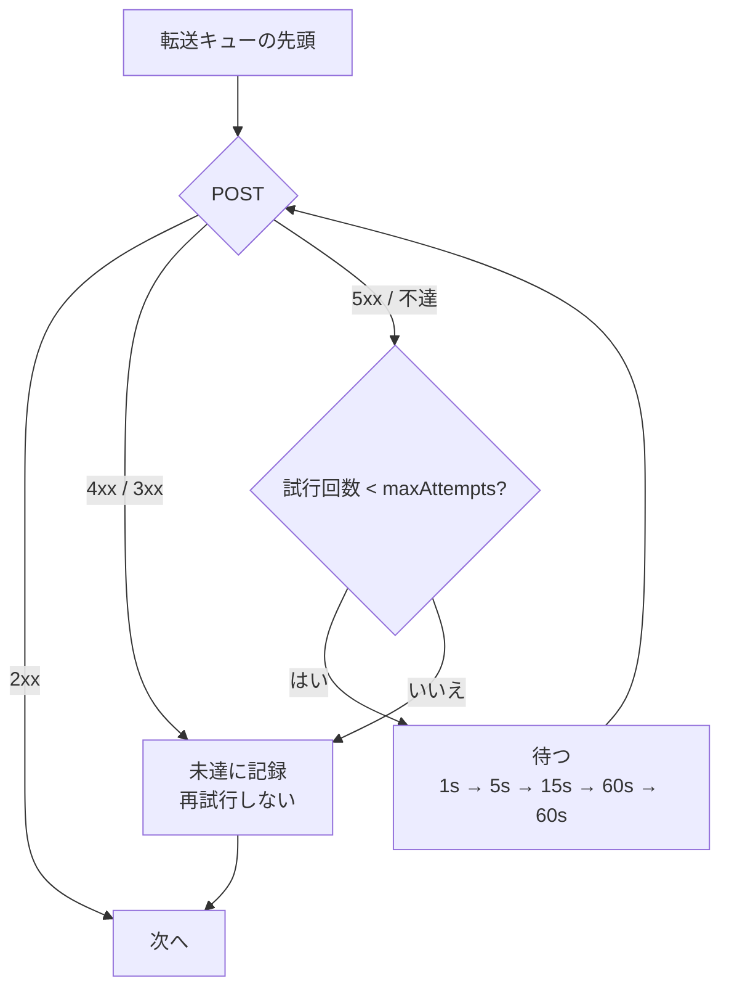

# 設計: 待ち行列サービスの Webhook 転送

## 0. この設計の一番大事な前提

**監視は消費する。** データ待ち行列からの読み取りは**取り出して消す**操作で、
読んだ時点でホスト側からエントリは無くなる。取り消せない。

つまり **Webhook の失敗は「データの喪失」である。** プリンターの自動出力（PDF）とは性格が違う
——あちらは失敗してもスプールがホストの OUTQ に残るので、後から取り直せる。

この違いが設計の全部を決める。**「失敗しても大丈夫」の作りにできない**ので、
どこで諦めるか・諦めたものをどう見せるかを、機能そのものと同じ重さで決める必要がある。



---

## 1. 設定の形

### 置き場所——**サーバー設定だけ**

```ts
// config-types.ts。`printer` / `pcCommand` と同じ「サーバー設定にしか無いもの」
export const webhookSchema = z.object({
  /** 送り先。`http:` / `https:` のみ */
  url: z.string().url(),
  /** 認証ヘッダーの値。**平文では保存しない**（`secretEnc` か `secretEnv` のどちらか） */
  secretEnc: z.string().optional(),
  secretEnv: z.string().min(1).optional(),
  /** 秘密を載せるヘッダー名（既定 `Authorization`） */
  secretHeader: z.string().min(1).optional(),
  /** 1 回の送信の待ち時間上限（ms・既定 10_000） */
  timeoutMs: z.number().int().positive().max(120_000).optional(),
  /** 諦めるまでの試行回数（既定 5） */
  maxAttempts: z.number().int().min(1).max(20).optional()
}).strict();

export const serverSessionObject = z.object({
  ...sessionBase,
  printer: printerSchema.optional(),
  pcCommand: pcCommandSchema.optional(),
  webhook: webhookSchema.optional()   // ← 足す
}).strict();
// personalSessionObject には**足さない**。`.strict()` が 400 で弾く（信頼境界 1 層目）
```

**なぜサーバー設定だけか。** Webhook は**サーバーから外へ出ていくデータ経路**である。
個人設定に置けると、一般利用者が「サーバーが読めるキューの中身を自分の URL へ送る」設定を
作れてしまう——`printer.autoPdfDir`（サーバー上の任意パスへの書き込み）と同格の力を持つ。

`assertTypeConsistent` に 1 行足す: **`webhook` は `dtaqwatch` にしか付かない**
（`printer` / `dtaqWatch` と同じ扱い）。

### 秘密の扱い

`system.signon` の前例をそのまま踏む。**平文はファイルに書かない。**

| 経路 | 使いどころ |
|---|---|
| `secretEnv: "ORDER_HOOK_TOKEN"` | 運用者向け。値は環境変数。**設定ファイルには名前だけ** |
| `secretEnc: "v1:iv:tag:ct"` | 画面から入力したとき。`SecretCrypto` で暗号化して保存 |

**API では値を返さない。** `pcCommand` と違い、これは**秘密**なので
「設定されているか」（`hasSecret: true`）だけ返す。編集フォームは空から始まり、
**空で送れば既存を保つ**（`system.password` と同じ約束）。

---

## 2. 送るもの

```
POST <url>
Content-Type: application/json
Authorization: <secret>                    ← 設定があるとき
X-As400-Delivery: <uuid>                   ← 再送でも同じ。**冪等性の鍵**
X-As400-Signature: sha256=<hex>            ← 秘密があるとき。本文の HMAC
```

```json
{
  "queue":   "MYLIB/ORDERQ",
  "ref":     "srv:受注監視",
  "seq":     42,
  "at":      "2026-08-02T01:23:45.678Z",
  "bytes":   80,
  "text":    "ORD-0001 ...",
  "sender":  "QPADEV0001/USER/123456"
}
```

- `text` は**監視の `encoding` 設定で解いた結果**（`utf8` / `ebcdic` / `base64`）。
  画面の履歴に出しているものと**同じ値**——2 通りの解き方を持たない
- `sender` は save-sender 有効なキューのときだけ
- **`X-As400-Delivery` は再送でも変わらない。** 受け手が二重処理を避けられるようにする
  ——「送ったが応答が届かなかった」を我々は区別できないので、**受け手に冪等性を委ねる**
  のが唯一正しい形。ここを設計に書いておかないと、運用で必ず二重処理が起きる

### 成功の判定

**2xx だけ成功。** 3xx は追わない（リダイレクト先が別ホストになりうる＝送り先が
設定と違うところになる）。4xx は**再試行しない**（受け手が「要らない」と言っている。
何度送っても同じ）。5xx とネットワーク不達は再試行する。

| 応答 | 扱い |
|---|---|
| 2xx | 成功 |
| 3xx | **失敗・再試行しない**（送り先がすり替わる） |
| 4xx | **失敗・再試行しない**（送っても直らない） |
| 5xx / タイムアウト / 不達 | **再試行する** |

---

## 3. 失敗をどう扱うか（この設計の核心）

### 3.1 監視は止めない

受け手が落ちていても、**キューの読み取りは続ける**。止めると:

- ホスト側のキューが溢れる（`MAXENTRIES` を超えると送信側が失敗する）
- 「受け手の障害」が「ホスト側の業務の障害」に伝播する

読み取りと送信を**分ける**——読んだら転送キューに積み、送信は別の流れで進む。

### 3.2 転送キューは上限つき（メモリ）

```
未送が溜まる → 上限（既定 500 件）→ **古いものから落とす**
落としたものは「未達」として記録し、画面に出す
```

プリンターの帳票バッファ（`REPORT_LIMIT = 50`）と同じ形。**無限に溜めない**のは、
受け手が一晩落ちていたときにサーバーのメモリを食い潰さないため。

### 3.3 諦め方



**諦めたら次へ進む。** 1 件のために止まると後続が全部詰まる——
`X-As400-Delivery` で受け手が冪等なら、順序より進み続けるほうが被害が小さい。

### 3.4 未達の記録

```ts
interface UndeliveredEntry {
  seq: number; at: number; reason: string;
  /** 本文の先頭だけ（全文はメモリに持たない） */
  preview: string;
}
```

- 上限 **50 件**（新しい順に残す）
- **サービス一覧（`svc:services`）と監視コンソールに出す**——
  プリンターの `outputWarnings` と同じ置き場所
- `WatchView` に `undelivered: number` を足し、**行に赤く出す**

**「黙って消えない」がここの唯一の目的。** データは既に失われているので、
できるのは「失われたと分かるようにする」ことだけ。

### 3.5 プロセスが落ちたら未送分は失われる ⚠

**これは塞がない。** 塞ぐには転送キューを**ディスクに永続化**する必要があり、そうすると:

- 書き込み先・破損時の扱い・古い未送分の掃除、という新しい問題が一式付いてくる
- 「消えたデータの置き場」がサーバー上に増える（信頼境界の話が増える）

**代わりに正直に書く。** 設定画面に「サーバーの停止・再起動で未送分は失われます」と出し、
`docs/` にも残す。**要件次第で後から足せる**が、いま入れる価値より複雑さのほうが大きい。

→ **これは利用者の判断を仰ぐ**（下記「決めていただきたいこと」）。

---

## 4. URL の制限をどうするか

送り先はサーバーから到達できる**あらゆるホスト**になりうる。社内ネットワークの中で
動いていれば、内部のサービスにも届く。

**この設定を書けるのは admin だけ**で、admin は既に

- サーバー機で任意のコマンドを実行できる（`pcCommand`）
- サーバー上の任意パスに書ける（`printer.autoPdfDir`）

ので、**新しい権限を与えるわけではない**（権限昇格にはならない）。

したがって既定は**許可リストを持たない**。掛けるのは最低限:

| 検査 | いつ |
|---|---|
| `http:` / `https:` のみ | 保存時（400） |
| URL として解釈できる | 保存時（400） |
| リダイレクトを追わない | 実行時 |

`checkOutputDir` / `checkPrintDest` の前例に合わせ、**保存時に弾く**
（実行時に初めて失敗すると、設定したのに動かないのが後から分かる）。

**許可リストが要る運用**（受け手を限定したい）なら、サーバー起動オプション
`--webhook-allow <host,...>` を足せる。**要件が出てから足す**——
使われない設定は、あるだけで判断を鈍らせる。

→ **これも利用者の判断を仰ぐ**。

---

## 5. どこに置くか（構造）

```
packages/server/src/
  webhook-sink.ts      ← 新規。転送キュー・再試行・未達の記録
  watch-registry.ts    ← push() から sink へ渡す 1 行だけ足す
  config-types.ts      ← webhookSchema
  config-routes.ts     ← 保存時の URL 検査（checkOutputDir に倣う）
  host-printers.ts     ← WatchRow に undelivered を足す
```

**`WatchRegistry` に HTTP を書かない。** レジストリの責務は「ホストの待ち行列を読む」で、
そこへ送信の再試行や HTTP の都合が混ざると、両方が読みにくくなる。
`sink` は差し替え可能な口（テストでは偽物を渡す）にする。

```ts
export interface WatchSink {
  deliver(ref: string, entry: WatchEntryView, label: string): void;  // **投げない・待たない**
}
```

`push()` からは `void this.sink?.deliver(...)` で**待たずに**渡す
——読み取りループを送信で塞がない（3.1）。

---

## 6. 画面

### 設定（`ConfigCard.vue`）

`dtaqwatch` に**信頼設定の欄**を新設する（いまは printer と display にしか無い）。
条件は `canEditPrinter` と同じ形＝**サーバー設定 かつ 編集権限 かつ `dtaqwatch`**。

```
┌ 待ち行列サービス（信頼設定）─────────────────────┐
│ 転送先 URL   [https://example.internal/hooks/order  ]│
│ 認証ヘッダー [Authorization ▾] [****（変更しない）  ]│
│ 待ち時間上限 [10] 秒    諦めるまで [5] 回            │
│                                                      │
│ ⚠ 監視はエントリを取り出して消します。転送に失敗した │
│   ぶんは**元に戻せません**。サーバーの停止・再起動で  │
│   未送分は失われます。                               │
└──────────────────────────────────────────────────────┘
```

**警告文をここに出すのが要点。** 「消える」ことを設定の場で言わないと、
落とし穴に気づくのは事故が起きた後になる。

### サービス一覧（`ServicesPane.vue`）

```
受注監視   👁 待ち行列   監視中   自動   エントリ 128 件   [停止]
                                        ⚠ 未達 3 件
```

未達があれば**赤く出す**。理由の文面は `error` / `warnings` と同じく
**操作できる相手にだけ**（URL が載りうる）。

---

## 7. テスト方針

| 層 | 何を |
|---|---|
| 単体（sink） | 2xx で成功／4xx・3xx は再試行しない／5xx は再試行して諦める／**順序**／上限で古いものから落ちる／`X-As400-Delivery` が再送で変わらない |
| 単体（設定） | 個人設定に `webhook` を送ると 400／`dtaqwatch` 以外に付けると 400／秘密が API で返らない／保存で秘密が消えない（空＝据え置き） |
| 実機 E2E | 実キュー → 実際の HTTP 受け口（スクリプト内に立てる）へ届く／**受け手を落としても監視が止まらない**／未達が画面に出る |

**「受け手を落としても監視が止まらない」を実機で測る**のが要点。ここが崩れると、
受け手の障害がホスト側の業務を止める。

---

## 8. 決めていただきたいこと

### D1. プロセスが落ちたときの未送分（3.5）

| 案 | 得 | 損 |
|---|---|---|
| **失うと割り切る**（推奨） | 単純。置き場が増えない | 再起動で消える。**画面と文書で明示する** |
| ディスクに永続化 | 消えない | 書き込み先・破損・掃除という問題が一式増える |

推奨は割り切り。**要件が出てから足せる**——先に入れて外すのは難しい。

### D2. URL の制限（4）

| 案 | 得 | 損 |
|---|---|---|
| **制限なし**（推奨・admin 限定なので権限昇格にならない） | 単純。運用の自由度 | 内部ネットワークへも届く |
| 起動オプションで許可ホストを絞る | 受け手を限定できる | 設定が増える。使われないと判断を鈍らせる |

### D3. 順序と冪等性の重み

**「諦めたら次へ進む」（3.3）**を採ると、順序が飛ぶことがある。
「順序を守るほうが大事（詰まっても止める）」なら設計を変える必要がある。
受け手が冪等・順序非依存で書ける前提でよいか。
''')
