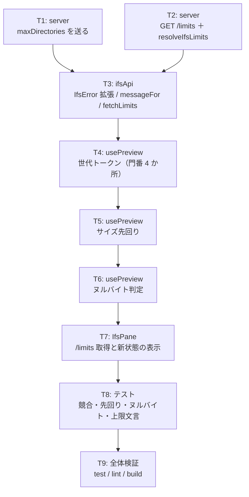

# 計画: IFS の上限表示・プレビュー競合対策・先回り判定

## subtask 分割の判定: **分割しない**

`DESIGN.md`「5.」の決定木に当てる。

- 3 件は**別々に検証でき、別 PR にもできる**（低結合）——本来は「そもそも別 work」の側に落ちる
- しかし**同じ 3 ファイル（`host-ifs.ts` / `ifsApi.ts` / `usePreview.ts`）を触り**、
  上限値という 1 つの概念を共有する。別 PR にすると同じファイルで衝突し、
  `/limits` エンドポイントを 2 回に分けて設計することになる
- 規模も小さい（サーバー 2 箇所・クライアント 3 ファイル・テスト 3 ファイル）
- → **1 PR・単一 tasks.md**。subtask 化は過剰

## 実装方針

**サーバー → API 層 → composable → 画面 → テスト**の順に、依存の上流から下ろす。
各タスクは「型が通り、既存テストが落ちない」状態で区切る。

競合対策（T4）を**先に置かない**——先回り（T5）とヌルバイト（T6）が `show()` の同じ関数に入るので、
門番を入れてから機能を足す方が、後から門番を差し込むより漏れにくい。

## 作業順序と依存関係

1. **T1** `host-ifs.ts` の `TOO_MANY_DIRECTORIES` に `maxDirectories` を足す（依存: なし）
2. **T2** `resolveIfsLimits()` ＋ `GET /api/host/ifs/limits`（依存: なし。既定解決は既存ヘルパへ委譲）
3. **T3** `ifsApi.ts`: `IfsError.maxDirectories` / `messageFor` の上限表示 / `fetchLimits()`（依存: T1・T2）
4. **T4** `usePreview.ts`: 世代トークンと門番 4 か所、捨てる blob を作らない（依存: なし）
5. **T5** `usePreview.ts`: `sizeHint` によるサイズ先回り（依存: T3・T4）
6. **T6** `usePreview.ts`: 復号後の文字列でヌルバイト判定（依存: T4）
7. **T7** `IfsPane.vue`: `/limits` を引いて渡す。`tooLarge` / `binaryContent` の表示（依存: T5・T6）
8. **T8** テスト（依存: T1〜T7）
9. **T9** 全体検証と backlog 消し込みの準備（依存: T8）

## リスク / 留意点

| リスク | 対応 |
|---|---|
| **門番の漏れ**（4 か所のうち 1 つ忘れる） | T8 で**4 か所それぞれにテストを 1 本ずつ**当てる。`finally` の `loading` を忘れやすい |
| **捨てた blob のリーク** | `createObjectURL` を `isStale()` の**後**に呼ぶ設計にする（作らなければ漏れない）。`trackUrls()` で created 数を検査 |
| **先回りの誤発火**（読めるものを断る） | `sizeHint !== undefined && limits !== undefined && sizeHint > max` の 3 条件。境界（同値）は読む |
| **既存テストの期待値変更を見落とす** | `ifs-error-messages.test.ts:61` は確実に落ちる。落ちたら期待値を更新（機能後退ではない） |
| `/limits` の失敗でペインが壊れる | `IfsPane` で握って先回り無しで続行。**エラー表示もしない**（付随機能） |
| 既定値が 2 箇所になる | `resolveIfsLimits` は `deleteLimits(deps)` / `DEFAULT_MAX_DIRECTORIES` へ委譲。自前で `?? 5000` と書かない |
| `reload` の巻き戻しが新しい表示を壊す | spec D3 のトークン比較。テストで固定 |

## テスト方針

### 競合（T4 の検証。4 か所ぶん）

`fetch` を**要求ごとに解決タイミングを変えられる**モックに差し替える（既存の `mockJson` は即時解決）。
遅延を外から制御する `deferred` 方式にする。

- 遅い A → 速い B の順で `show` → **B が表示される**
- 遅い A が返っても `error` が書かれない（A が失敗する形でも B の表示が残る）
- 遅い A が返っても `loading` が `true` のまま（B が実行中）→ B 完了で `false`
- 画像/PDF で古い応答が来ても **`createObjectURL` が呼ばれない**（作らないから漏れない）
- `reload` の巻き戻しが新しい `show` を上書きしない

### 先回り（T5）

- `sizeHint` が上限超過 → **`fetch` が 1 度も呼ばれない**（`vi.fn()` の `mock.calls.length === 0`）
- `sizeHint` が上限と同値 → 読みに行く
- `sizeHint` が `undefined` → 読みに行く
- `limits` 未取得 → 読みに行く

### ヌルバイト（T6）

- 復号できた文字列に `U+0000` を含む → `binaryContent: true`
- 含まない → 従来どおり
- `content: null`（復号失敗）→ `undecodable` のまま、`binaryContent` は立たない

### 上限文言（T3）

- zip `TOO_LARGE` / read `TOO_LARGE` / `TOO_MANY_DIRECTORIES` の 3 つで**上限が文言に出る**
- 上限フィールドが欠けた応答で `undefined` が**出ない**
- 既存の「`KNOWN_ERROR_CODES` がサーバーの全コードを覆う」検査が通り続ける

### サーバー（T1・T2）

- `GET /api/host/ifs/limits` が 200 で 6 つの値を返す
- **ホストに繋がなくても答える**（`withIfs` を通らない）
- CLI 引数で上書きした値が反映される
- `TOO_MANY_DIRECTORIES` の応答に `maxDirectories` が載る

### 全体（T9）

- `npm test`（既知の `zip-writer.test.ts` 4 件を除き全通過）
- `npm run lint`（追跡下のソース＝`npx eslint packages tools` がクリーン）
- `npm run build -w @as400web/web-ui`（`vue-tsc` 込み）
- **バンドルサイズが大きく増えていないこと**（直近の実測 358,354 バイトを基準線にする）
