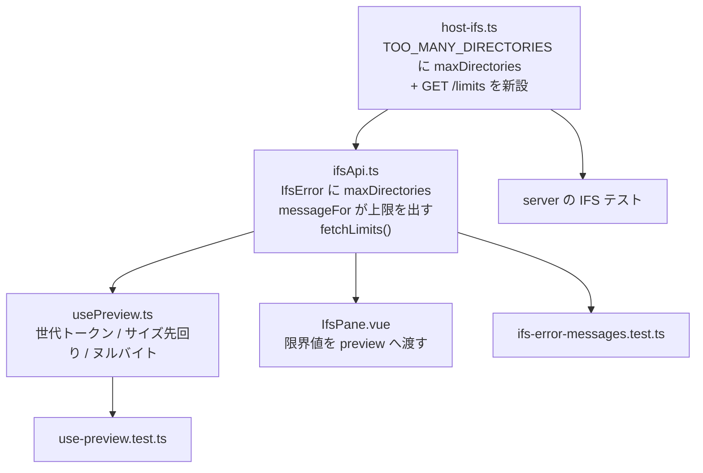

# 調査: IFS の上限表示・プレビュー競合・先回り判定

## 調査の問い

- Q1: プレビューの競合はどこで起きるか。`loading` / `error` も巻き込むか
- Q2: サーバーは上限値をどこまで送っているか。クライアントはなぜ出していないか
- Q3: **クライアントが `readMaxBytes` を先に知る手段はあるか**（先回り判定の前提）
- Q4: ヌルバイト判定はどの層で行えるか。復号に失敗した場合はどうなるか
- Q5: 既存テストはどこまで押さえていて、どこに足せばよいか

## 判明した事実

### F1. 競合は `show()` の 3 つの代入すべてに乗る（Q1）

`usePreview.ts` の `show()` は `await` の後に `state` / `error` / `loading` を無条件で書く。

| 行 | 代入 | 遅い応答が勝つと |
|---|---|---|
| `:132-145` | `state.value = {…}`（テキスト） | 選んでいないファイルの中身が出る |
| `:151-158` | `state.value = {…}`（PDF/画像） | 同上。**さらに blob URL を作る** |
| `:160-163` | `error.value = …` / `state.value = undefined` | 古い失敗が新しい成功を消す |
| `:165` | `loading.value = false`（`finally`） | 新しい要求の実行中に**ローディングが消える** |

つまり「最後の代入だけ守る」では足りず、**4 か所すべてを最新要求かで門番する**必要がある。

`revoke()`（`:90-92`）は `state.value?.url` を解放する設計なので、
**古い応答が作った blob URL は `state` に入らないまま宙に浮く**——捨てるときに明示的に解放しないと漏れる。

`reload(ccsid)`（`:108-114`）は `show()` を呼んだ後 `state.value === undefined` なら元に戻す。
ここも門番の対象（古い `reload` が新しい `show` の結果を差し戻す形がありうる）。

### F2. サーバーは既に上限を送っている。出していないのはクライアント（Q2）

**この 3 件のうち 2 件は、サーバー側の変更がほぼ要らない。**

| 応答 | サーバーが送る値 | `messageFor` の扱い |
|---|---|---|
| zip `TOO_LARGE`（`host-ifs.ts:775-790`） | `files` `bytes` **`maxFiles` `maxBytes`** `partial` | `ifsApi.ts:66-70` が `files`/`bytes` のみ使用 |
| zip `TOO_MANY_DIRECTORIES`（`:792-803`） | `directories` `partial`（**上限なし**） | `:60-61` が `directories` のみ |
| read `TOO_LARGE`（`:372-381`, `:391-400`） | `bytes` **`maxBytes`** | 同じ `TOO_LARGE` 分岐を通る |
| upload `TOO_LARGE`（`:550-563`） | `files` `directories` `bytes` **`maxFiles` `maxDirectories` `maxBytes`** | 同上 |
| 削除 `TOO_MANY` | `entries` **`max`** | **`上限 ${b.max} 件` を出している**（唯一の例） |

クライアントの `IfsError` 型（`ifsApi.ts:11-27`）には `maxFiles` / `maxBytes` の口が**既にある**
（`maxDirectories` だけ無い）。

→ **サーバー変更は `TOO_MANY_DIRECTORIES` に `maxDirectories` を足す 1 箇所だけ**。
残りは `messageFor` の書き方の問題。同じ関数の中で削除だけが上限を出しており、不揃いが目に見える。

### F3. クライアントが上限を先に知る口は無い（Q3）★ 設計判断が要る

上限は**サーバー設定**（`app.ts:82-83` の `DEFAULT_IFS_ZIP_MAX_*`、CLI 引数で上書き可）で、
`deps` として `registerHostIfsRoutes` に渡るだけ。**応答に載るのは超過して失敗したときだけ**。

- `/api/host/ifs/*` は **11 本すべて POST**（`list` / `read` / `download` / `write` / `mkdir` /
  `rename` / `delete` / `delete-plan` / `zip` / `upload`）。読み取り専用の設定を返す口は無い
- 設定を返す既存の口は `/api/me` と `/api/version` の 2 本（どちらも GET・`app.ts:113-124`）
- 認証は `app.use("*", createAuthMiddleware(deps.auth))`（`app.ts:99`）で**全体に掛かる**ので、
  新しい GET を足しても認可の穴にはならない

選択肢は 3 つ:

| 案 | 内容 | 評価 |
|---|---|---|
| (a) `GET /api/host/ifs/limits` を新設 | 起動時に 1 回引いて保持 | **設定の正がサーバー 1 箇所に保たれる**。先回りが初回から効く |
| (b) 413 から学習してキャッシュ | 1 回失敗して初めて知る | **初回の大きいファイルは従来どおり待たされる**＝item の目的（体感）を満たさない |
| (c) クライアントに定数を置く | 実装が最小 | **CLI 引数で変えるとずれる**。README に 6 引数を載せた意味が無くなる |

→ **(a) を採る**。(c) は README（`:162-164`）が「上限は設定で変えられる」と明言している以上、
クライアント定数は嘘になる。

### F4. ヌルバイトは復号後のテキストで見れば足りる（Q4）

サーバーの `read`（`encoding: "utf8"`）は決定表で復号し、**復号できないと 200 で `content: null`**
を返す（`usePreview.ts:138-139` の `undecodable`）。

- **復号できた場合**: 返ってきた文字列に `U+0000` が混ざる。ここを見れば判定できる（追加往復ゼロ）
- **復号できなかった場合**（`content: null`）: 中身を見る手段が無い。
  ただしこの場合は既に「文字コード未対応」の案内に落ちており、**壊れた表示にはならない**（03 D11 の指摘どおり）

→ **復号後の文字列で判定する**。base64 で読み直して生バイトを見る案は、
**1 往復増やして得るものが「案内文の精度」だけ**なので採らない（IFS は実効 100KB/s）。

判定の閾値は「1 個でもあればバイナリ」とする。テキストファイルに `U+0000` が正当に入ることはない。

### F5. 既存テストの土台はそのまま使える（Q5）

`packages/web-ui/test/use-preview.test.ts` に:

- `harness()` — composable を実マウント（`onBeforeUnmount` を働かせる）
- `mockJson(body, status)` / `mockBlob()` — `globalThis.fetch` を差し替え
- `trackUrls()` — `createObjectURL` / `revokeObjectURL` の呼び出しを記録

競合のテストは **`fetch` を要求ごとに解決タイミングを変えて返すモック**が要る（既存の `mockJson` は
即時解決なので順序を作れない）。`trackUrls()` はそのまま「捨てた blob を解放したか」の検査に使える。

`packages/web-ui/test/ifs-error-messages.test.ts` に
「`KNOWN_ERROR_CODES` がサーバーの全コードを覆っている」検査が既にある（`:45`）。
文言に上限を足す変更はここに 1 ケース足せばよい。`:61` の
「`TOO_LARGE` は超過した実測値を添える」は**期待値の更新が要る**。

### F6. 先回り判定の対象は 3 種別すべて

`show()` は `binary` を読みに行かない（`:119-124`）が、`text` / `pdf` / `image` は無条件に読む。
`IfsPane.vue:198` が `entry.size` を `sizeHint` として渡しているので、**値は既に手元にある**。

ただし `reload(ccsid)` は `current.bytes`（実測済み）を渡すので、**一度開けたものを開き直す経路**では
先回りが誤発火しない（既に上限内と分かっている）。

## 影響範囲

`packages/core` には触れない。

## 実現性 / リスク

- **競合対策は定石**（単調増加のトークンを持ち、`await` 明けに `token === latest` を見る）。
  リスクは**門番の漏れ**——`finally` の `loading` を忘れると「新しい要求中にローディングが消える」
- **`GET /limits` は接続不要**（サーバー設定を返すだけ）。ホストに繋がなくても答えられるので、
  `withIfs` を通さない。**接続前でも UI が上限を知れる**のは利点
- **先回りの誤発火**が一番怖い。一覧のサイズが古い／取れない（`sizeHint` が `undefined` や 0）ときに
  読めるファイルを断ると劣化になる。**「分かっていて、かつ超えている」ときだけ断る**
- 既存の期待値（`ifs-error-messages.test.ts:61`）が変わるので、更新漏れは test で落ちる

## spec への申し送り

- **`GET /api/host/ifs/limits` を新設する**（F3 の (a)）。返す値は `readMaxBytes` /
  `zipMaxBytes` / `zipMaxFiles` / `zipMaxDirectories`。削除系も同じ deps にあるので併せて返すか決める
- **門番は 4 か所**（テキスト代入・blob 代入・エラー代入・`finally` の loading）。
  1 か所でも漏れると症状が残る。テストも 4 つ分ける
- **捨てる blob は明示的に解放する**。`revoke()` は `state.value?.url` しか見ないので、
  古い応答の URL はそのままでは漏れる
- **ヌルバイトは復号後の文字列で判定**（F4）。追加往復なし
- **先回りは `sizeHint !== undefined && sizeHint > readMaxBytes` のときだけ**（F6）。
  上限を知らない（`/limits` がまだ返っていない）間は先回りしない＝従来動作
- 文言の単位は既存に揃える——バイトは MB（`(b / 1024 / 1024).toFixed(1)`）、件数はそのまま
