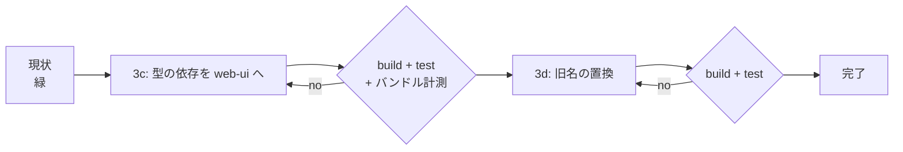

# 計画: ライブラリ切り出しの後始末（3c ＋ 3d）

## 1. split 判定（protocol「2.8」）

**subtask には割らない。** 2 項目とも小さく機械的で、subtask 層の対象
（「高結合で 1 PR には割れないが大規模」）に当たらない。

## 2. 前作業と違って、途中で緑にできる

`20260801-library-extraction-drop-core-reexport` は「利用側を移す」と「再輸出を消す」の間で
一度も緑にならなかった。今回は **3c と 3d が互いに独立**なので、段ごとに緑で刻める。

**3c を先にやる**——バンドルサイズの検証が要るのはこちらだけなので、
3d の差分（約 70 箇所の識別子置換）が混ざる前に測ったほうが切り分けやすい。

## 3. タスクの順序

| 段 | 内容 | 終了時に確認すること |
|---|---|---|
| T1 | `browser.ts` の再輸出 3 文を削除し、web-ui 6 ファイルを hostserver 直参照へ | `tsc -b` 緑 |
| T2 | マニフェスト（core から削除・web-ui の devDependencies へ追加） | `npm install` 後に `tsc -b` 緑 |
| T3 | ガードを「例外なし」に強化＋宣言の検査を追加 | わざと戻して落ちることを確認 |
| T4 | **3c の検証**（バンドル計測・`node:net` 0 件） | 359,853 バイト以下 |
| T5 | `Tn5250Error` → `As400Error` の置換（32 ファイル） | `tsc -b` 緑・残存 0 件 |
| T6 | 全体検証 | build / test / lint 緑 |

## 4. リスクと対処

| リスク | 兆候 | 対処 |
|---|---|---|
| `import type` が値 import に化け、バンドルに `node:net` が入る | バンドル増加 | T4 で実測（サイズ＋`grep node:net`） |
| **3d の置換が残すべき 4 箇所を巻き込む** | `errors-compat.test.ts` が落ちる | 置換対象を**ファイル単位で明示的に除外**し、置換後に残存箇所を走査して確認 |
| `ifs-ops.ts` の重複 import で構文エラー | ビルド失敗 | 先に手で畳んでから一括置換にかける |
| web-ui が hostserver を `dependencies` に入ってしまう | 本番インストールに Node 専用パッケージが混じる | T3 のガードで `devDependencies` 側にあることを検査 |

## 5. 対象外の確認（requirement から不変）

`Tn5250Error` 別名そのものの削除・`errors-compat.test.ts` の書き換え・
`ebcdic`/`scs` 再輸出・項目 4・振る舞いの変更。
