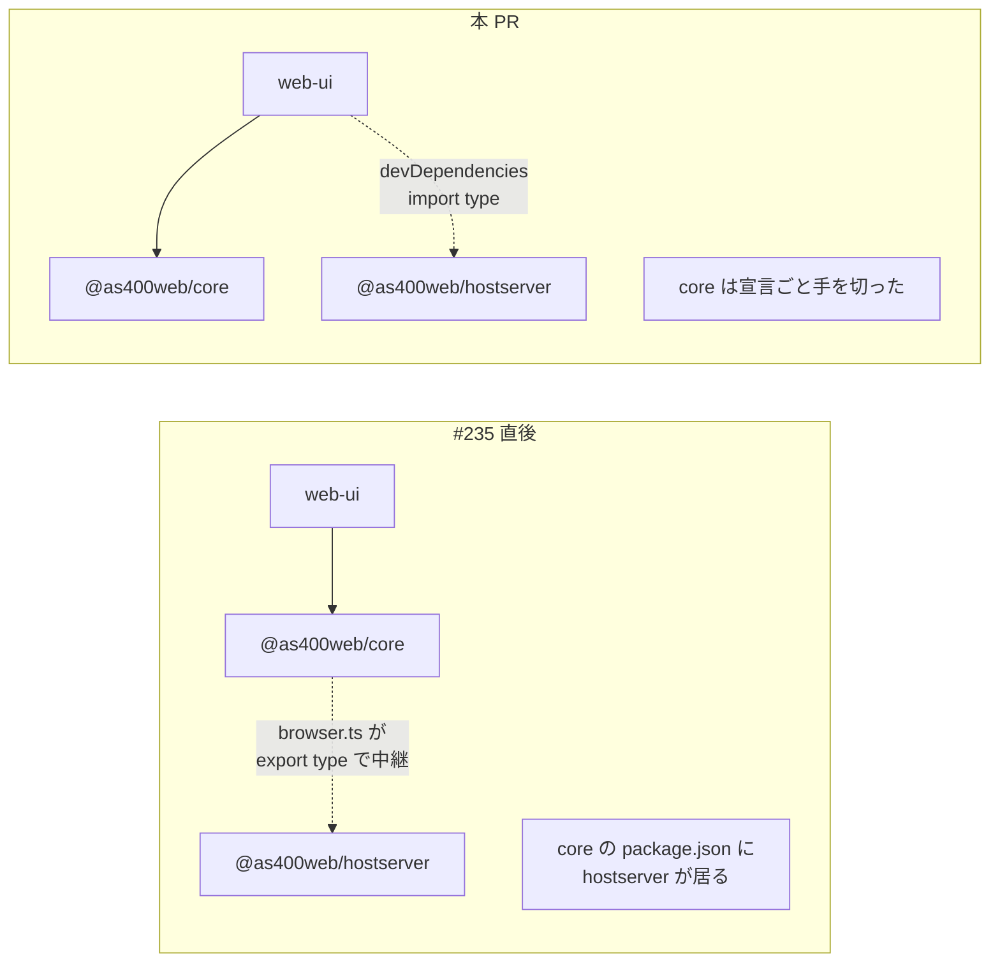

# レビューガイド: ライブラリ切り出しの後始末（3c ＋ 3d）

**43 ファイルの差分だが、読むべきは 6 ファイル。** 32 ファイルは単一識別子の置換
（`Tn5250Error` → `As400Error`）で、差分を 1 つ見れば残りは同じ形。

## 1. 3c —— core とホストサーバーの縁を完全に切る

PR #235 で**実行時**の依存は消えたが、**型のみの依存**が残っていた。

**型を中継していた 1 点のために、`packages/core` が `node:net` を含むパッケージを
`dependencies` に持っていた。** 使っているのは web-ui なので、web-ui が実体から取る形にした。

### 読むところ

- **`packages/core/src/browser.ts`** — hostserver 由来の `export type` 3 文を削除。
  「ここへ戻すな」の理由を JSDoc に残した
- **`packages/web-ui/src/{ifsApi,dtaqApi}.ts` / `components/TransferPane.vue`** —
  `import type … from "@as400web/hostserver"` へ。`ifsApi.ts` は `LineEnding`（ebcdic 由来）が
  混ざっていたので import を 2 文に割った
- **`packages/web-ui/package.json`** — `devDependencies` に追加（**`dependencies` ではない**）
- **`packages/core/test/hostserver-not-reexported.test.ts`** — 例外を消して「0 件」に強化し、
  **宣言の検査を 2 件追加**（ソースに参照が無くても `package.json` に残っていれば戻れてしまう）

### 効いたことの確認

| | 値 |
|---|---|
| web-ui 本番バンドル JS | **359,853 バイト（1 バイトも変わらず）** |
| バンドル内の `node:net` / `node:tls` | **0 件** |
| バンドル内の `hostserver` の文字列 | **0 件** |

`import type` が実行時に消えていることの三重の裏取り。

## 2. 3d —— 旧名を新しいコードから消す

`Tn5250Error` は `As400Error` の**別名**（同一クラス）。`base/src/errors.ts` の JSDoc は
「このリポジトリ内の新しいコードでは `As400Error` を使うこと」としているが、混在していた。

**32 ファイル / 78 箇所**を置換。使われ方は `import` と
`expect(() => …).toThrow(Tn5250Error)` の 2 種類だけで、同一クラスなので振る舞いは変わらない。

### 残した 5 ファイル（意図的）

| 場所 | 理由 |
|---|---|
| `packages/base/src/errors.ts` / `index.ts` | **別名の定義そのもの**（外部利用者の互換シム） |
| `packages/core/src/index.ts` | 公開 API の後方互換 |
| `packages/core/test/errors-compat.test.ts` | **新旧の同一性を検査するのが役目**。消すと検査が成立しない |
| `packages/core/test/codec-reexport.test.ts` | 改名の経緯を述べたコメント（識別子ではない） |

`errors-compat.test.ts` が緑＝**旧名は引き続き外から取れる**。

> backlog の 3d は `tools/hostserver-check` の 7 ファイルだけを挙げていたが、実測すると
> テスト 24 ファイルにも残っていた。tools だけ直しても「新旧の混在を意図していない」という
> 目的が達成されないので、揃えた。

## 3. 検証のポイント

| 見るところ | 値 |
|---|---|
| `packages/core` の `dependencies` | base / ebcdic / scs（hostserver は**消えた**） |
| web-ui バンドル | **359,853 バイト**（前後で完全一致） |
| テスト | 3,266 → **3,268**（+2 は宣言検査。失敗 0） |
| 残存する `Tn5250Error` | **5 ファイルのみ**（すべて意図的） |

## 4. この作業で踏んだ落とし穴（2 つとも AGENTS.md に反映済み）

1. **root の `tsc -b` は web-ui を検査していない。** `browser.ts` の型を 1 つ消したとき
   root のビルドは緑のままで、`vue-tsc` が `packages/web-ui/test/` を落とした。
   web-ui は root の project references に無く、しかも `tsconfig.test.json` で
   **test も型検査の対象**（core / hostserver は `include: ["src"]` なので慣習が違う）
2. **自分で書いた注意書きが、自分の書いたガードを誤検知させた。**
   `browser.ts` に「hostserver をここへ戻すな」と JSDoc を書いたら、`tsc` がコメントを
   出力に残すため `dist/browser.js` を読む検査が引っかかった。
   → 「成果物を読む検査はコメントを剥がしてから見る」
