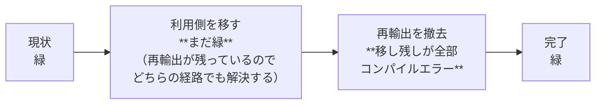

# 計画: 利用側の直参照化と core の hostserver 再輸出の撤去

## 1. split 判定（protocol「2.8」）

**subtask には割らない。** 58 ファイル・61 文だが、性質は import 指定子の付け替えで機械的。
前作業（`20260801-library-extraction-hostserver`）と同じく、subtask に割っても PR の境界は
変わらず、子の state machine が増えるだけである。

## 2. 前作業と決定的に違う点 —— 途中で緑にならない

前作業は「base を切る → 緑 → hostserver を切る → 緑」と**段ごとに緑で刻めた**。
今回は刻めない。

**s1 が緑なのは罠**。再輸出が残っている間は「移したつもりで移せていない」箇所があっても
`tsc -b` が通ってしまう。移し残しが露見するのは s2 の瞬間で、そこで初めてまとめて落ちる。

### 対策: 撤去を先にやらず、**機械的な網で移し残しを 0 にしてから撤去する**

`tsc` に頼れない区間があるので、**自前の走査で「移すべき import が残っていないこと」を
先に 0 件にする**。使うのは spec を書くのに使った分類スクリプトそのもの
（`@as400web/core` からの import を base / hostserver / ebcdic / scs / core に振り分け、
core 以外が残っていれば列挙する）。作業ディレクトリではなくリポジトリに
`packages/core/test/hostserver-not-reexported.test.ts` として置き、**恒久的なガードにする**。

## 3. 段取り

| 段 | 内容 | 終了時に確認すること |
|---|---|---|
| **T1** | 分類スクリプトを整え、移設対象を確定する | 対象 58 ファイル / 61 文が再現できる |
| **T2** | `packages/server/src`（31 ファイル）の import を割る | `tsc -b` 緑・**分類走査で server/src の残り 0** |
| **T3** | `packages/server/test`（16 ファイル）の import を割る | 同上・`npm test -w @as400web/server` 緑 |
| **T4** | `tools/hostserver-check/src`（11 ファイル）の import を割る | 同上 |
| **T5** | マニフェスト（`package.json` / `tsconfig.json`）を更新 | `npm install` 後に `tsc -b` 緑 |
| **T6** | **`packages/core/src/index.ts` の再輸出 39 行を撤去** | `tsc -b` 緑（ここで落ちたら移し残し） |
| **T7** | ガードテストを作り直す（`git mv` ＋ 中身の反転） | わざと戻して落ちることを確認 |
| **T8** | 全体検証 | `dist/index.js` の hostserver が 33 → 0 |

**T2〜T5 の各段で `tsc -b` は緑のまま**（再輸出がまだあるので当然）。
だから**分類走査の残件数を各段の合否にする**——これが今回の実質的なゲートである。

## 4. 手作業にしない部分・する部分

- **機械的にやる**: 「どの名前がどのパッケージのものか」の判定。手で振り分けると必ず間違える
  （`Tn5250Error` が base のもの、`LogicalPage` が scs のもの、といった非自明な対応がある）
- **手でやる**: import 文の**書き換えそのもの**。1 文を 2〜3 文に割る操作で、
  周囲のコメント（`/** … */` が import の項目に付いている箇所がある）を巻き込みやすい。
  前作業で `sed` の一括置換に 2 回取りこぼした（動的 import / 区切り文字と交替の衝突）ので、
  **スクリプトで対象を出し、編集は 1 ファイルずつ確認しながら行う**

## 5. リスクと対処

| リスク | 兆候 | 対処 |
|---|---|---|
| **移し残しに気づかないまま T6 へ進む** | T6 で大量のコンパイルエラー | T2〜T5 のゲートを分類走査の残件数にする（`tsc` を当てにしない） |
| import を割るときに**別名や `type` 修飾を落とす** | 型エラー / 実行時 undefined | `tsc -b` ＋ テストで捕まる。加えて割った後の名前の集合が元と一致することを走査で確認 |
| `browser.ts` の `export type` を巻き込んで消す | web-ui のビルドが落ちる | T7 のガードで `dist/browser.js` を検査。web-ui の diff 0 も基準 |
| **web-ui を無意識に触る** | 後方互換の主張が崩れる | T8 で `git diff --stat -- packages/web-ui` が空であることを確認 |
| `package.json` に宣言せず hoisting で動いてしまう | 気づかない（monorepo では動く） | T5 で明示的に追加し、走査で「import しているのに宣言が無い」を検査 |

## 6. 対象外の確認（requirement から不変）

`packages/web-ui`・`browser.ts` の型 3 箇所・`@as400web/core/codec` ファサード・
`ebcdic`/`scs` 再輸出の撤去・`Tn5250Error` の改名・publish・項目 4。
