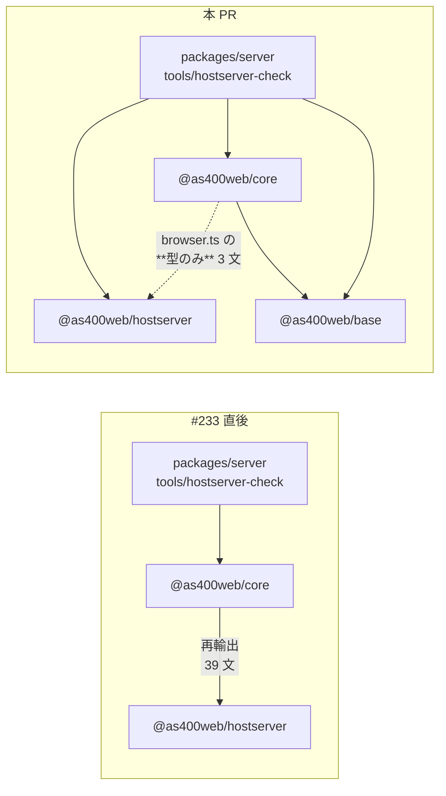
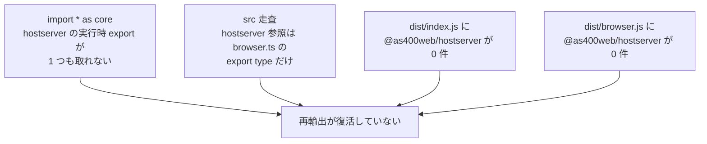

# レビューガイド: core の hostserver 再輸出の撤去

**71 ファイルの差分だが、読むべきは 6 ファイル。** 58 ファイルは import 指定子の付け替えで、
「どのパッケージから取るか」だけが変わっている。

## 1. これは何の作業か

PR #233 でホストサーバー層を `@as400web/hostserver` へ切り出したとき、利用側を壊さないために
`@as400web/core` に再輸出を残した。その結果 **`core → hostserver` の実行時依存が残り**、
「TN5250 だけ欲しい」利用者はホストサーバー一式を引き取り続けていた。ここを閉じる。

**実線が消えて点線になった**のがこの PR。点線（型のみ）は実行時に何も引かない。

### 効いたかどうかは 1 つの数字で分かる

| | 着手前 | 着手後 |
|---|---|---|
| `packages/core/dist/index.js` の `@as400web/hostserver` | **33 箇所** | **0 箇所** |

ビルド成果物を見ているので、`export type` の書き忘れや値 export への化けも同時に検出できる。

## 2. 読むべき 6 ファイル

### 2.1 撤去そのもの — `packages/core/src/index.ts`

`@as400web/hostserver` からの再輸出 **39 文（168 行）** を削除。
`@as400web/ebcdic` からの再輸出（純 DBCS・CCSID テキスト）と `@as400web/base` の
`assertIdentifier` は**残る**——これらは TN5250 側も使う。

### 2.2 例外を明文化 — `packages/core/src/browser.ts`

`@as400web/core/browser` の**型のみ再輸出 3 箇所は意図的に残している**。
直参照にすると**ブラウザ向けパッケージが `node:net` を含むパッケージを依存に持つ**ため。
「`export type` を外してはならない」理由を JSDoc に書いた。

`packages/core/package.json` の `dependencies` に `@as400web/hostserver` が残るのも
**この型解決のため**で、実行時に読み込むためではない。

### 2.3 不変条件を固定する 2 本（★本体）

**`packages/core/test/hostserver-not-reexported.test.ts`**（前身の裏返し・5 テスト）

前身は `hostserver-reexport.test.ts`（「再輸出が到達可能なこと」を検査）。
**中身だけ反転させると次に読む人が逆の期待をする**ので、ファイル名ごと変えた
（そのため git 上は D + A に見える。削除ではなく作り直し）。

**c と d はビルド成果物を読む。** ソースの `export type` は目視で値と区別しにくく、
実行時に何が残るかは `dist` を見るのが唯一確実。**`dist` が無ければ落とす**
（skip にすると「ビルドしていないから緑」という無意味な緑になる）。

**`packages/server/test/import-from-owner.test.ts`**（新設・3 テスト）

「使うものは在り処から取る」を走査で固定する。**撤去した今でもこのテストは要る**——
`As400Error` のように **core が今も再輸出している名前**（`@as400web/base` 由来）は
`@as400web/core` から取っても**通ってしまう**。通るが出どころが見えなくなる。
名前の表は各パッケージの `index.ts` から読む（手で持つと出どころが移ったとき検査だけ古くなる）。

### 2.4 既存バグの修正 — `db-pool.ts` / `host-sql.ts` / `result-set-store.ts` / `host-upload.ts`

**この 4 ファイルはサーバー自前の pino ではなくライブラリ側の注入式ロガーを使っていた。**
本 PR が作った問題ではない——分割前は `import { childLog } from "@as400web/core"` で、
**core が base の `childLog` を再輸出していたため気づきにくかった**。

AGENTS.md:「アプリ（server）は自前の pino を使う。消えて困る側を注入に依存させない」。
`main.ts` が `setLogSink` を呼ぶので通常の起動では出力されるが、**それは注入に依存している
ということ**で、呼ばない入口（テスト・ツール・組み込み）では静かに消える。

`log-independence.test.ts` に走査を 1 件足して再発を塞いだ。
**足した直後に `db-pool.ts` を検出した**——こちらが `grep` で数えたときに落としていた 4 件目。

## 3. 機械的な部分（流し読みでよい）

- **58 ファイル / 61 文**の import 付け替え。宛先の内訳:
  `@as400web/base` 46 文 / `@as400web/hostserver` 37 文 / `@as400web/core`（残る）15 文 /
  `@as400web/scs` 3 文 / `@as400web/ebcdic` 3 文
- **名前を落としていないことは機械的に確認済み**——書き換え前後で
  「各ファイルが `@as400web/*` から取っているローカル名の集合」を突き合わせ、
  78 ファイル分すべて差分ゼロ。別名（`childLog as coreChildLog`）と `type` 修飾も保たれている
- `package.json` / `tsconfig.json` に使うパッケージを宣言（monorepo では宣言しなくても
  hoisting で動くので、宣言そのものを `import-from-owner.test.ts` が検査する）

## 4. 検証のポイント

| 見るところ | 値 |
|---|---|
| `dist/index.js` の hostserver | **33 → 0** |
| `packages/web-ui` の追跡差分 | **0**（1 行も変えていない） |
| web-ui 本番バンドル | **359,853 バイト**（前後で完全一致） |
| テスト | 3,263 → **3,266**（失敗 0） |

## 5. あえてやらなかったこと

- **`packages/web-ui` の直参照化**。`@as400web/hostserver` は `node:net` を含む Node 専用
  パッケージで、ブラウザ向けパッケージの依存に載せるものではない
- **`packages/core` の `dependencies` から `@as400web/hostserver` を外す**。
  `browser.ts` の型 3 箇所が参照するため。外すには web-ui を触る必要がある（follow-up 3c）
- **`Tn5250Error` の改名**。`tools/hostserver-check` の 7 ファイルが旧名を使っているが、
  本 PR は import 元の付け替えに徹し識別子には触れていない（follow-up に起票）
- **`@as400web/core` の `ebcdic` / `scs` 再輸出の撤去**。TN5250 の実装自身が使っており別軸
