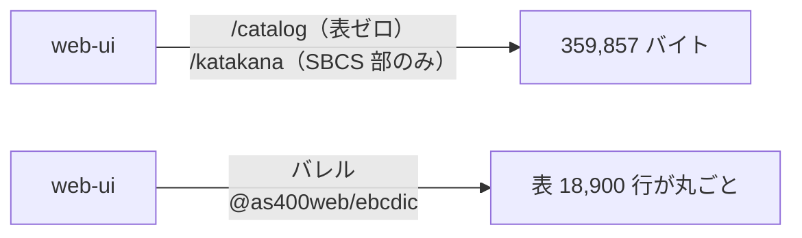

# レビューガイド: ebcdic 再輸出の撤去

**差分 11 ファイル。** 「ライブラリ切り出し」の最後の 1 件。

| 場所 | 内容 |
|---|---|
| `packages/tn5250/src/{index,browser}.ts` | ebcdic 再輸出 5 ブロック（24 名前）を削除 |
| `packages/web-ui/`（7） | 狭い入口へ付け替え＋`dependencies` 追加 |
| `AGENTS.md` | 規約の主旨を「再輸出そのものを置かない」に改めた |

## 1. 24 個のうち 6 個しか使われていなかった

再輸出は「利用側を壊さないため」に置かれたが、**実測すると 18 個は誰も使っていなかった**。

| 使われていた 6 個 | 利用者 | 新しい入口 |
|---|---|---|
| `TEXT_CCSIDS` / `ccsidLabel` | `IfsPane.vue` | `@as400web/ebcdic/catalog`（**表ゼロ**） |
| `LineEnding` | `ifsApi.ts` / `usePreview.ts` | `@as400web/ebcdic/catalog` |
| `katakanaChar` / `latinChar` | `ScreenGrid.vue` / `screenExport.ts` | `@as400web/ebcdic/katakana`（**SBCS 部のみ**） |
| `codecForCcsid` | `test/host-code-pages.test.ts` | `@as400web/ebcdic/codec` |

## 2. ★ 入口を間違えるとバンドルが膨らむ

使われていた 6 個はすべて**表を引き込まない狭い入口**から来ている。
web-ui の import 先を `@as400web/ebcdic`（**バレル**）にすると変換表 18,900 行が丸ごと入る。

**この作業の直前（#237）でまさにそれをやった**——`@as400web/scs` のバレルに向けて
359,853 → **1,458,480 バイト（約 4 倍）**。

**バンドルの実測は人が回すときにしか効かない。** そこで
`ebcdic-not-reexported.test.ts` の 5 番目の検査が、**入口の指定そのもの**を走査して固定する
（`/catalog` `/katakana` `/codec` 以外を許さない）。

## 3. `import` は消していない

`screen/` `protocol/` `session/` が内部で EBCDIC を使うのは正当な依存。
禁じるのは **`export … from "@as400web/ebcdic"`** の形だけで、ガードもその形だけを見る。

## 4. ガードは 2 方向とも壊して確認した

| 壊し方 | 結果 |
|---|---|
| `index.ts` に再輸出を 1 行戻す | **2 件 FAIL**（バレル到達／src 走査） |
| `ifsApi.ts` の入口をバレルに変える | **FAIL**「バレルに向けると変換表が丸ごとバンドルに入る」 |

## 5. 検証のポイント

| 見るところ | 値 |
|---|---|
| web-ui バンドル | **359,857 バイト（完全一致）**・modules 169 → 169 |
| DBCS 表（`ibm-1399` / `ibm-37` / `ibm-273`） | **0 件**（SBCS の 930/939 は各 1 件＝従来どおり） |
| テスト | 3,269 → **3,271**（失敗 0） |

## 6. AGENTS.md の主旨を変えた

従来「再輸出するなら `export *` を使わず列挙する」だったが、4 回の切り出しを経た結論は
**「再輸出そのものを置かない」**。実測（24 個中 6 個）とバンドル 4 倍の実例を根拠として添えた。
