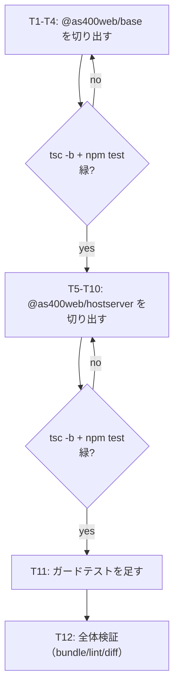

# 計画: ホストサーバー層のパッケージ分割

## 1. split 判定（protocol「2.8」）

**subtask には割らない。1 work = 1 PR のまま進める。**

protocol の subtask 層は「**高結合で 1 PR には割れないが大規模**」な作業のためのもの。
本作業はその形に当たらない。

- 作業は「`@as400web/base` の切り出し」→「`@as400web/hostserver` の切り出し」の
  **順序依存な 2 段**だが、**高結合ではない**（前段だけでも単体で成立し、緑のまま止まれる）
- subtask に割っても **PR の境界は変わらない**（protocol「2.8」の subtask は 1 PR を保つ仕組み）。
  得られるのは内部の工程レイヤリングだけで、その対価に子の state machine が 2 つ増える
- 差分は大きいが**性質は機械的**（ファイル移動と import の付け替え）。`git mv` を使えば
  レビューには rename として見え、実質の読みどころは新設 manifest 3 本・`index.ts` 2 本・
  ガードテスト 4 本に収束する

代わりに、**tasks.md の各段で `tsc -b` が緑であること**を境界条件にする（下記「3.」）。
これが subtask 分割の代替になる——途中で壊れたときに、どの段で壊れたかが機械的に分かる。

## 2. 進め方

**base を先にやる理由**: hostserver は `errors` / `log` / `identifier` に依存している。
base が先に独立していないと、hostserver を動かした瞬間に
`hostserver → core` の逆流依存が生まれ、受け入れ基準を満たせない。

## 3. 段の境界条件

| 段 | 完了時に成立していること |
|---|---|
| T1–T4（base） | `tsc -b` 緑・`npm test` がベースライン（265 files / 3,248 tests、既知の 4 失敗のみ）と同じ |
| T5–T10（hostserver） | 同上。加えて `packages/core/src/hostserver` が存在しない |
| T11（ガード） | 新設 4 テストが緑。**わざと壊して落ちることを確認**してから戻す |
| T12（検証） | `npm run lint` 緑・バンドル 359,853 バイト以下・server/web-ui/tools の diff が空 |

## 4. 手作業にしない部分

import の付け替えは対象が多い（core 側 15 ファイル・hostserver 側 46 ファイル・テスト 43 本）。
**一括置換で行い、置換後に `tsc -b` で検証する**。ただし:

- **`sed` の一括置換で済ませて目視を省かない**。`As400Error` 改名時に一括置換で
  re-export まで巻き込み旧名が外へ出なくなった事故（`20260719-core-debt-payoff`）がある。
  置換対象は import 文の**パス部分だけ**に限定し、識別子には触れない
- ファイル移動は **`git mv`** で行う（rename としてレビューさせるため。
  削除＋新規追加になると差分が 2 倍に見え、実質の変更が埋もれる）

## 5. リスクと対処

| リスク | 兆候 | 対処 |
|---|---|---|
| `export type` が値 import に化け、ブラウザに `node:net` が入る | web-ui バンドルが増える | T12 でバイト数と `grep node:net` を実測。spec「7.」の受け入れ基準 |
| core の re-export 面の列挙漏れ | server の型エラー | `hostserver-reexport.test.ts`（T11）が実行時に到達可能性を検査 |
| `tsc -b` の project references の順序間違い | ビルドが解決できない | T1 と T5 で root `tsconfig.json` を先に更新してからファイルを動かす |
| テスト移設で総数が減る（移し忘れ） | `npm test` の件数が減る | ベースライン 3,248 件と突き合わせる（spec「0.」） |
| `packages/server` を無意識に書き換える | 後方互換の主張が崩れる | T12 で `git diff --stat` が空であることを確認 |

## 6. 対象外の確認（requirement から不変）

publish・別リポジトリ化・`sql/split-statements.ts`・`transport/tcp.ts`/`types.ts`・
TN5250 一式の切り出し・公開 API の変更・`packages/server` の直参照化（follow-up。decisions.md D6）。
